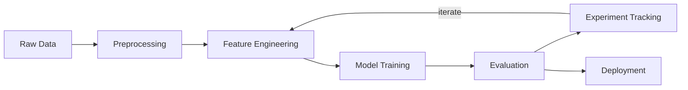

<!-- last-reviewed: 2026-02-19 -->
# Assignment 2b: Concepts, Admin & AI Setup

|                    |                                                           |
| ------------------ | --------------------------------------------------------- |
| **Author**         | Robert Frenken                                            |
| **Estimated time** | 5--7 hours                                                |
| **Prerequisites**  | Assignment 1 completed, GitHub account, computer access   |

---

## What You'll Learn

This assignment sets up the accounts, tools, and conceptual foundations you'll use throughout the lab. You'll configure OSC and Weights & Biases access, learn basic SQL, map out an ML pipeline, set up VS Code with AI coding assistants, and practice working effectively with LLMs.

---

## Part 0: Account Access

### 0.1 OSC Account

If you don't have an OSC account yet, follow the [Account Setup](../osc-basics/osc-account-setup.md) guide. Once you have credentials, verify SSH access:

```bash
ssh username@pitzer.osc.edu
```

You should land on a login node. Type `exit` to disconnect.

For SSH key setup and config tips, see [SSH Connection](../osc-basics/osc-ssh-connection.md).

- [ ] OSC account active
- [ ] SSH connection successful

### 0.2 Weights & Biases Account

1. Sign up at [wandb.ai/site](https://wandb.ai/site) using your **university email**
2. Apply for a free academic account at [wandb.ai/academic](https://wandb.ai/site/academic)
3. Install and log in locally:

```bash
pip install wandb
wandb login
# Paste your API key from https://wandb.ai/authorize
```

4. Verify it works:

```python
import wandb
wandb.init(project="test", mode="online")
wandb.log({"test_metric": 42})
wandb.finish()
```

Check [wandb.ai](https://wandb.ai/) — you should see a "test" project with one run.

For more on experiment tracking tools, see [Data & Experiment Tracking](../ml-workflows/data-experiment-tracking.md).

- [ ] W&B account created with university email
- [ ] `wandb login` successful
- [ ] Test run visible on wandb.ai

### 0.3 GitHub Education & Copilot

1. If you haven't already, apply for [GitHub Education](https://education.github.com/) with your `.edu` email
2. Once approved, enable [GitHub Copilot](https://github.com/features/copilot) (free for students)
3. Confirm Copilot is active: go to [github.com/settings/copilot](https://github.com/settings/copilot)

- [ ] GitHub Education approved (or application submitted)
- [ ] Copilot access confirmed

---

## Part 1: Database Concepts

### Why Databases Matter for ML

ML projects generate structured data that quickly outgrows spreadsheets and CSV files: dataset registries, experiment configs, run metrics, model metadata. A relational database lets you query this data efficiently, enforce consistency, and avoid the "which CSV was that?" problem.

### Hands-On: SQL with SQLite

SQLite is a file-based database — no server needed. Python includes it in the standard library.

Open a Python interpreter or Jupyter notebook and work through these exercises:

```python
import sqlite3

# Create an in-memory database
conn = sqlite3.connect(":memory:")
cursor = conn.cursor()

# Create a table
cursor.execute("""
    CREATE TABLE experiments (
        id INTEGER PRIMARY KEY,
        model_name TEXT NOT NULL,
        learning_rate REAL,
        batch_size INTEGER,
        accuracy REAL,
        created_at TIMESTAMP DEFAULT CURRENT_TIMESTAMP
    )
""")

# Insert some data
experiments = [
    ("LogisticRegression", 0.01, 32, 0.85),
    ("RandomForest", None, None, 0.91),
    ("MLP", 0.001, 64, 0.88),
    ("CNN", 0.0005, 128, 0.93),
    ("MLP", 0.01, 32, 0.86),
    ("CNN", 0.001, 64, 0.95),
]
cursor.executemany(
    "INSERT INTO experiments (model_name, learning_rate, batch_size, accuracy) VALUES (?, ?, ?, ?)",
    experiments,
)
conn.commit()
```

Now answer these with SQL queries:

**Exercise 1:** Select all experiments with accuracy above 0.90:

```sql
SELECT * FROM experiments WHERE accuracy > 0.90;
```

**Exercise 2:** Find the average accuracy per model:

```sql
SELECT model_name, AVG(accuracy) as avg_accuracy
FROM experiments
GROUP BY model_name
ORDER BY avg_accuracy DESC;
```

**Exercise 3:** Count experiments per batch size:

```sql
SELECT batch_size, COUNT(*) as num_experiments
FROM experiments
GROUP BY batch_size;
```

**Exercise 4:** Insert a new experiment and verify it appears:

```sql
INSERT INTO experiments (model_name, learning_rate, batch_size, accuracy)
VALUES ('GNN', 0.001, 64, 0.94);

SELECT * FROM experiments WHERE model_name = 'GNN';
```

For a more complete example of SQLite in an ML project, see the [SQLite Project Database](../ml-workflows/data-experiment-tracking.md#sqlite-project-database) section.

### Reflection Questions

Write 2--3 sentences for each in your blog post:

1. Why is a database better than a collection of CSV files for tracking experiments?
2. What would a JOIN be useful for in an ML project? (Hint: think about linking runs to datasets.)
3. When might you choose SQLite over a full database server like PostgreSQL?

- [ ] All 4 SQL exercises completed
- [ ] Reflection questions answered

---

## Part 2: ML Pipeline Concepts

A machine learning project follows a series of stages from raw data to deployed model. Understanding this pipeline helps you see how each tool and skill fits together.



**Stage descriptions:**

- **Raw Data** — Collect or download the dataset (CSV, database, API). Version it with DVC or Git LFS.
- **Preprocessing** — Clean missing values, normalize features, encode categoricals, split train/test.
- **Feature Engineering** — Create new features, select relevant ones, transform representations (e.g., graph construction for GNNs).
- **Model Training** — Fit the model to training data. Configure hyperparameters, choose optimizer, set up GPU training.
- **Evaluation** — Measure performance on the held-out test set. Use metrics appropriate for the task (accuracy, F1, AUC).
- **Experiment Tracking** — Log parameters, metrics, and artifacts with MLflow or W&B. Compare runs and iterate.
- **Deployment** — Serve the model for inference (API, batch, embedded) — not always required for research.

For a detailed walkthrough of this pipeline on OSC, see the [ML Workflow Guide](../ml-workflows/ml-workflow.md).

### Reflection Questions

Write 2--3 sentences for each:

1. Why is it important to split data into train and test sets *before* any preprocessing?
2. How does experiment tracking help you iterate faster?
3. Which stage(s) of the pipeline would benefit most from GPU acceleration, and why?

- [ ] Mermaid diagram reviewed and understood
- [ ] Reflection questions answered

---

## Part 3: VS Code & Copilot Configuration

### 3.1 Dotfiles and Dotfolders

In software development, **dotfiles** (files starting with `.`) store configuration:

| File/Folder | Purpose |
|-------------|---------|
| `.vscode/settings.json` | Project-specific VS Code settings |
| `.github/workflows/` | GitHub Actions CI/CD pipelines |
| `.gitignore` | Files Git should ignore |
| `.claude/` | Claude Code project settings |
| `CLAUDE.md` | Instructions for Claude Code |

These are typically committed to Git so the entire team shares the same configuration.

### 3.2 Review Your VS Code Settings

Open your VS Code settings (++ctrl+comma++) and find the `settings.json` file. Review the recommended Python settings from the [VS Code Extensions](../getting-started/vscode-extensions.md) guide.

Key settings to confirm:

- [ ] Default formatter set to Ruff (`charliermarsh.ruff`)
- [ ] Format on save enabled
- [ ] Pylance language server active

### 3.3 Set Up GitHub Copilot in VS Code

1. Install the **GitHub Copilot** extension (`github.copilot`)
2. Install **GitHub Copilot Chat** (`github.copilot-chat`)
3. Sign in when prompted (uses your GitHub Education account)
4. Test it: open a Python file, type a comment like `# Function that calculates the mean of a list`, and wait for Copilot's suggestion. Press ++tab++ to accept.

For setup details, see [AI Coding Assistants](../getting-started/ai-coding-assistants.md).

### 3.4 Create copilot-instructions.md

GitHub Copilot can read a `.github/copilot-instructions.md` file for project context. Create one in your EDA project from Assignment 2a:

```markdown
# Copilot Instructions

This project analyzes the HCRL Survival IDS dataset for automotive intrusion detection.

- Use pandas for data manipulation
- Use seaborn and matplotlib for visualization
- Use scikit-learn for ML models
- Follow PEP 8 style conventions
- Prefer explicit column names over positional indexing
```

- [ ] Copilot extension installed and working
- [ ] Copilot generated at least one useful suggestion
- [ ] `copilot-instructions.md` created in EDA project

---

## Part 4: Working with LLMs

Large language models (Copilot, Claude, ChatGPT) are powerful coding tools, but using them effectively requires practice.

### LLM Interaction Modes

| Mode | When to Use | Example |
|------|-------------|---------|
| **Planning** | Before writing code — design the approach | "I need to build an EDA pipeline. What steps should I follow?" |
| **Writing** | Generate code from a clear spec | "Write a function that loads a CSV and returns summary statistics" |
| **Explanation** | Understand existing code or errors | "Explain what this pandas groupby does" |
| **Debugging** | Fix errors with context | "I get a KeyError on line 15. Here's the traceback..." |

### Effective LLM Framework

1. **Plan first** — Describe what you want to build before asking for code. Give context about the project.
2. **Start slow** — Ask for small pieces, test them, then build up. Don't ask for 200 lines at once.
3. **Ask for explanations** — When the LLM generates code you don't understand, ask it to explain line by line.
4. **Update your dotfiles** — When you discover good patterns, add them to `CLAUDE.md` or `copilot-instructions.md` so the LLM remembers next time.

### Practice Task

Use an LLM (Copilot Chat, Claude, or ChatGPT) to help you with one of these:

1. Write a function that loads your Survival IDS dataset and prints a summary report
2. Debug an error you encountered in Assignment 2a
3. Explain a piece of code from Assignment 2a that you found confusing

Save the conversation (screenshot or copy-paste) — you'll reference it in your blog post.

For more on working with AI assistants, see [AI Coding Assistants](../getting-started/ai-coding-assistants.md).

- [ ] Used an LLM for at least one practice task
- [ ] Saved the conversation for your blog post

---

## Part 5: Create a CLAUDE.md

`CLAUDE.md` is a project configuration file that gives [Claude Code](https://claude.ai/claude-code) context about your project. This connects Assignment 2a and 2b — you'll write one for your EDA project.

Create a `CLAUDE.md` file in the root of your EDA repository from Assignment 2a:

```markdown
# CLAUDE.md

## Project Overview
Exploratory data analysis of the HCRL Survival IDS dataset for
automotive CAN bus intrusion detection.

## Tech Stack
- Python 3.11+
- pandas, matplotlib, seaborn for EDA
- scikit-learn for baseline ML models
- Jupyter notebooks for analysis

## Commands
- Install dependencies: `pip install -r requirements.txt`
- Run notebook: `jupyter notebook notebooks/eda.ipynb`

## Conventions
- Save figures to `figures/` directory
- Use seaborn style for all plots
- Pin dependencies in `requirements.txt`
```

Customize it based on your actual project setup. For a deeper guide, see [Project Configuration with CLAUDE.md](../getting-started/ai-coding-assistants.md#project-configuration-with-claudemd).

- [ ] `CLAUDE.md` created in EDA project root
- [ ] Contents customized to match your actual project

---

## Part 6: Publish

Write a blog post (or page) on your Quarto site summarizing what you learned. This can be a separate post from your Assignment 2a EDA post.

### Suggested Content

Pick one or more of these formats:

- **Written reflection** — What did you learn about databases, ML pipelines, and AI tools? What surprised you?
- **Quiz yourself** — Write 5 questions and answers about the concepts covered (SQL, ML pipeline stages, dotfiles)
- **Visualization** — Create a diagram (Mermaid, draw.io, or hand-drawn) of your personal development setup and tools

### Publishing Steps

1. Create a new `.qmd` file in your Quarto site's `posts/` folder
2. Add a YAML header with title, description, date, and categories
3. Write your content (include your LLM conversation from Part 4)
4. Preview: `quarto preview`
5. Commit and push

- [ ] Blog post written with reflection, quiz, or visualization
- [ ] Blog post live on your Quarto site

---

## Final Deliverables

Submit the following:

- [ ] **OSC SSH access** working (demonstrate with a screenshot or terminal output)
- [ ] **W&B account** created — test run visible on wandb.ai
- [ ] **SQL queries** completed (4 exercises)
- [ ] **Reflection questions** answered (3 from Part 1 + 3 from Part 2)
- [ ] **Copilot** installed and working in VS Code
- [ ] **`CLAUDE.md`** created in your EDA project repository
- [ ] **Blog post** live on your Quarto site

---

## Troubleshooting

| Problem | Fix |
|---------|-----|
| `ssh: connect to host pitzer.osc.edu port 22: Connection refused` | Check that OSC is not in maintenance (see [System Status](https://www.osc.edu/supercomputing/system-status)). Verify your SSH key is uploaded at [my.osc.edu](https://my.osc.edu) |
| `wandb: ERROR api_key not configured` | Run `wandb login` again and paste your API key from [wandb.ai/authorize](https://wandb.ai/authorize) |
| Copilot not showing suggestions | Check that you're signed in (click the Copilot icon in the status bar). Make sure the file type is supported (`.py`, `.qmd`, etc.) |
| `sqlite3.OperationalError: no such table` | Make sure you ran the `CREATE TABLE` statement before querying |
| Copilot Chat says "not available" | Ensure you have the `github.copilot-chat` extension installed and your GitHub Education status is active |
| Quarto render fails on Mermaid | Make sure you're using fenced code blocks with the `mermaid` language identifier |
