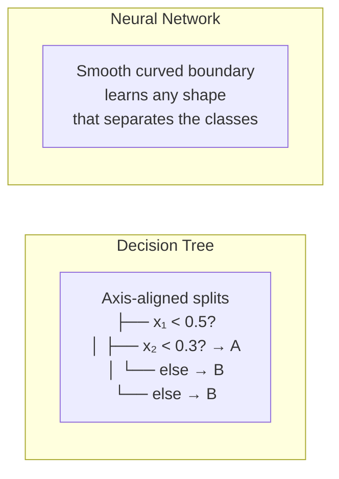
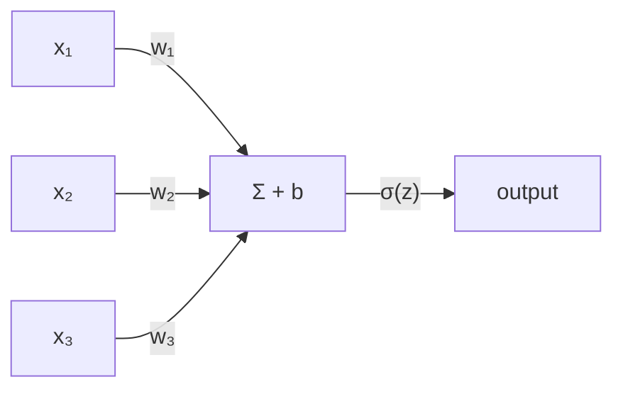

<!-- last-reviewed: 2026-02-26 -->
# Assignment 3b: Neural Network from Scratch

|                    |                                                                    |
| ------------------ | ------------------------------------------------------------------ |
| **Author**         | Robert Frenken                                                     |
| **Estimated time** | 5--7 hours                                                         |
| **Prerequisites**  | Assignment 2a completed (pandas, sklearn basics), numpy            |

---

## What You'll Build

A neural network from scratch using only numpy — no PyTorch, no TensorFlow. You'll implement forward propagation, backpropagation, and a training loop to classify a non-linear dataset. By the end you'll understand what's happening inside frameworks like PyTorch before you start using them.

---

## Part 0: Setup

### 0.1 Create a GitHub Repository

1. Go to [github.com/new](https://github.com/new)
2. Repository name: `nn-from-scratch`
3. Set to **Public**, check **"Add a README"**, add a **Python `.gitignore`**
4. Clone it:

```bash
git clone git@github.com:YOURUSERNAME/nn-from-scratch.git
cd nn-from-scratch
```

### 0.2 Set Up Your Environment

=== "uv (recommended)"

    ```bash
    uv venv
    source .venv/bin/activate   # Windows Git Bash: source .venv/Scripts/activate
    uv pip install numpy matplotlib scikit-learn jupyter
    ```

=== "pip"

    ```bash
    python -m venv .venv
    source .venv/bin/activate   # Windows Git Bash: source .venv/Scripts/activate
    pip install numpy matplotlib scikit-learn jupyter
    ```

### 0.3 Create Your Notebook

```bash
mkdir notebooks
jupyter notebook
```

Create a new notebook at `notebooks/nn_from_scratch.ipynb`. All code in this assignment goes in this notebook.

---

## Part 1: Why Neural Networks?

Machine learning models differ in their **inductive biases** — the assumptions they make about the data. A decision tree splits the feature space along axis-aligned boundaries. A neural network learns smooth, curved boundaries that can fit complex patterns.



To see this difference concretely, let's create a baseline using a dataset that decision trees struggle with.

### Hands-on: decision tree baseline

```python
import numpy as np
import matplotlib.pyplot as plt
from sklearn.datasets import make_moons
from sklearn.tree import DecisionTreeClassifier

# Generate the dataset
X, y = make_moons(n_samples=500, noise=0.2, random_state=42)

# Plot the raw data
plt.figure(figsize=(8, 6))
plt.scatter(X[y == 0, 0], X[y == 0, 1], c='steelblue', label='Class 0', alpha=0.6)
plt.scatter(X[y == 1, 0], X[y == 1, 1], c='coral', label='Class 1', alpha=0.6)
plt.title('make_moons Dataset (n=500, noise=0.2)')
plt.xlabel('x₁')
plt.ylabel('x₂')
plt.legend()
plt.show()
```

Now train a decision tree and plot its decision boundary:

```python
def plot_decision_boundary(model_predict, X, y, title, ax=None):
    """Plot the decision boundary of a classifier."""
    if ax is None:
        fig, ax = plt.subplots(figsize=(8, 6))
    x_min, x_max = X[:, 0].min() - 0.5, X[:, 0].max() + 0.5
    y_min, y_max = X[:, 1].min() - 0.5, X[:, 1].max() + 0.5
    xx, yy = np.meshgrid(np.linspace(x_min, x_max, 200),
                         np.linspace(y_min, y_max, 200))
    grid = np.c_[xx.ravel(), yy.ravel()]
    Z = model_predict(grid).reshape(xx.shape)

    ax.contourf(xx, yy, Z, alpha=0.3, cmap='coolwarm')
    ax.scatter(X[y == 0, 0], X[y == 0, 1], c='steelblue', label='Class 0', alpha=0.6)
    ax.scatter(X[y == 1, 0], X[y == 1, 1], c='coral', label='Class 1', alpha=0.6)
    ax.set_title(title)
    ax.set_xlabel('x₁')
    ax.set_ylabel('x₂')
    ax.legend()

# Train and plot decision tree
dt = DecisionTreeClassifier(max_depth=5, random_state=42)
dt.fit(X, y)
plot_decision_boundary(dt.predict, X, y, 'Decision Tree (max_depth=5)')
plt.show()
```

Notice the blocky, staircase-like boundary. By the end of this assignment, your neural network will draw a smooth curve instead.

---

## Part 2: The Building Blocks

### What is a neuron?

A single neuron computes a **weighted sum** of its inputs, adds a **bias**, and passes the result through an **activation function**:



$$z = w_1 x_1 + w_2 x_2 + w_3 x_3 + b$$
$$\text{output} = \sigma(z)$$

### Why activation functions?

Without an activation function, stacking layers doesn't help. Two linear transformations in a row collapse into a single linear transformation:

$$W_2(W_1 x + b_1) + b_2 = (W_2 W_1)x + (W_2 b_1 + b_2) = W' x + b'$$

The activation function introduces **non-linearity**, which is what lets neural networks learn curved decision boundaries.

### Implement sigmoid

The **sigmoid** function squashes any input to the range (0, 1) — useful for binary classification:

```python
def sigmoid(z):
    """Sigmoid activation function."""
    return 1 / (1 + np.exp(-z))

def sigmoid_derivative(a):
    """Derivative of sigmoid, given the sigmoid output a = sigmoid(z)."""
    return a * (1 - a)
```

Test it:

```python
z = np.array([-5, -1, 0, 1, 5])
print(f"sigmoid({z}) = {sigmoid(z).round(4)}")
# Expected: [0.0067, 0.2689, 0.5, 0.7311, 0.9933]
```

!!! question "Reflection"
    If you stack two linear layers (no activation), what single operation is the result equivalent to? Why does this mean linear layers alone can't learn the moon-shaped boundary?

---

## Part 3: Forward Pass

We'll build a network with this architecture:

- **Input layer:** 2 neurons (x₁, x₂ — the two features of `make_moons`)
- **Hidden layer:** 8 neurons with sigmoid activation
- **Output layer:** 1 neuron with sigmoid activation (binary classification)

### Initialize weights

```python
np.random.seed(42)

# Shapes: (rows = inputs from previous layer, cols = neurons in this layer)
W1 = np.random.randn(2, 8) * 0.5   # (2 inputs, 8 hidden) → shape (2, 8)
b1 = np.zeros((1, 8))               # (1, 8)

W2 = np.random.randn(8, 1) * 0.5   # (8 hidden, 1 output) → shape (8, 1)
b2 = np.zeros((1, 1))               # (1, 1)

print(f"W1 shape: {W1.shape}")  # (2, 8)
print(f"b1 shape: {b1.shape}")  # (1, 8)
print(f"W2 shape: {W2.shape}")  # (8, 1)
print(f"b2 shape: {b2.shape}")  # (1, 1)
```

### Implement forward pass

```python
def forward(X, W1, b1, W2, b2):
    """
    Forward pass through the network.

    X shape:  (n_samples, 2)
    Z1 shape: (n_samples, 8)  — hidden layer pre-activation
    A1 shape: (n_samples, 8)  — hidden layer post-activation
    Z2 shape: (n_samples, 1)  — output pre-activation
    A2 shape: (n_samples, 1)  — output (prediction)
    """
    Z1 = X @ W1 + b1            # (n, 2) @ (2, 8) + (1, 8) = (n, 8)
    A1 = sigmoid(Z1)            # (n, 8)

    Z2 = A1 @ W2 + b2           # (n, 8) @ (8, 1) + (1, 1) = (n, 1)
    A2 = sigmoid(Z2)            # (n, 1)

    return Z1, A1, Z2, A2

# Test with a few samples
Z1, A1, Z2, A2 = forward(X[:5], W1, b1, W2, b2)
print(f"Predictions for first 5 samples: {A2.flatten().round(4)}")
print(f"Actual labels:                   {y[:5]}")
```

The predictions are random right now — the network hasn't learned anything yet.

!!! question "Reflection"
    Why do we initialize weights randomly instead of setting them all to zero? (Hint: consider what happens during backpropagation if all neurons in a layer start with identical weights.)

---

## Part 4: Loss and Backpropagation

### Binary cross-entropy loss

The loss function measures how wrong our predictions are. For binary classification, we use **binary cross-entropy**:

$$\mathcal{L} = -\frac{1}{n}\sum_{i=1}^{n}\left[y_i \log(\hat{y}_i) + (1 - y_i)\log(1 - \hat{y}_i)\right]$$

```python
def compute_loss(y_true, y_pred):
    """Binary cross-entropy loss."""
    n = y_true.shape[0]
    # Clip predictions to avoid log(0)
    y_pred = np.clip(y_pred, 1e-8, 1 - 1e-8)
    loss = -np.mean(y_true * np.log(y_pred) + (1 - y_true) * np.log(1 - y_pred))
    return loss
```

### Backpropagation

Backpropagation computes **how much each weight contributed to the error**, then adjusts weights proportionally. It's the chain rule from calculus applied repeatedly.

!!! info "Don't memorize the formulas"
    The goal is seeing that backprop is **mechanical** — you compute the output error, then propagate it backward through each layer. PyTorch's `loss.backward()` does exactly this, automatically.

```python
def backward(X, y_true, Z1, A1, Z2, A2, W1, b1, W2, b2):
    """
    Backward pass — compute gradients for all weights and biases.

    Returns gradients: dW1, db1, dW2, db2
    """
    n = X.shape[0]
    y_true = y_true.reshape(-1, 1)    # (n, 1)

    # Output layer error
    dZ2 = A2 - y_true                  # (n, 1) — how wrong is each prediction?

    # Gradients for W2, b2
    dW2 = (A1.T @ dZ2) / n             # (8, 1) — average gradient across samples
    db2 = np.sum(dZ2, axis=0, keepdims=True) / n  # (1, 1)

    # Propagate error back to hidden layer
    dA1 = dZ2 @ W2.T                   # (n, 8)
    dZ1 = dA1 * sigmoid_derivative(A1) # (n, 8) — chain rule with activation

    # Gradients for W1, b1
    dW1 = (X.T @ dZ1) / n              # (2, 8)
    db1 = np.sum(dZ1, axis=0, keepdims=True) / n  # (1, 8)

    return dW1, db1, dW2, db2
```

---

## Part 5: Training Loop

Now we put it all together: forward pass → compute loss → backward pass → update weights. This cycle repeats for many **epochs** (passes through the data).

```python
# Hyperparameters
learning_rate = 0.5
epochs = 1000

# Re-initialize weights
np.random.seed(42)
W1 = np.random.randn(2, 8) * 0.5
b1 = np.zeros((1, 8))
W2 = np.random.randn(8, 1) * 0.5
b2 = np.zeros((1, 1))

# Track loss for plotting
losses = []

for epoch in range(epochs):
    # Forward
    Z1, A1, Z2, A2 = forward(X, W1, b1, W2, b2)

    # Loss
    loss = compute_loss(y, A2)
    losses.append(loss)

    # Backward
    dW1, db1, dW2, db2 = backward(X, y, Z1, A1, Z2, A2, W1, b1, W2, b2)

    # Update weights (gradient descent)
    W1 -= learning_rate * dW1
    b1 -= learning_rate * db1
    W2 -= learning_rate * dW2
    b2 -= learning_rate * db2

    if epoch % 100 == 0:
        accuracy = np.mean((A2.flatten() > 0.5) == y)
        print(f"Epoch {epoch:4d} | Loss: {loss:.4f} | Accuracy: {accuracy:.3f}")

print(f"\nFinal — Loss: {losses[-1]:.4f} | Accuracy: {np.mean((A2.flatten() > 0.5) == y):.3f}")
```

### Plot the loss curve

```python
plt.figure(figsize=(8, 5))
plt.plot(losses)
plt.title('Training Loss Over Time')
plt.xlabel('Epoch')
plt.ylabel('Binary Cross-Entropy Loss')
plt.grid(True, alpha=0.3)
plt.show()
```

The loss should decrease smoothly — if it doesn't, something is wrong with the gradient computation.

### Compare decision boundaries

```python
def nn_predict(X_input):
    """Predict using our trained neural network."""
    _, _, _, A2 = forward(X_input, W1, b1, W2, b2)
    return (A2.flatten() > 0.5).astype(int)

fig, axes = plt.subplots(1, 2, figsize=(16, 6))

# Decision tree
plot_decision_boundary(dt.predict, X, y, 'Decision Tree (max_depth=5)', ax=axes[0])

# Neural network
plot_decision_boundary(nn_predict, X, y, 'Neural Network (2→8→1)', ax=axes[1])

plt.tight_layout()
plt.show()
```

!!! tip "Side-by-side comparison"
    The decision tree's boundary is blocky and axis-aligned. The neural network's boundary is smooth and follows the shape of the moons. This is the power of learning continuous, non-linear functions.

### Experiment with hyperparameters

Try different configurations and observe the effects:

| Hidden size | Learning rate | Expected behavior |
|:-----------:|:------------:|-------------------|
| 4 | 0.5 | Simpler boundary, may underfit |
| 8 | 0.5 | Good fit (baseline) |
| 16 | 0.5 | More complex boundary, may overfit on noisy points |
| 8 | 0.1 | Slower convergence, may need more epochs |
| 8 | 1.0 | Faster convergence, risk of instability |

Modify the hidden layer size by changing the shapes of `W1` (second dim) and `W2` (first dim). Run each experiment and save the decision boundary plots.

---

## Part 6: Connecting to the Real World

### What PyTorch adds

You just implemented everything manually. In practice, PyTorch handles the tedious parts:

- **Autograd:** Automatic gradient computation — no hand-written `backward()` function
- **GPU acceleration:** Move tensors to GPU with `.cuda()` for massive speedups
- **Optimizers:** Adam, SGD with momentum, learning rate schedulers
- **Pre-built layers:** `nn.Linear`, `nn.ReLU`, `nn.BatchNorm1d`, and hundreds more
- **Datasets/DataLoaders:** Efficient batching, shuffling, and parallel data loading

### The sklearn shortcut

Scikit-learn's `MLPClassifier` does everything you just built — in 4 lines:

```python
from sklearn.neural_network import MLPClassifier

mlp = MLPClassifier(hidden_layer_sizes=(8,), activation='logistic',
                    max_iter=1000, random_state=42)
mlp.fit(X, y)
print(f"sklearn MLP accuracy: {mlp.score(X, y):.3f}")
```

The value of this assignment isn't the code — it's understanding what those 4 lines are doing under the hood.

For setting up PyTorch on OSC, see the [PyTorch & GPU Setup](../ml-workflows/pytorch-setup.md) guide.

!!! question "Reflection"
    When you call `loss.backward()` in PyTorch, what is it doing? How does it relate to the `backward()` function you wrote in Part 4?

---

## Part 7: Publish

Convert your notebook into a Quarto blog post on your personal website. Your post should include:

1. The decision boundary comparison (decision tree vs neural network)
2. Your loss curve
3. A brief explanation of what surprised you or what you learned

Add it to your Quarto blog and push to GitHub Pages.

---

## Final Deliverables

- [ ] Decision tree baseline plot from Part 1
- [ ] Working `forward()` and `backward()` functions that produce decreasing loss
- [ ] Loss curve plot from Part 5
- [ ] Side-by-side decision boundary comparison (decision tree vs neural network)
- [ ] Results from at least 3 hyperparameter experiments (Part 5 table)
- [ ] Three reflection question answers (Parts 2, 3, and 6)
- [ ] Blog post URL from Part 7

---

## Troubleshooting

| Problem | Cause | Fix |
|---------|-------|-----|
| Loss is `nan` | Learning rate too high — weights explode | Reduce learning rate (try 0.1 or 0.01) |
| Loss not decreasing | Bug in the backward pass or weight update | Check gradient shapes match weight shapes. Verify the sign: `W -= lr * dW` (subtract, not add) |
| Decision boundary is a straight line | Hidden layer too small or not enough epochs | Try 8+ hidden neurons and 1000+ epochs |
| `ValueError: shapes not aligned` | Matrix dimension mismatch | Print shapes at each step: `X (n,2) @ W1 (2,8) → (n,8)`. The inner dimensions must match |
| Sigmoid overflow warning | Very large values of `z` in `np.exp(-z)` | This is usually harmless. If it causes `nan`, clip inputs: `z = np.clip(z, -500, 500)` before sigmoid |

---

## Sources

- [Neural Networks and Deep Learning](http://neuralnetworksanddeeplearning.com/) — Michael Nielsen, 2015
- [3Blue1Brown Neural Networks series](https://www.3blue1brown.com/topics/neural-networks) — Grant Sanderson, 2017
- [CS231n: Convolutional Neural Networks for Visual Recognition](https://cs231n.github.io/) — Stanford University
- [scikit-learn classifier comparison](https://scikit-learn.org/stable/auto_examples/classification/plot_classifier_comparison.html) — decision boundary plotting reference
