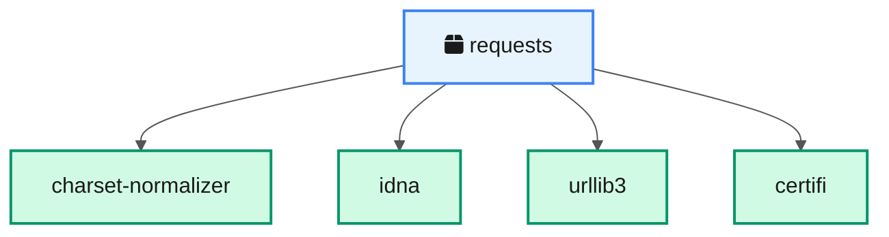
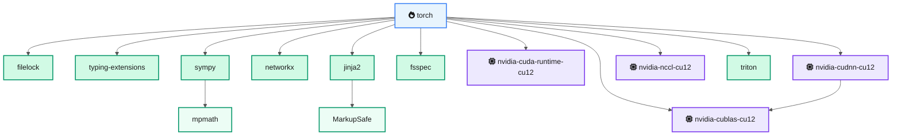
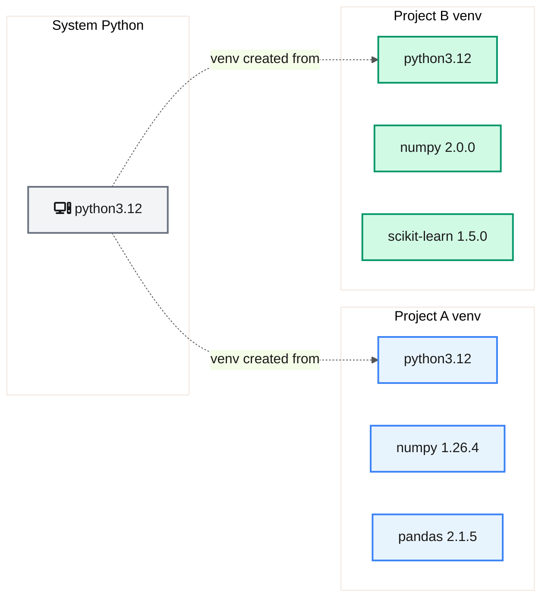

<!-- last-reviewed: 2026-02-26 -->
# Assignment 3a: Package Management Concepts

|                    |                                                              |
| ------------------ | ------------------------------------------------------------ |
| **Author**         | Robert Frenken                                               |
| **Estimated time** | 3--4 hours                                                   |
| **Prerequisites**  | Assignment 1 completed, Python basics                        |

---

## What You'll Learn

Why package management exists, how dependency resolution works, and when to use pip vs conda vs uv. By the end you'll be able to create reproducible Python environments for any project.

---

## Part 0: What is a Package?

Python's **standard library** ships with the language — modules like `os`, `json`, `math`, and `pathlib` are always available. But most real projects need **third-party packages** from [PyPI](https://pypi.org/) (the Python Package Index), a public repository of over 500,000 packages.

When you run `pip install requests`, pip:

1. Queries PyPI for the `requests` package
2. Downloads a **wheel** (`.whl`) — a pre-built archive of Python code
3. Installs it into your environment's `site-packages/` directory
4. Resolves and installs any **dependencies** that `requests` itself needs

### Task

Create and activate a fresh virtual environment, then count what's already installed:

```bash
python -m venv scratch-env
source scratch-env/bin/activate   # Windows Git Bash: source scratch-env/Scripts/activate
pip list
```

You should see only `pip` and `setuptools` — a clean slate. Now install one package and count again:

```bash
pip install requests
pip list
```

!!! question "How many packages are installed now?"
    You asked for 1 package but got several. Where did the extras come from? Keep this question in mind as you continue.

When you're done exploring, deactivate and delete the scratch environment:

```bash
deactivate
rm -rf scratch-env
```

---

## Part 1: Why Package Management Matters

### The dependency chain problem

When you install a package, it brings its own dependencies — and those dependencies have dependencies too. This is called a **dependency tree**.

Here's what happens when you install `requests`:



Four dependencies — manageable. Now look at what happens with a large ML framework like PyTorch:



One `pip install torch` pulls in **14+ packages** including GPU libraries, a symbolic math engine, and a template language. Every one of those packages has its own version requirements, and they all have to be compatible with each other.

### Why this matters

Imagine Project A needs `numpy==1.26.4` and Project B needs `numpy==2.0.0`. If both are installed into the same Python environment, one project breaks. This is the **version conflict problem**, and it's the core reason package management tools exist.

!!! question "Reflection"
    What could go wrong if two projects share a single Python installation and one of them upgrades a shared dependency?

---

## Part 2: Virtual Environments

A **virtual environment** (venv) is an isolated Python installation. Each venv has its own `site-packages/` directory, so packages installed in one venv don't affect another.



Each project gets exactly the versions it needs. No conflicts.

### Hands-on: prove isolation works

Create two virtual environments with different numpy versions:

```bash
# Environment 1: numpy 1.x
python -m venv env-numpy1
source env-numpy1/bin/activate
pip install "numpy>=1.26,<2"
python -c "import numpy; print(f'env-numpy1: numpy {numpy.__version__}')"
deactivate

# Environment 2: numpy 2.x
python -m venv env-numpy2
source env-numpy2/bin/activate
pip install "numpy>=2.0,<3"
python -c "import numpy; print(f'env-numpy2: numpy {numpy.__version__}')"
deactivate
```

Verify that each environment has its own version. Then clean up:

```bash
rm -rf env-numpy1 env-numpy2
```

!!! question "Reflection"
    Why not install everything into the system Python? What problems would that cause on a shared system like OSC where multiple users and projects coexist?

---

## Part 3: Package Managers Compared

The lab uses three package managers. Each has different strengths:

| Feature | pip | conda | uv |
|---------|-----|-------|----|
| **Source** | PyPI (Python packages) | conda-forge / Anaconda (any language) | PyPI (Python packages) |
| **Speed** | Moderate | Slow | Very fast (10--100x pip) |
| **Resolver** | Backtracking (since pip 20.3) | SAT solver | SAT solver |
| **Lock files** | No built-in (`pip freeze` is approximate) | `environment.yml` (not locked) | `uv.lock` (deterministic) |
| **Non-Python packages** | No | Yes (CUDA, MKL, compilers) | No |
| **Lab usage** | Legacy projects, quick installs | CUDA toolkit, complex C dependencies | New projects, daily development |

### When to use each

- **uv** — Default choice for new projects. Fast, deterministic, excellent error messages.
- **conda** — When you need non-Python dependencies (CUDA, MKL, system libraries) that aren't available as pip wheels.
- **pip** — When a package is only on PyPI and not on conda-forge.

For details on how we use these on OSC, see the [Environment Management](../working-on-osc/osc-environment-management.md) guide and the [Python Environment Setup](../getting-started/python-environment-setup.md) guide.

### Hands-on: compare pip and uv speed

Install the same set of packages with pip and uv, and compare the time:

```bash
# Time pip
python -m venv pip-test
source pip-test/bin/activate
time pip install requests flask pandas numpy
deactivate
rm -rf pip-test

# Time uv (install uv first if needed: curl -LsSf https://astral.sh/uv/install.sh | sh)
uv venv uv-test
source uv-test/bin/activate
time uv pip install requests flask pandas numpy
deactivate
rm -rf uv-test
```

!!! question "Reflection"
    Conda can install non-Python packages like CUDA libraries. Why is this useful? When would pip or uv alone not be enough?

---

## Part 4: Requirements Files

A **requirements file** records exactly which packages (and versions) a project needs, so anyone can recreate the environment.

### Two approaches

**`pip freeze`** — captures everything currently installed, including transitive dependencies:

```bash
pip freeze > requirements.txt
# Output includes every package with exact versions:
# certifi==2024.8.30
# charset-normalizer==3.4.0
# idna==3.10
# requests==2.32.3
# urllib3==2.2.3
```

**Hand-curated** — list only your direct dependencies with version ranges:

```text
# requirements.txt (hand-curated)
requests>=2.31,<3
flask>=3.0,<4
pandas>=2.1,<3
```

The hand-curated approach is easier to maintain — you only list what you directly use. But it's less reproducible because transitive dependency versions can drift.

### Lock files: the best of both worlds

A **lock file** pins every dependency (direct and transitive) to exact versions, generated from your hand-curated requirements:

```mermaid
%%{init: {'theme': 'base', 'themeVariables': {'primaryColor': '#e8f4fd', 'primaryTextColor': '#1a1a1a', 'lineColor': '#555'}}}%%
graph LR
    A@{ shape: doc, label: "fa:fa-file-lines requirements.txt<br/>(what you want)" }:::decision -->|"uv pip compile"| B@{ shape: doc, label: "fa:fa-lock requirements.lock<br/>(exact versions)" }:::data
    B -->|"uv pip install -r"| C(["fa:fa-check Reproducible<br/>environment"]):::success

    classDef decision fill:#fef3c7,stroke:#d97706,color:#1a1a1a,stroke-width:2px
    classDef data fill:#d1fae5,stroke:#059669,color:#1a1a1a,stroke-width:2px
    classDef success fill:#d1fae5,stroke:#059669,color:#1a1a1a,stroke-width:2px
```

```bash
# Create a hand-curated requirements.txt first, then:
uv pip compile requirements.txt -o requirements.lock
uv pip install -r requirements.lock
```

### Hands-on: create and use a requirements file

1. Create a virtual environment and install some packages:

    ```bash
    uv venv req-test
    source req-test/bin/activate
    uv pip install requests pandas matplotlib
    ```

2. Generate a requirements file:

    ```bash
    pip freeze > requirements.txt
    cat requirements.txt
    ```

3. Test that it works — create a fresh environment and install from the file:

    ```bash
    deactivate
    uv venv req-verify
    source req-verify/bin/activate
    uv pip install -r requirements.txt
    python -c "import requests, pandas, matplotlib; print('All packages installed successfully')"
    ```

4. Clean up:

    ```bash
    deactivate
    rm -rf req-test req-verify requirements.txt
    ```

---

## Part 5: Publish

Write a short blog post on your Quarto website explaining **one concept** from this assignment. Pick the topic that surprised you most or that you think would be most useful to a classmate. Ideas:

- Why virtual environments exist (and what goes wrong without them)
- How dependency trees work — with your own diagram
- pip vs conda vs uv — which to use when

Your post should include at least one code example or diagram. Add it to your Quarto blog and push to GitHub Pages.

---

## Final Deliverables

- [ ] Screenshot of `pip list` from Part 0 showing installed packages after `pip install requests`
- [ ] Screenshots showing different numpy versions in two separate venvs (Part 2)
- [ ] Terminal output comparing pip vs uv install times (Part 3)
- [ ] Contents of your `requirements.txt` from Part 4
- [ ] Three reflection question answers (Parts 1, 2, and 3)
- [ ] Blog post URL from Part 5

---

## Troubleshooting

| Problem | Cause | Fix |
|---------|-------|-----|
| `error: externally-managed-environment` | System Python is locked down (common on Ubuntu 23.04+, OSC) | Use a virtual environment — `python -m venv .venv && source .venv/bin/activate` |
| `pip: command not found` after activating venv | venv was created without pip, or activation failed | Recreate with `python -m venv --clear .venv` or use `uv venv` |
| `ResolutionImpossible` or version conflict | Two packages need incompatible versions of a shared dependency | Read the error to find the conflicting package. Try relaxing version pins or check if a newer version resolves the conflict |
| `uv: command not found` | uv is not installed | Install with `curl -LsSf https://astral.sh/uv/install.sh \| sh` then restart your terminal |

---

## Sources

- [Python Packaging User Guide](https://packaging.python.org/) — PyPA (Python Packaging Authority)
- [uv documentation](https://docs.astral.sh/uv/) — Astral
- [Conda documentation](https://docs.conda.io/) — Anaconda, Inc.
