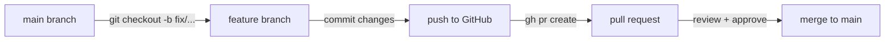

<!-- last-reviewed: 2026-02-26 -->
# Issues, Pull Requests & Code Review

|                    |                                                           |
| ------------------ | --------------------------------------------------------- |
| **Audience**       | All lab members                                           |
| **Prerequisites**  | GitHub account, `gh` CLI installed, basic Git ([clone, commit, push](../github/git-fundamentals.md)) |

---

## Why This Matters

Issues and pull requests (PRs) are how open-source projects and research teams track work and review changes. Even if you never contribute to someone else's project, understanding this workflow makes your own research more reproducible and your collaboration with labmates smoother.

This page covers two scenarios:

1. **Filing issues on external projects** — reporting bugs you find in libraries like PyTorch, Mosaic, or Quarto
2. **The branch → PR → review workflow** — how we collaborate on lab repos

---

## Part 1: Filing Issues

An issue is a structured bug report or feature request. Good issues get fast responses; vague ones get ignored.

### Anatomy of a Good Issue

Every issue has a **title** and a **body** (markdown). The body should answer three questions:

1. **What happened?** — The exact error message and where it occurred
2. **How can someone reproduce it?** — Minimal code that triggers the bug
3. **What should happen instead?** — The expected behavior or a suggested fix

### Writing a Bug Report

=== "Template"

    ```markdown
    ## Summary
    One sentence describing the bug.

    ## Reproduction
    Minimal code or steps to trigger the issue.

    ```javascript
    // example code that breaks
    ```

    **Environment:** Library version, browser/OS, runtime (Node, Quarto, etc.)

    **Error message:**
    ```
    Paste the exact error from the console/terminal
    ```

    ## Expected Behavior
    What should happen instead.

    ## Suggested Fix (optional)
    If you found a workaround or know the root cause, include it.
    ```

=== "Real Example"

    ```markdown
    ## Summary
    `wasmConnector()` returns a Promise in v0.18.0+, but the Get Started
    docs show synchronous usage, causing `TypeError: t.addEventListener
    is not a function`.

    ## Reproduction
    **Environment:** Quarto 1.6, `@uwdata/vgplot@0.21.1` via jsDelivr CDN

    ```javascript
    vg = {
      const mod = await import("https://cdn.jsdelivr.net/.../+esm");
      await mod.coordinator().databaseConnector(mod.wasmConnector());
      return mod;
    }
    ```

    **Error in browser console:**
    ```
    TypeError: t.addEventListener is not a function
    ```

    ## Working Fix
    Await `wasmConnector()` separately:
    ```javascript
    const wasm = await mod.wasmConnector();
    mod.coordinator().databaseConnector(wasm);
    ```

    ## Suggested Doc Fix
    The Get Started page should show `wasmConnector()` as async.
    ```

!!! tip "Include a fix if you have one"
    Maintainers are more likely to act quickly on issues that include a working solution. Even if you're not sure it's the *right* fix, showing what worked for you is extremely helpful.

### Filing with the `gh` CLI

```bash
# File an issue on an external project
gh issue create --repo uwdata/mosaic \
  --title "Docs: wasmConnector() requires await in v0.18.0+" \
  --body "$(cat <<'EOF'
## Summary
...your issue body here...
EOF
)"

# File an issue on a lab repo
gh issue create --repo OSU-CAR-MSL/KD-GAT \
  --title "Bug: training curves export missing temporal runs" \
  --label bug
```

=== "CLI"

    ```bash
    # Interactive mode (prompts for title, body, labels)
    gh issue create --repo owner/repo

    # From a markdown file (useful for longer issues)
    gh issue create --repo owner/repo \
      --title "Your title" \
      --body-file issue_draft.md
    ```

=== "Web UI"

    1. Go to the repository on GitHub
    2. Click the **Issues** tab
    3. Click **New issue**
    4. If the repo has templates, choose the appropriate one
    5. Fill in the title and body, then click **Submit new issue**

### Issue Etiquette for External Projects

- **Search first** — check if someone already reported the same issue
- **Be specific** — "it doesn't work" is not useful; include versions, error messages, and reproduction steps
- **Be respectful** — maintainers are often volunteers; thank them for their work
- **Stay on topic** — one bug per issue; don't bundle unrelated problems
- **Follow up** — if the maintainer asks for more info, respond promptly

!!! warning "Don't file issues for usage questions"
    Most projects have a **Discussions** tab or community forum for "how do I..." questions. Issues are for bugs and feature requests. Filing usage questions as issues clutters the tracker and annoys maintainers.

### Viewing and Managing Issues

```bash
# List open issues on a repo
gh issue list --repo owner/repo

# View a specific issue
gh issue view 42 --repo owner/repo

# Search across repos
gh search issues "wasmConnector" --repo uwdata/mosaic

# Close an issue you filed
gh issue close 42 --repo owner/repo
```

---

## Part 2: Pull Requests

A pull request proposes changes from your branch to the main branch. It's both a code review mechanism and an audit trail of what changed and why.

### The Branch Workflow



### Step by Step

#### 1. Create a Branch

Always work on a branch, never directly on `main`.

```bash
# Start from up-to-date main
git checkout main
git pull

# Create a descriptive branch
git checkout -b fix/wasm-connector-await

# Branch naming conventions:
#   fix/short-description     — bug fixes
#   feat/short-description    — new features
#   docs/short-description    — documentation changes
#   refactor/short-description — code restructuring
```

#### 2. Make Your Changes and Commit

```bash
# Stage specific files (not git add -A)
git add reports/paper/_setup.qmd reports/dashboard.qmd

# Commit with a clear message
git commit -m "Fix wasmConnector() async initialization

wasmConnector() returns a Promise in vgplot v0.18.0+.
The old pattern passed the unresolved Promise to databaseConnector(),
causing 'TypeError: t.addEventListener is not a function'.

Fixes #42"
```

!!! tip "Commit message format"
    - **First line:** imperative mood, under 72 characters ("Fix bug", not "Fixed bug" or "Fixes bug")
    - **Body:** explain *why*, not *what* (the diff shows what changed)
    - **Footer:** reference issues with `Fixes #N` for auto-close on merge

#### 3. Push and Create the PR

```bash
# Push the branch (first time: -u sets upstream tracking)
git push -u origin fix/wasm-connector-await

# Create the pull request
gh pr create \
  --title "Fix wasmConnector() async initialization" \
  --body "$(cat <<'EOF'
## Summary
- Await `wasmConnector()` before passing to `databaseConnector()`
- Fixes TypeError in all 4 Mosaic setup files

## Related Issues
Fixes #42

## Test Plan
- [ ] `quarto preview reports/` renders without console errors
- [ ] Dashboard loads Parquet data correctly
- [ ] Paper chapter figures display
EOF
)"
```

The CLI prints a URL — share it with your reviewer or labmate.

#### 4. Respond to Review Feedback

Reviewers may leave comments requesting changes. To address them:

```bash
# Make the requested changes on your branch
git add <changed-files>
git commit -m "Address review: add null guard for empty query results"
git push
```

The PR updates automatically when you push to the same branch.

#### 5. Merge

Once approved, merge via CLI or the green button on GitHub:

=== "CLI"

    ```bash
    # Squash merge (combines all commits into one clean commit)
    gh pr merge --squash

    # Regular merge (preserves commit history)
    gh pr merge --merge

    # Clean up local branch after merge
    git checkout main
    git pull
    git branch -d fix/wasm-connector-await
    ```

=== "Web UI"

    1. Click **Merge pull request** (or **Squash and merge**)
    2. Confirm the merge
    3. Click **Delete branch** when prompted

!!! info "Squash vs merge"
    **Squash merge** combines all your branch commits into a single commit on main. This keeps the main branch history clean. Use this for most PRs. **Regular merge** preserves the full commit history — use this for large features where individual commits tell a meaningful story.

---

## Part 3: Code Review

Code review catches bugs, shares knowledge, and maintains quality. Even in a small lab, reviewing each other's work improves everyone's code.

### As a Reviewer

```bash
# List PRs waiting for review
gh pr list --repo OSU-CAR-MSL/KD-GAT

# Check out the PR locally to test it
gh pr checkout 15

# Leave a review
gh pr review 15 --approve
gh pr review 15 --request-changes --body "Need to handle the empty array case"
gh pr review 15 --comment --body "Looks good, minor suggestion on line 42"
```

### What to Look For

| Check | What to Ask |
|-------|------------|
| **Correctness** | Does the code do what the PR says it does? |
| **Edge cases** | What happens with empty data, null values, missing files? |
| **Style** | Does it match the existing codebase patterns? |
| **Tests** | Are new behaviors covered? Do existing tests still pass? |
| **Scope** | Does the PR do only what it claims? No unrelated changes? |

### Review Etiquette

- **Be specific** — "this might break if X is empty" is better than "this seems wrong"
- **Suggest, don't demand** — use "consider..." or "what about..." phrasing
- **Separate nits from blockers** — prefix minor style comments with "nit:" so the author knows what's critical
- **Approve when it's good enough** — don't block on perfection

---

## Part 4: Contributing to External Projects

When you find and fix a bug in an open-source library, you can contribute the fix back. This is the standard open-source workflow.

### Fork → Branch → PR

```bash
# 1. Fork the repo (creates your copy on GitHub)
gh repo fork uwdata/mosaic --clone

# 2. Create a branch for your fix
cd mosaic
git checkout -b fix/wasm-connector-docs

# 3. Make changes, commit, push to YOUR fork
git add docs/get-started/index.md
git commit -m "Docs: show wasmConnector() as async in Get Started"
git push -u origin fix/wasm-connector-docs

# 4. Open a PR from your fork to the upstream repo
gh pr create --repo uwdata/mosaic \
  --title "Docs: show wasmConnector() as async in Get Started" \
  --body "..."
```

!!! tip "Start with an issue"
    For non-trivial changes, file an issue first and discuss the approach with maintainers before writing code. This prevents wasted work if they have a different solution in mind.

### Keeping Your Fork Updated

```bash
# Add the original repo as "upstream" (one-time)
git remote add upstream https://github.com/uwdata/mosaic.git

# Sync main with upstream before starting new work
git checkout main
git fetch upstream
git merge upstream/main
git push origin main
```

---

## `gh` CLI Quick Reference

### Issues

```bash
gh issue create --repo owner/repo             # Interactive
gh issue create --repo owner/repo --title "..." --body "..."
gh issue create --repo owner/repo --body-file draft.md --title "..."
gh issue list --repo owner/repo --state open
gh issue view N --repo owner/repo
gh issue close N --repo owner/repo
gh search issues "query" --repo owner/repo
```

### Pull Requests

```bash
gh pr create                                   # Interactive (current branch)
gh pr create --title "..." --body "..."
gh pr list                                     # PRs in current repo
gh pr view N                                   # View PR details
gh pr checkout N                               # Check out PR locally
gh pr diff N                                   # View PR diff
gh pr review N --approve
gh pr review N --request-changes --body "..."
gh pr merge --squash                           # Merge current PR
gh pr close N                                  # Close without merging
```

### Useful Patterns

```bash
# View all PRs you need to review
gh search prs --review-requested=@me --state=open

# See the CI status of a PR
gh pr checks N

# Create a PR and immediately open in browser
gh pr create --title "..." --body "..." --web
```

---

## Common Mistakes

| Mistake | Fix |
|---------|-----|
| Committing directly to `main` | Always create a branch first. Use branch protection rules to enforce this. |
| Huge PRs that change 20 files | Keep PRs small and focused. One logical change per PR. |
| Vague issue titles ("it's broken") | Include the specific error and where it happens |
| Forgetting `Fixes #N` in PR body | Without it, issues don't auto-close on merge |
| Force-pushing after review comments | Reviewers lose track of what changed. Push new commits instead. |
| Not pulling before branching | `git pull` on main first, then create your branch |
| Filing issues without searching first | Use `gh search issues` to check for duplicates |

## Related Guides

- [Git Fundamentals](../github/git-fundamentals.md) — Core Git commands and mental model
- [Git Troubleshooting](../github/git-troubleshooting.md) — Merge conflicts, undoing changes, recovery
- [Contributing Guide](how-this-site-works.md) — How this site works, adding new pages
- [Project Management](github-projects.md) — GitHub Projects boards, workflows, and automation
- [GitHub Pages Setup](github-pages-setup.md) — Setting up MkDocs or Quarto documentation sites
