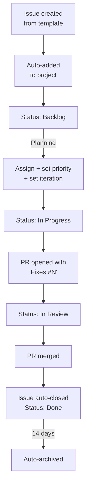

<!-- last-reviewed: 2026-02-26 -->
# Project Management with GitHub Projects

|                    |                                                           |
| ------------------ | --------------------------------------------------------- |
| **Audience**       | All lab members                                           |
| **Prerequisites**  | GitHub account, `gh` CLI installed                        |

---

## What GitHub Projects Is

GitHub Projects (v2) is an integrated planning tool built into GitHub. It connects directly to Issues and Pull Requests across multiple repositories, giving your team a single view of all work.

**Core features:**

- **Three view types** — Table (spreadsheet), Board (kanban), Roadmap (timeline)
- **Cross-repo** — one project spans KD-GAT, lab-setup-guide, Map-Visualizations, and dotfiles
- **Custom fields** — Status, Priority, Size, Iteration, dates, text, numbers (up to 50)
- **Built-in automations** — auto-close on merge, auto-add new issues, auto-archive stale items
- **Two-way sync** — changes in the project reflect on the underlying issues/PRs and vice versa

**What it is NOT:**

- Not a full PM tool like Jira — no dependency graphs, no time tracking, no Gantt editing
- Built-in automations are limited (use GitHub Actions for custom triggers)
- Sub-issues are relatively new and still evolving

---

## Quick Start

### 1. Authenticate the CLI

```bash
# Add the project scope to your GitHub token
gh auth refresh -s project

# Verify
gh auth status
```

### 2. Create a Project

=== "CLI"

    ```bash
    # User-owned project
    gh project create --title "MSL Lab Tracker"

    # Organization-owned project
    gh project create --owner OSU-CAR-MSL --title "MSL Lab Tracker"
    ```

=== "Web UI"

    1. Go to your profile (or org) > **Projects** tab
    2. Click **New project**
    3. Choose a template or start blank
    4. Name it and add a description

### 3. Link Your Repositories

```bash
# Replace N with your project number (shown in the URL)
gh project link N --repo OSU-CAR-MSL/KD-GAT
gh project link N --repo OSU-CAR-MSL/lab-setup-guide
gh project link N --repo OSU-CAR-MSL/Map-Visualizations
```

Once linked, the project appears in each repo's **Projects** tab, and issues can easily be added.

---

## Custom Fields

Every project starts with a **Status** field. Add more to fit your workflow.

### Recommended Fields

| Field | Type | Values | Purpose |
|-------|------|--------|---------|
| **Status** | Single select | `Backlog`, `Todo`, `In Progress`, `In Review`, `Done` | Core workflow |
| **Priority** | Single select | `P0-Critical`, `P1-High`, `P2-Medium`, `P3-Low` | Triage |
| **Size** | Single select | `XS`, `S`, `M`, `L`, `XL` | Rough effort (t-shirt sizing) |
| **Category** | Single select | `Research`, `Engineering`, `Docs`, `DevOps`, `Bug` | Work type |
| **Iteration** | Iteration | 2-week cycles | Sprint planning (optional) |
| **Repository** | Built-in (auto) | — | Which repo the issue belongs to |

```bash
# Create a priority field via CLI
gh project field-create N --owner YOUR_USER \
  --name "Priority" --data-type "SINGLE_SELECT" \
  --single-select-options "P0-Critical,P1-High,P2-Medium,P3-Low"
```

!!! tip "Start minimal"
    Begin with Status + Priority only. Add Size, Category, and Iteration later when you feel the need.

---

## Views

Views are saved configurations of layout, filters, sort order, and grouping. Create multiple views for different purposes.

### Recommended Views

| View | Layout | Filter / Group | Use Case |
|------|--------|----------------|----------|
| **Board** | Board | Group by Status | Daily work — kanban columns |
| **Backlog** | Table | Filter: `status:Backlog` Sort: Priority | Triage and planning |
| **My Work** | Table | Filter: `assignee:@me` | Personal dashboard |
| **By Repo** | Table | Group by Repository | See work distribution across repos |
| **Roadmap** | Roadmap | Group by Iteration | Timeline planning (if using iterations) |

### Filter Syntax

```
# Items assigned to me in the current iteration
iteration:@current assignee:@me

# High priority, not done
priority:P0-Critical,P1-High -status:Done

# Issues from a specific repo
repo:OSU-CAR-MSL/KD-GAT

# Unassigned items (needs triage)
no:assignee
```

---

## Automations

### Built-in Workflows (No Code Required)

Access via project menu > **Workflows**.

| Workflow | What It Does | Default |
|----------|-------------|---------|
| Item closed | Set Status → "Done" | **On** |
| PR merged | Set Status → "Done" | **On** |
| Item added | Set Status → "Todo" | Off |
| Item reopened | Set Status → "Todo" | Off |
| Auto-add | Add new issues/PRs from linked repos | Off |
| Auto-archive | Hide stale "Done" items after N days | Off |

!!! warning "Enable auto-add"
    Turn on the **Auto-add** workflow so new issues from linked repos automatically appear in the project. Without this, you have to add every issue manually.

### GitHub Actions for Custom Automation

For anything beyond built-in workflows, use the official [`actions/add-to-project`](https://github.com/actions/add-to-project) action. Add this to each repo:

```yaml
# .github/workflows/add-to-project.yml
name: Add to project

on:
  issues:
    types: [opened, transferred]
  pull_request:
    types: [opened]

jobs:
  add-to-project:
    runs-on: ubuntu-latest
    steps:
      - uses: actions/add-to-project@v1
        with:
          project-url: https://github.com/users/YOUR_USER/projects/N
          github-token: ${{ secrets.ADD_TO_PROJECT_PAT }}
```

!!! danger "Token requirement"
    The default `GITHUB_TOKEN` **cannot** access Projects. You need a classic Personal Access Token with `repo` + `project` scopes, stored as a repository secret named `ADD_TO_PROJECT_PAT`.

---

## Linking PRs to Issues

Always connect your pull requests to the issues they address. This enables auto-close: when the PR merges, the linked issue closes and the project moves it to "Done."

### Closing Keywords

Use any of these in the PR description:

```
Fixes #42
Closes #42
Resolves #42
```

For cross-repo references:

```
Fixes OSU-CAR-MSL/lab-setup-guide#15
```

### PR Template

Add a template so every PR includes the link by default:

```markdown
<!-- .github/pull_request_template.md -->
## Summary


## Related Issues
Fixes #

## Test Plan

```

!!! tip "Rules for auto-close"
    - The keyword must be in the PR description (not just a commit message)
    - The PR must target the **default branch** (usually `main`)
    - When the PR merges, the linked issue closes automatically

---

## Issue Templates

For hands-on guidance on writing and filing issues, see [Issues, PRs & Code Review](github-issues-and-prs.md). The templates below configure the repo so contributors get a structured form when creating issues.

Create 2–3 templates per repo in `.github/ISSUE_TEMPLATE/`:

=== "Bug Report"

    ```yaml
    # .github/ISSUE_TEMPLATE/bug_report.yml
    name: Bug Report
    description: Report a bug
    labels: ["bug"]
    body:
      - type: textarea
        attributes:
          label: Description
          description: What happened?
        validations:
          required: true
      - type: textarea
        attributes:
          label: Steps to Reproduce
      - type: textarea
        attributes:
          label: Expected Behavior
      - type: textarea
        attributes:
          label: Environment
          description: OS, Python version, PyTorch version, etc.
    ```

=== "Feature Request"

    ```yaml
    # .github/ISSUE_TEMPLATE/feature_request.yml
    name: Feature Request
    description: Suggest a new feature or enhancement
    labels: ["feature"]
    body:
      - type: textarea
        attributes:
          label: Description
          description: What do you want and why?
        validations:
          required: true
      - type: textarea
        attributes:
          label: Proposed Solution
      - type: textarea
        attributes:
          label: Alternatives Considered
    ```

=== "Research Task"

    ```yaml
    # .github/ISSUE_TEMPLATE/research_task.yml
    name: Research Task
    description: Literature review, experiment, or analysis task
    labels: ["research"]
    body:
      - type: textarea
        attributes:
          label: Objective
          description: What question are you trying to answer?
        validations:
          required: true
      - type: textarea
        attributes:
          label: Approach
      - type: textarea
        attributes:
          label: Success Criteria
    ```

---

## Labels Strategy

Keep a small, consistent label set across all repos (8–12 total):

| Label | Description |
|-------|-------------|
| `bug` | Something isn't working |
| `feature` | New functionality |
| `enhancement` | Improvement to existing functionality |
| `docs` | Documentation only |
| `devops` | CI/CD, infrastructure, tooling |
| `research` | Literature review, experiments, analysis |

!!! warning "Don't duplicate labels as project fields"
    Use labels for repo-level metadata visible in issue lists (e.g., `bug`, `docs`). Use project fields for workflow metadata (Priority, Size). Using both for the same concept causes them to drift out of sync.

---

## Milestones vs Iterations

| | Milestones | Iterations |
|---|-----------|------------|
| **Scope** | Single repository | Cross-repo (project-level) |
| **Purpose** | Goal-oriented ("Paper submission", "v1.0") | Time-oriented ("Sprint 5", "Week of Feb 24") |
| **Progress** | Built-in progress bar (% closed) | No built-in progress bar |
| **Where visible** | Issue metadata, repo milestone page | Project views only |

**Recommendation for our lab:**

- Use **milestones** for goal-oriented targets (paper deadlines, release dates)
- Add **iterations** only if you want formal sprint cadence with weekly/biweekly cycles
- For a small team, milestones alone may be enough

---

## The Full Issue Lifecycle



---

## `gh` CLI Cheat Sheet

### Project Operations

```bash
# List your projects
gh project list

# View project in browser
gh project view N --web

# View as JSON (for scripting)
gh project view N --format json
```

### Working with Items

```bash
# List all items
gh project item-list N --format json

# Add an existing issue to the project
gh project item-add N --url https://github.com/user/repo/issues/42

# Create a draft item
gh project item-create N --title "Research: attention mechanisms for CAN data"

# Archive an item
gh project item-archive N --id ITEM_ID

# Show in-progress items with jq
gh project item-list N --format json | \
  jq -r '.items[] | select(.status=="In Progress") | "\(.title) (\(.repository))"'

# Count items by status
gh project item-list N --format json | \
  jq -r '[.items[] | .status] | group_by(.) | map({status: .[0], count: length})'
```

### Bulk Operations

```bash
# Add all open issues from a repo to the project
gh issue list --repo user/repo --state open --json url -q '.[].url' | \
  xargs -I{} gh project item-add N --url {}

# Export project to TSV
gh project item-list N --format json | \
  jq -r '.items[] | [.title, .status, .assignees, .repository] | @tsv'
```

---

## Recommended Rollout

### Phase 1 — Minimal Setup (Week 1)

- [ ] Create one project spanning all lab repos
- [ ] Add Status + Priority fields
- [ ] Enable auto-add and auto-close workflows
- [ ] Create Board and Backlog views
- [ ] Add `actions/add-to-project` workflow to each repo

### Phase 2 — Templates and Process (Week 2–3)

- [ ] Create issue templates (bug, feature, research) in each repo
- [ ] Create PR template with `Fixes #` placeholder
- [ ] Define a small consistent label set across repos
- [ ] Add a "My Work" view

### Phase 3 — Iterate Based on Need (Month 2+)

- [ ] Add iterations if you want sprint-based planning
- [ ] Add Size field if you want effort estimation
- [ ] Add Roadmap view for timeline visualization
- [ ] Configure auto-archive for stale "Done" items

!!! tip "Don't over-engineer"
    The biggest mistake is building a complex system before anyone uses it. Start with Phase 1 and add complexity only when you feel the pain of not having it.

---

## Common Pitfalls

| Pitfall | Fix |
|---------|-----|
| Over-engineering the board before anyone uses it | Start with Status + Priority + 2 views. Add more later. |
| `GITHUB_TOKEN` can't access Projects | Use a classic PAT with `repo` + `project` scopes |
| Draft issues that never become real issues | Convert within a week or delete. Drafts can't link to PRs. |
| PRs don't auto-close issues | Add `Fixes #N` in the PR description, targeting the default branch |
| "Done" items clutter the board | Enable auto-archive (14 days) |
| Labels AND project fields track the same thing | Pick one. Use labels for type (`bug`, `docs`), fields for workflow (`Priority`, `Size`). |
| Large issues stuck "In Progress" for weeks | Break into sub-issues — each completable in 1–3 days |
| Cross-repo work has no linkage | Reference with `org/repo#N` — GitHub renders them as clickable links |

## Related Guides

- [Contributing Guide](how-this-site-works.md) — How this site works, adding new pages
- [Issues, PRs & Code Review](github-issues-and-prs.md) — Filing issues, opening pull requests, and reviewing code
- [GitHub Pages Setup](github-pages-setup.md) — Setting up MkDocs or Quarto documentation sites
