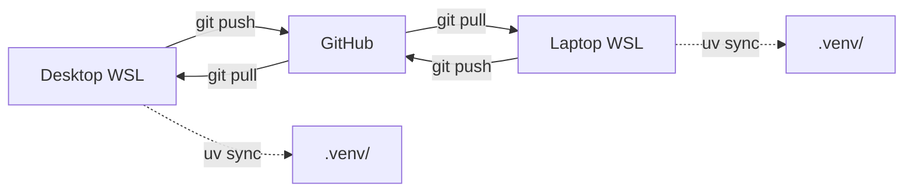

# Python Environment Setup

This guide walks you through setting up Python development environments for lab work. The approach uses **two environments** tuned for different workloads:

| Environment | Where | Package Manager | Use Case |
|-------------|-------|----------------|----------|
| **Local (WSL)** | `~/projects/` on WSL native filesystem | **`uv`** | Docs, light dev, scripting, Claude Code |
| **OSC** | `~/venvs/` on OSC home directory | **`pip` + `venv`** (via `module load`) | ML training, torch-geometric, CUDA workloads |

!!! info "Why different tools for each?"
    **`uv`** is 10-100x faster than pip, manages Python versions, and handles everything you need for local work. On OSC, the `module` system provides pre-built Python, CUDA, and compiler toolchains that `pip` integrates with natively. `uv` would bypass the module system and likely break packages with C extensions like torch-geometric.

---

## Step 1: Move Code to WSL Native Filesystem

If your projects currently live on the Windows filesystem (`/mnt/c/...`), moving them to WSL's native ext4 filesystem fixes slow I/O, permission issues, and path confusion. WSL2 accesses Windows files through a 9P protocol translation layer that is dramatically slower and mangles file permissions.

```bash
# Create projects directory in WSL home
mkdir -p ~/projects

# Clone fresh (recommended over copying to avoid permission artifacts)
cd ~/projects
git clone https://github.com/OSU-CAR-MSL/lab-setup-guide.git
# Repeat for other repos
```

!!! tip "VS Code integration"
    Open a WSL-native folder with `code ~/projects/lab-setup-guide`. VS Code detects WSL automatically and shows **WSL: Ubuntu** in the bottom-left corner. The integrated terminal is a proper WSL shell with no path translation issues.

After migrating:

- Your Windows `/mnt/c/` copies become backups; delete them once you're confident
- Use `git push` / `git pull` to sync between machines (not file copying)

---

## Step 2: Bootstrap WSL Python Tooling

Install the minimum system packages, then let `uv` manage everything else.

```bash
# Install system prerequisites
sudo apt update && sudo apt install -y python3-pip python3-venv

# Install uv (Astral's fast Python package manager)
curl -LsSf https://astral.sh/uv/install.sh | sh

# Restart shell or source the path (the installer adds ~/.local/bin to PATH)
source ~/.bashrc

# Verify
uv --version
```

### What `uv` replaces locally

| Traditional Tool | `uv` Equivalent | Purpose |
|-----------------|-----------------|---------|
| `pip install` | `uv pip install` | Install packages |
| `python -m venv` | `uv venv` | Create virtual environments |
| `pyenv` | `uv python install 3.12` | Manage Python versions |
| `pip-tools` | `uv lock` / `uv sync` | Lockfiles and reproducibility |

---

## Step 3: Set Up Local Project Environments

### For this docs site (lab-setup-guide)

```bash
cd ~/projects/lab-setup-guide

# Create a venv managed by uv
uv venv

# Activate it
source .venv/bin/activate

# Install docs dependencies
uv pip install mkdocs-material mkdocs-minify-plugin

# Verify the site builds
mkdocs serve   # visit http://127.0.0.1:8000
```

### For a general Python project

```bash
cd ~/projects/my-research

# Initialize uv project (creates pyproject.toml if missing)
uv init

# Add dependencies
uv add numpy pandas matplotlib

# Run inside the venv without manually activating
uv run python my_script.py
```

### The `.venv/` convention

`uv` creates a `.venv/` directory inside each project (not a central location). This is standard Python convention and works well with VS Code's auto-detection of virtual environments.

!!! warning "Don't commit `.venv/`"
    The `.venv/` directory should be in your `.gitignore`. Each machine builds its own venv from the lockfile.

---

## Step 4: Git Line-Ending Configuration

WSL uses LF line endings while Windows uses CRLF. Setting `core.autocrlf=input` (converts CRLF to LF on commit) is a good start. For extra safety, add a `.gitattributes` file to each repo:

```gitattributes
# Normalize line endings
* text=auto
*.sh text eol=lf
*.py text eol=lf
*.md text eol=lf
*.yml text eol=lf
*.yaml text eol=lf
```

This ensures consistent LF endings regardless of which machine or OS commits the files. A `.gitattributes` file has been added to this repository.

To set `autocrlf` globally if you haven't already:

```bash
git config --global core.autocrlf input
```

---

## Step 5: OSC Environments

On OSC, continue using the module system and `pip` as documented in the [Environment Management](../working-on-osc/osc-environment-management.md) guide:

```bash
module load python/3.9-2022.05
python -m venv ~/venvs/myproject
source ~/venvs/myproject/bin/activate
pip install torch torchvision torch-geometric
```

!!! note "Why not `uv` on OSC?"
    OSC's `module load python` sets up compiler flags, library paths, and CUDA integration. `pip` within that environment respects these paths and builds C extensions correctly. `uv` would use its own Python and skip the module system, breaking packages like torch-geometric. The speed benefit of `uv` matters less on OSC where you set up environments infrequently.

---

## Step 6: Multi-Device Workflow

If you work on multiple machines (desktop and laptop), keep them in sync:

1. Both machines use WSL with code in `~/projects/`
2. Sync via `git push` / `git pull` (not file copying)
3. `.gitattributes` in each repo ensures consistent line endings
4. `uv sync` on each machine recreates the same venv from the lockfile
5. `.venv/` is gitignored — each machine builds its own



---

## Summary of What Gets Installed

| Tool | Install Method | Purpose |
|------|---------------|---------|
| `python3-pip` | `apt` | System pip (bootstrap only) |
| `python3-venv` | `apt` | System venv support |
| `uv` | `curl` installer | Primary local package manager |
| `mkdocs-material` | `uv pip install` in project `.venv/` | Docs site |

---

## Verification

After completing all steps, confirm everything works:

```bash
# Confirm you're in WSL native filesystem
pwd
# Should show ~/projects/..., NOT /mnt/c/...

# Confirm uv works
uv --version

# Confirm docs site builds
cd ~/projects/lab-setup-guide
source .venv/bin/activate
mkdocs build --strict
mkdocs serve   # visit http://127.0.0.1:8000

# Confirm git is clean (no phantom permission changes)
git status
# Should be fast, no spurious modifications
```

---

## What This Does NOT Cover

These topics are out of scope for local development setup:

- **Local CUDA/GPU setup** — ML training happens on OSC, not locally
- **Conda** — `uv` replaces this for local work; OSC uses modules instead
- **Docker** — Not needed for the current workflow

---

## Next Steps

- Set up [AI Coding Assistants](ai-coding-assistants.md) for VS Code
- Learn about [OSC Environment Management](../working-on-osc/osc-environment-management.md)
- Review [PyTorch Setup on OSC](../ml-workflows/pytorch-setup.md)
