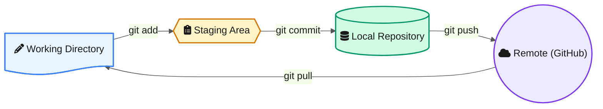
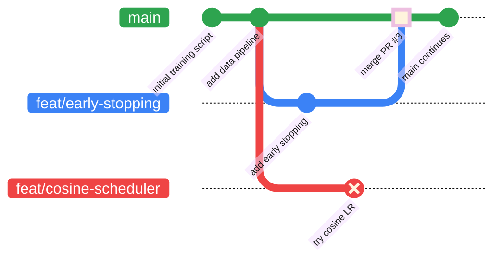
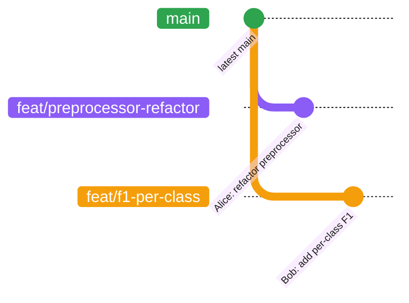

<!-- last-reviewed: 2026-03-30 -->
# Git Fundamentals

Essential Git commands and concepts for daily lab work. This page covers the mental model, core workflow, branching, and commit conventions you need to be productive immediately.

| | |
|---|---|
| **Audience** | All lab members |
| **Prerequisites** | Terminal access, a GitHub account |

---

## The Git Mental Model

Git manages your code through four distinct areas. Understanding where your changes live at any moment is the single most important concept in Git.



- **Working Directory** — The files you see and edit on disk. Any change you make starts here. Git watches this directory and knows when something differs from the last commit.
- **Staging Area** — A holding zone for changes you want in your next commit. `git add` moves changes here. This lets you commit specific files instead of everything at once.
- **Local Repository** — Your full project history stored in `.git/`. Each `git commit` creates a permanent snapshot here. This is entirely on your machine — nobody else sees it yet.
- **Remote Repository** — The shared copy on GitHub. `git push` sends your local commits here; `git pull` brings others' commits down to your working directory.

!!! info "Key insight"
    Git tracks **snapshots**, not diffs. Every commit stores the complete state of every tracked file. This is why Git can instantly switch between branches — it just swaps one snapshot for another.

## Core Commands

### First-Time Setup

Run these once after installing Git. They set your identity for every commit:

```bash
git config --global user.name "Your Name"
git config --global user.email "your.email@example.com"
git config --global init.defaultBranch main
```

!!! tip "SSH authentication"
    You also need SSH keys to push/pull without entering your password every time. See [SSH & Authentication](ssh-and-authentication.md) for setup.

### Starting a Project

=== "Clone an existing repo"

    ```bash
    git clone git@github.com:OSU-CAR-MSL/some-project.git
    cd some-project
    ```

=== "Start a new repo locally"

    ```bash
    mkdir my-project && cd my-project
    git init
    ```

For creating repos on GitHub (visibility, templates, branch protection), see [Repository Setup](repository-setup.md).

### Daily Workflow

This is the cycle you will repeat dozens of times a day:

```bash
# 1. See what's changed
git status

# 2. Stage specific files (prefer this over "git add .")
git add train.py utils/data_loader.py

# 3. Review what you're about to commit
git diff --staged

# 4. Commit with a descriptive message
git commit -m "Add learning rate warmup to training loop"

# 5. Push to remote
git push
```

To see unstaged changes (what you've modified but haven't added yet):

```bash
git diff
```

To pull the latest changes from your team:

```bash
git pull
```

!!! warning "Always pull before starting new work"
    Run `git pull` at the start of every work session. If you make commits on top of stale code, you will hit merge conflicts when you push. Pulling first keeps your branch in sync and avoids unnecessary headaches.

### Viewing History

```bash
# Compact history with branch graph
git log --oneline --graph

# Last 10 commits only
git log --oneline -10

# Full details of a specific commit
git show abc1234

# Who changed each line of a file (and when)
git blame train.py
```

## Branching

Never commit directly to `main`. Branches let you work on features, fixes, or experiments in isolation. If something breaks, `main` stays clean.

### Branch Commands

```bash
# List all local branches (* marks current)
git branch

# Create a new branch and switch to it
git checkout -b feat/lr-scheduler
# or the newer syntax:
git switch -c feat/lr-scheduler

# Switch back to main
git checkout main
# or:
git switch main

# Delete a branch after it's been merged
git branch -d feat/lr-scheduler
```

### Why Branch? A Walkthrough

Imagine you have a working training script on `main`. Your advisor asks for two things: (1) add early stopping, and (2) try a cosine learning rate scheduler. These are independent experiments — you don't want one half-finished change breaking the other.

**Without branches**, you'd edit `train.py` for both at once, end up with tangled changes, and when the cosine scheduler hurts performance you'd have to manually undo just those edits without touching the early stopping code.

**With branches**, each experiment is isolated:

```bash
# Start from a clean main
git checkout main
git pull

# Experiment 1: early stopping
git checkout -b feat/early-stopping
# ... edit train.py, add the EarlyStopping callback ...
git add train.py
git commit -m "Add early stopping with patience=10"
git push -u origin feat/early-stopping

# Experiment 2: cosine scheduler (start fresh from main)
git checkout main
git checkout -b feat/cosine-scheduler
# ... edit train.py differently — main's clean version, not the early stopping one ...
git add train.py
git commit -m "Replace StepLR with CosineAnnealingWarmRestarts"
git push -u origin feat/cosine-scheduler
```

Now you can run SLURM jobs from each branch independently. If cosine scheduling doesn't help, just delete that branch — `main` and the early stopping branch are untouched:

```bash
git checkout main
git branch -d feat/cosine-scheduler        # local
git push origin --delete feat/cosine-scheduler  # remote
```

If early stopping works, merge it into `main` via a pull request. The timeline looks like this:



!!! tip "The key insight"
    Branches are cheap. Creating one takes milliseconds and costs nothing. The real cost is **not** branching — tangled changes, broken `main`, and hours spent untangling commits that should have been separate.

!!! info "Branch naming and PR workflow"
    The lab uses prefixed branch names: `fix/`, `feat/`, `docs/`, `refactor/`. For the complete branching strategy and pull request process, see [Issues, PRs & Code Review](../contributing/github-issues-and-prs.md).

### Working Together: Alice and Bob

The solo walkthrough above shows why *you* should branch. This walkthrough shows what happens when **two people** work on the same repo at the same time — the situation where branching goes from "nice habit" to "absolutely essential."

**The setup:** Alice and Bob are both working on `KD-GAT`, an intrusion detection model. Alice is improving the data preprocessing pipeline. Bob is adding a new evaluation metric. Both start Monday morning from the same `main`.

---

**Monday 9 AM — Alice starts her branch:**

```bash
# Alice
git checkout main && git pull
git checkout -b feat/preprocessor-refactor
# ... edits src/preprocess.py and src/dataset.py ...
git add src/preprocess.py src/dataset.py
git commit -m "Refactor preprocessor to handle variable-length CAN frames"
git push -u origin feat/preprocessor-refactor
```

**Monday 10 AM — Bob starts his branch (from the same `main`):**

```bash
# Bob
git checkout main && git pull
git checkout -b feat/f1-per-class
# ... edits src/evaluate.py and src/config.py ...
git add src/evaluate.py src/config.py
git commit -m "Add per-class F1 scoring to evaluation pipeline"
git push -u origin feat/f1-per-class
```

At this point, two branches exist in parallel. Alice and Bob are editing **different files**, so there's no conflict. The repo looks like:



---

**Monday afternoon — Alice opens a pull request:**

```bash
# Alice
gh pr create --title "Refactor preprocessor for variable-length frames" \
  --body "Closes #18. Handles variable-length CAN frames without padding."
```

Bob reviews it, leaves a comment asking Alice to add a docstring to the new `parse_frame()` function. Alice pushes a follow-up commit:

```bash
# Alice (still on feat/preprocessor-refactor)
# ... adds the docstring ...
git add src/preprocess.py
git commit -m "Add docstring to parse_frame"
git push    # PR updates automatically
```

Bob approves. Alice merges via the PR:

```bash
# Alice
gh pr merge --squash
```

---

**Tuesday — Bob needs to update his branch:**

Bob's branch was created from Monday's `main`, but `main` now includes Alice's merged changes. Before opening his own PR, Bob pulls the latest `main` into his branch:

```bash
# Bob
git checkout main && git pull          # get Alice's merged changes
git checkout feat/f1-per-class
git merge main                         # bring main's updates into his branch
```

Since Alice edited `preprocess.py` / `dataset.py` and Bob edited `evaluate.py` / `config.py`, this merge completes automatically — no conflicts.

!!! tip "What if they edited the same file?"
    If both Alice and Bob had modified `src/config.py`, Git would flag a **merge conflict** on Bob's `git merge main`. Bob would see conflict markers in the file and need to resolve them manually. See [Merge Conflicts](git-troubleshooting.md#merge-conflicts) for a step-by-step walkthrough.

Bob then opens his PR:

```bash
# Bob
git push
gh pr create --title "Add per-class F1 scoring" \
  --body "Adds per-class F1 to the eval pipeline. Tested on OTIDS dataset."
```

Alice reviews, approves, and Bob merges. Both features are now on `main`, with a clean history showing exactly who did what and why.

---

**What would have happened without branches?**

Both Alice and Bob edit `main` directly. Alice pushes first. Bob tries to push:

```
$ git push
 ! [rejected]        main -> main (non-fast-forward)
error: failed to push some refs to 'git@github.com:OSU-CAR-MSL/KD-GAT.git'
hint: Updates were rejected because the tip of your current branch is behind
hint: its remote counterpart.
```

Bob's push is **rejected** — Git won't let him overwrite Alice's commits. He now has to `git pull`, hope there are no conflicts, and if there are, untangle his changes from hers with no clear record of which changes belong to which task. There's no PR, no review, no discussion trail. This is the mess that branches prevent.

!!! info "Sources and further reading"
    This walkthrough draws on patterns from several well-established Git teaching resources:

    - [Pro Git Book — Contributing to a Project](https://git-scm.com/book/en/v2/Distributed-Git-Contributing-to-a-Project) — the John/Jessica parallel-push scenario that shows rejection and resolution
    - [Atlassian — Feature Branch Workflow](https://www.atlassian.com/git/tutorials/comparing-workflows/feature-branch-workflow) — the Mary/Bill narrative with PR review as a conversation
    - [GitHub Docs — GitHub Flow](https://docs.github.com/en/get-started/using-github/github-flow) — the 6-step create/commit/PR/review/merge/cleanup framework
    - [The Turing Way — Git Branches](https://book.the-turing-way.org/reproducible-research/vcs/vcs-git-branches) — research-oriented framing of branches as independent experiments

### Worktrees

Sometimes you need two branches checked out **at the same time** — for example, running a training job on your feature branch while reviewing a labmate's PR on another. Normally you'd have to stash or commit your work, switch branches, then switch back. **Worktrees** let you skip all of that.

A worktree creates a second working directory linked to the same repository. Each worktree has its own branch checked out, but they share the same Git history and `.git` data.

```bash
# Create a worktree for a labmate's PR branch in a sibling directory
git worktree add ../review-pr-42 feat/new-loss-function

# Now you have two directories:
#   ~/KD-GAT/              → your feature branch (still running)
#   ~/review-pr-42/        → the PR branch (ready to review)
```

Work in either directory independently — they don't interfere with each other. When you're done:

```bash
# Remove the worktree when finished
git worktree remove ../review-pr-42
```

**When worktrees are useful:**

| Scenario | Without Worktrees | With Worktrees |
|----------|-------------------|----------------|
| Review a PR while your experiment runs | Stash changes, switch branch, switch back, pop stash | `git worktree add`, review, remove |
| Compare outputs between branches | Check out one branch at a time, re-run each | Both branches checked out, run simultaneously |
| Run SLURM jobs from two branches | Clone the repo a second time | `git worktree add` — instant, shared history |
| Fix a bug on `main` during feature work | Commit WIP, switch to main, fix, switch back | Fix in a separate worktree, never interrupt your flow |

```bash
# List all active worktrees
git worktree list

# Create a worktree with a new branch
git worktree add ../hotfix-branch -b fix/data-corruption

# Prune stale worktree entries (if you deleted the directory manually)
git worktree prune
```

!!! warning "Don't check out the same branch in two worktrees"
    Git prevents this because simultaneous edits to the same branch from two directories would corrupt the index. Each worktree must have a unique branch.

## Commit Messages

Good commit messages make `git log` useful and `git blame` informative. Bad ones make debugging a nightmare.

**The rules:**

1. Use **imperative mood** — "Add feature" not "Added feature" (think: "This commit will _Add feature_")
2. Keep the first line (subject) **under 72 characters**
3. Leave a blank line, then explain **why** in the body (the diff already shows _what_)
4. Reference issues when relevant — `Fixes #12` automatically closes issue 12

```bash
# Good
git commit -m "Add early stopping to prevent overfitting on small datasets"

git commit -m "Fix data loader crash when batch size exceeds dataset length

The DataLoader raised an IndexError when num_samples < batch_size.
Added a floor check and a warning log message.

Fixes #47"

# Bad
git commit -m "fixed stuff"
git commit -m "update"
git commit -m "WIP"
git commit -m "changes to train.py and utils.py and config and data loader"
```

!!! tip "Lab commit standard"
    The lab has specific conventions for commit scopes and PR descriptions. See the [lab commit message standard](../contributing/github-issues-and-prs.md) for details.

## .gitignore

A `.gitignore` file tells Git which files to never track. Without it, you will accidentally commit Python bytecode, virtual environments, API keys, or multi-gigabyte datasets.

Common patterns for ML Python projects:

```gitignore
# Byte-compiled / cached
__pycache__/
*.pyc
*.pyo

# Virtual environments
.venv/
venv/

# Environment variables and secrets
.env
.env.local

# IDE settings
.vscode/
.idea/

# Data and model artifacts (too large for Git)
data/
models/
*.pt
*.ckpt

# Build artifacts
*.egg-info/
dist/
build/

# Jupyter checkpoints
.ipynb_checkpoints/

# OS files
.DS_Store
Thumbs.db
```

Use the **negation pattern** `!` to re-include something inside an ignored directory:

```gitignore
data/
!data/README.md
```

!!! tip "GitHub templates"
    When creating a repo on GitHub, select the **Python** `.gitignore` template. It covers most of these patterns out of the box.

For line endings and `.gitattributes` configuration on Windows/WSL, see [Python Environment Setup](../getting-started/python-environment-setup.md).

## Quick Reference

| I want to... | Command |
|---|---|
| See what's changed | `git status` |
| Stage specific files | `git add file1.py file2.py` |
| Stage all changes | `git add .` |
| Commit staged changes | `git commit -m "message"` |
| Push to remote | `git push` |
| Pull latest changes | `git pull` |
| Create a new branch | `git checkout -b branch-name` |
| Switch branches | `git checkout branch-name` |
| See commit history | `git log --oneline --graph` |
| See who changed a line | `git blame file.py` |
| See unstaged changes | `git diff` |
| See staged changes | `git diff --staged` |
| Undo unstaged changes to a file | `git restore file.py` |
| Unstage a file | `git restore --staged file.py` |
| Delete a merged branch | `git branch -d branch-name` |
| Stash uncommitted work | `git stash` |
| Restore stashed work | `git stash pop` |
| Check out a second branch simultaneously | `git worktree add ../dir branch-name` |
| Remove a worktree | `git worktree remove ../dir` |

## Related Guides

- [SSH & Authentication](ssh-and-authentication.md) — set up keys and `gh` CLI
- [Repository Setup](repository-setup.md) — create and configure repos on GitHub
- [Issues, PRs & Code Review](../contributing/github-issues-and-prs.md) — the collaboration workflow
- [Git Troubleshooting](git-troubleshooting.md) — merge conflicts, undoing changes, recovery
