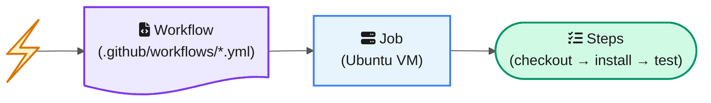

<!-- last-reviewed: 2026-03-30 -->
# GitHub Actions CI/CD

Automate linting, testing, and deployment so you never merge broken code. This page gives you working workflows you can drop into any lab repo today.

| | |
|---|---|
| **Audience** | All lab members |
| **Prerequisites** | A GitHub repository, basic Git knowledge ([fundamentals](git-fundamentals.md)) |

---

## What GitHub Actions Does

GitHub Actions runs tasks automatically in response to events in your repository — a push, a pull request, or a schedule. Each workflow is a YAML file that tells GitHub: "when this happens, spin up a virtual machine and run these commands."



Common use cases:

- **Run linting and tests on every push** — catch errors before they reach `main`
- **Check formatting on pull requests** — enforce consistent code style across the team
- **Build and deploy documentation** — auto-publish MkDocs or Quarto sites to GitHub Pages
- **Scheduled data refresh or link checking** — cron jobs for maintenance tasks

## Anatomy of a Workflow File

### File Location

All workflows live in `.github/workflows/` at the root of your repository. One file per workflow; name it descriptively:

```
.github/workflows/
├── ci.yml            # lint + test on every push
├── deploy-docs.yml   # build and deploy documentation
└── lint.yml          # formatting checks only
```

### Basic Structure

```yaml
name: CI                          # Display name in Actions tab

on:                               # When to run
  push:
    branches: [main]
  pull_request:
    branches: [main]

jobs:
  test:                           # Job ID
    runs-on: ubuntu-latest        # VM to use
    steps:
      - uses: actions/checkout@v4           # Step 1: get code
      - uses: actions/setup-python@v5       # Step 2: install Python
        with:
          python-version: "3.12"
      - run: pip install -r requirements.txt  # Step 3: install deps
      - run: pytest                           # Step 4: run tests
```

Every workflow has three layers: **triggers** (`on:`), **jobs** (named blocks that run in parallel by default), and **steps** (sequential commands within a job).

### Common Triggers

| Trigger | When It Runs |
|---------|-------------|
| `push` | On every push to specified branches |
| `pull_request` | When a PR is opened or updated |
| `schedule` | On a cron schedule (e.g., `cron: '0 8 * * 1'` = every Monday 8 AM UTC) |
| `workflow_dispatch` | Manual trigger from Actions tab or `gh workflow run` |

### Path Filtering

Only run the workflow when specific files change:

```yaml
on:
  push:
    paths:
      - 'src/**'
      - 'tests/**'
      - 'pyproject.toml'
```

!!! tip "Save CI minutes with path filters"
    Use path filtering to avoid running expensive CI on docs-only changes. If someone edits a README, there is no reason to re-run your full test suite.

## Starter Workflows for Research Repos

Copy one of these into `.github/workflows/ci.yml` and push. You will have working CI in under five minutes.

### Python Lint + Test

=== "uv (Recommended)"

    ```yaml
    name: CI

    on:
      push:
        branches: [main]
      pull_request:

    jobs:
      lint-and-test:
        runs-on: ubuntu-latest
        steps:
          - uses: actions/checkout@v4

          - uses: astral-sh/setup-uv@v5
            with:
              version: "latest"

          - uses: actions/setup-python@v5
            with:
              python-version: "3.12"

          - name: Install dependencies
            run: uv sync

          - name: Lint with ruff
            run: uv run ruff check .

          - name: Run tests
            run: uv run pytest
    ```

=== "pip"

    ```yaml
    name: CI

    on:
      push:
        branches: [main]
      pull_request:

    jobs:
      lint-and-test:
        runs-on: ubuntu-latest
        steps:
          - uses: actions/checkout@v4

          - uses: actions/setup-python@v5
            with:
              python-version: "3.12"
              cache: "pip"

          - name: Install dependencies
            run: pip install -r requirements.txt

          - name: Lint with ruff
            run: ruff check .

          - name: Run tests
            run: pytest
    ```

!!! info "Free tier limits"
    These workflows run on GitHub's free tier. Public repos get unlimited minutes; private repos get 2,000 free minutes/month.

## Useful Actions

### Core Actions

| Action | Purpose |
|--------|---------|
| `actions/checkout@v4` | Clone your repo into the runner |
| `actions/setup-python@v5` | Install Python (supports version matrix and caching) |
| `astral-sh/setup-uv@v5` | Install uv package manager |
| `actions/cache@v4` | Cache directories between runs (speeds up CI) |

### Status Badges

Add a badge to your README to show CI status at a glance:

```markdown

```

Replace `owner/repo` with your GitHub org and repo name, and `ci.yml` with your workflow filename.

## Secrets and Environment Variables

### Adding Repository Secrets

1. Go to your repository on GitHub
2. **Settings** → **Secrets and variables** → **Actions** → **New repository secret**
3. **Name:** `WANDB_API_KEY` (example)
4. **Value:** paste the key

### Using Secrets in Workflows

```yaml
steps:
  - name: Train model
    env:
      WANDB_API_KEY: ${{ secrets.WANDB_API_KEY }}
    run: python train.py
```

Common secrets for ML repos:

- `WANDB_API_KEY` — Weights & Biases experiment tracking
- `HF_TOKEN` — Hugging Face Hub uploads
- `GITHUB_TOKEN` — automatically available, no setup needed (for GitHub API calls)

!!! danger "Never hardcode API keys"
    Never put API keys directly in workflow files or code. Always use repository secrets. GitHub automatically masks secret values in log output.

For creating tokens, see [Personal Access Tokens](ssh-and-authentication.md#personal-access-tokens-pats).

## Debugging Failed Workflows

### Reading Logs

```bash
# List recent workflow runs
gh run list

# View a specific run
gh run view <run-id>

# Show only the failed steps
gh run view <run-id> --log-failed
```

Or in the browser: **Actions tab** → click the failed run → click the red X step → read the log output.

### Common Failures

| Problem | Likely Cause | Fix |
|---------|-------------|-----|
| Tests pass locally but fail in CI | Different Python version or missing system deps | Pin Python version in workflow, check `runs-on` |
| `ModuleNotFoundError` | Dependency not in requirements file | Add the missing package to `requirements.txt` or `pyproject.toml` |
| Secret is empty/undefined | Secret name mismatch or not set | Check Settings → Secrets, match the exact name |
| Workflow doesn't trigger | Wrong branch name in `on:` filter or path filter excludes changes | Check `branches:` and `paths:` in the workflow |
| `Permission denied` | `GITHUB_TOKEN` lacks permission | Add a `permissions:` block to the workflow |

### Running Workflows Manually

Add `workflow_dispatch` to your triggers so you can run the workflow on demand:

```yaml
on:
  workflow_dispatch:
```

Then trigger from the CLI:

```bash
gh workflow run ci.yml
```

!!! tip "Test without dummy commits"
    `workflow_dispatch` is useful for testing workflow changes without pushing empty commits. Make your edits, push once, then trigger manually as many times as you need.

## Related Guides

- [Git Fundamentals](git-fundamentals.md) — core Git commands
- [GitHub Pages Setup](../contributing/github-pages-setup.md) — deploying documentation sites with Actions
- [GitHub Projects](../contributing/github-projects.md) — automated project board updates via Actions
- [Hugging Face Spaces](../ml-workflows/huggingface-spaces.md) — deploying ML demos
- [SSH & Authentication](ssh-and-authentication.md) — tokens and secrets setup
