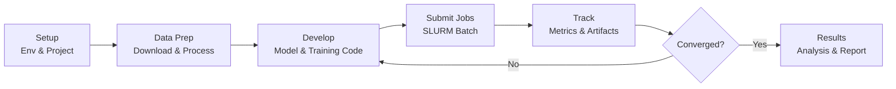

<!-- last-reviewed: 2026-02-19 -->
# ML Project Template

A starting-point structure and checklist for running ML experiments on OSC.

## Workflow Overview



## Recommended Directory Layout

```
~/projects/my_ml_project/
├── README.md                 # Project documentation
├── requirements.txt          # Python dependencies
├── .gitignore               # See template below
├── data/                    # Small data files, data scripts
│   ├── download_data.sh
│   └── preprocess.py
├── src/                     # Source code
│   ├── __init__.py
│   ├── models/
│   ├── data/
│   ├── utils/
│   └── train.py             # Training entry point
├── scripts/                 # SLURM job scripts
│   ├── train_baseline.sh
│   └── hyperparameter_search.sh
├── configs/                 # Experiment configs (YAML)
│   ├── default.yaml
│   └── experiment1.yaml
├── notebooks/               # Exploratory analysis only
├── tests/
├── logs/
├── checkpoints/
└── results/
```

## Data Organization on Scratch

Store large datasets and job outputs on scratch, not in your home directory:

```
/fs/scratch/PAS1234/$USER/
├── datasets/               # Large datasets
│   ├── imagenet/
│   ├── cifar10/
│   └── custom_dataset/
└── my_ml_project/         # Project-specific data
    ├── processed_data/
    ├── checkpoints/       # Model checkpoints
    └── results/           # Experiment outputs
```

!!! warning "Scratch is purged after 90 days of inactivity"
    Copy final results and best checkpoints to your home or project directory. See [Clusters Overview](../osc-basics/osc-clusters-overview.md) for storage details.

## .gitignore Template

```gitignore
# Python
__pycache__/
*.py[cod]
*$py.class
*.so
.venv/
venv/

# Data and models
data/raw/
data/processed/
*.pth
*.ckpt
checkpoints/
*.h5
*.hdf5

# Logs and results
logs/
results/
*.log

# Notebooks
.ipynb_checkpoints/

# IDE
.vscode/
.idea/

# OS
.DS_Store
Thumbs.db
```

## Checklist

- [ ] **Environment** — venv or conda created and documented in `requirements.txt` ([Environment Management](../working-on-osc/osc-environment-management.md))
- [ ] **PyTorch** — installed with correct CUDA version, verified on GPU node ([PyTorch & GPU Setup](pytorch-setup.md))
- [ ] **Training script** — uses `argparse`, device setup, checkpointing, and logging
- [ ] **Job scripts** — SLURM batch scripts for training and sweeps ([Job Submission](../working-on-osc/osc-job-submission.md))
- [ ] **Experiment tracking** — MLflow, W&B, or DVC configured ([Data & Experiment Tracking](data-experiment-tracking.md))
- [ ] **Reproducibility** — random seeds set, configs saved with checkpoints
- [ ] **Data on scratch** — large files on `/fs/scratch/`, not `$HOME`
- [ ] **Version control** — code committed, large files in `.gitignore`
