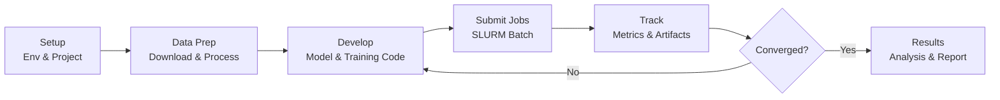

# Machine Learning Workflow Guide

Best practices and workflows for running machine learning experiments on OSC.

## Overview

This guide covers the complete ML workflow on OSC:
1. Environment setup
2. Data management
3. Code organization
4. Training and experimentation
5. Results tracking and analysis



## Project Structure

### Recommended Directory Layout

```
~/projects/my_ml_project/
├── README.md                 # Project documentation
├── requirements.txt          # Python dependencies
├── environment_setup.md      # Environment setup instructions
├── .gitignore               # Git ignore file
├── data/                    # Small data files, data scripts
│   ├── download_data.sh
│   └── preprocess.py
├── src/                     # Source code
│   ├── __init__.py
│   ├── models/              # Model definitions
│   │   ├── __init__.py
│   │   └── resnet.py
│   ├── data/                # Data loading
│   │   ├── __init__.py
│   │   └── dataset.py
│   ├── utils/               # Utility functions
│   │   ├── __init__.py
│   │   └── metrics.py
│   └── train.py             # Training script
├── scripts/                 # SLURM job scripts
│   ├── train_baseline.sh
│   └── hyperparameter_search.sh
├── configs/                 # Configuration files
│   ├── default.yaml
│   └── experiment1.yaml
├── notebooks/               # Jupyter notebooks for analysis
│   └── analysis.ipynb
├── tests/                   # Unit tests
│   └── test_model.py
├── logs/                    # Training logs
├── checkpoints/             # Model checkpoints
└── results/                 # Experiment results
```

### Data Organization

```
/fs/scratch/PAS1234/$USER/
├── datasets/               # Large datasets
│   ├── imagenet/
│   ├── cifar10/
│   └── custom_dataset/
└── my_ml_project/         # Project-specific data
    ├── processed_data/
    ├── checkpoints/       # Model checkpoints
    └── results/           # Experiment outputs
```

## Complete Workflow

### 1. Setup Phase

#### A. Create Project Structure

```bash
# Create project
mkdir -p ~/projects/my_ml_project
cd ~/projects/my_ml_project

# Create directory structure
mkdir -p src/{models,data,utils} scripts configs notebooks tests logs checkpoints results
touch README.md requirements.txt .gitignore
```

#### B. Initialize Git

```bash
git init
git add README.md .gitignore
git commit -m "Initial commit"

# If using remote repository
git remote add origin <your-repo-url>
git push -u origin main
```

#### C. Setup Environment

```bash
# Load modules
module load python/3.9-2022.05 cuda/11.8.0

# Create virtual environment
python -m venv ~/venvs/my_ml_project
source ~/venvs/my_ml_project/bin/activate

# Install dependencies
pip install torch torchvision numpy pandas matplotlib tensorboard
pip freeze > requirements.txt
```

#### D. Create .gitignore

```gitignore
# Python
__pycache__/
*.py[cod]
*$py.class
*.so
.Python
.venv/
venv/
ENV/

# Data and models
data/raw/
data/processed/
*.pth
*.ckpt
checkpoints/
*.h5
*.hdf5

# Logs and results
logs/
results/
*.log

# Notebooks
.ipynb_checkpoints/
*.ipynb

# IDE
.vscode/
.idea/
*.swp
*.swo

# OS
.DS_Store
Thumbs.db
```

### 2. Data Preparation

#### Download and Prepare Data

Create `data/prepare_data.sh`:

```bash
#!/bin/bash
#SBATCH --job-name=prepare_data
#SBATCH --time=02:00:00
#SBATCH --output=logs/prepare_data_%j.out

# Use scratch space
SCRATCH_DIR=/fs/scratch/PAS1234/$USER/my_ml_project
mkdir -p $SCRATCH_DIR/datasets

# Download data (example)
cd $SCRATCH_DIR/datasets
wget https://example.com/dataset.tar.gz
tar -xzf dataset.tar.gz

# Preprocess
module load python/3.9-2022.05
source ~/venvs/my_ml_project/bin/activate
python ~/projects/my_ml_project/data/preprocess.py \
    --input $SCRATCH_DIR/datasets/raw \
    --output $SCRATCH_DIR/datasets/processed

echo "Data preparation complete"
```

#### Create Dataset Class

`src/data/dataset.py`:

```python
import torch
from torch.utils.data import Dataset
from PIL import Image
import os

class CustomDataset(Dataset):
    def __init__(self, data_dir, transform=None):
        self.data_dir = data_dir
        self.transform = transform
        self.samples = self._load_samples()
    
    def _load_samples(self):
        # Load and organize your data
        samples = []
        # ... your data loading logic
        return samples
    
    def __len__(self):
        return len(self.samples)
    
    def __getitem__(self, idx):
        # Load and transform sample
        sample, label = self.samples[idx]
        
        if self.transform:
            sample = self.transform(sample)
        
        return sample, label
```

### 3. Model Development

#### Define Model

`src/models/model.py`:

```python
import torch
import torch.nn as nn

class MyModel(nn.Module):
    def __init__(self, num_classes=10):
        super(MyModel, self).__init__()
        self.features = nn.Sequential(
            nn.Conv2d(3, 64, kernel_size=3, padding=1),
            nn.ReLU(inplace=True),
            nn.MaxPool2d(kernel_size=2, stride=2),
            # ... more layers
        )
        self.classifier = nn.Linear(512, num_classes)
    
    def forward(self, x):
        x = self.features(x)
        x = torch.flatten(x, 1)
        x = self.classifier(x)
        return x
```

### 4. Training Script

Your training script (`src/train.py`) should include:

- **`argparse`** for configuration (data paths, hyperparameters, output directory)
- **Device setup** (`cuda` if available, else `cpu`)
- **DataLoaders** with `num_workers`, `pin_memory`, and `shuffle`
- **Training loop** with loss computation, backpropagation, and validation
- **Checkpointing** — save best model and periodic snapshots
- **Logging** — print metrics per epoch, optionally log to TensorBoard

For PyTorch training patterns, mixed precision, and checkpointing examples, see [PyTorch & GPU Setup](pytorch-setup.md).

### 5. Job Submission

Submit training as SLURM batch jobs. For job script templates (single GPU, multi-GPU, hyperparameter sweeps with job arrays), see the [Job Submission Guide](../working-on-osc/osc-job-submission.md).

### 6. Experiment Tracking

Track metrics, hyperparameters, and artifacts across runs. See [Data & Experiment Tracking](data-experiment-tracking.md) for DVC, SQLite, MLflow, W&B, and TensorBoard setup.

## Best Practices

### 1. Version Control
- Commit code regularly
- Use meaningful commit messages
- Tag important experiments
- Don't commit large files

### 2. Reproducibility
- Set random seeds
- Document environment (requirements.txt)
- Save hyperparameters with checkpoints
- Use configuration files

### 3. Resource Management
- Test with small dataset first
- Use debug queue for testing
- Request appropriate resources
- Monitor GPU usage

### 4. Data Management
- Use scratch space for large data
- Don't store data in home directory
- Clean up old checkpoints
- Archive completed experiments

### 5. Code Organization
- Modular code (separate data, models, training)
- Use configuration files
- Write unit tests
- Document your code

## Next Steps

- Review [PyTorch & GPU Setup](pytorch-setup.md)
- Check [Best Practices](../working-on-osc/osc-best-practices.md)
- Read [Job Submission Guide](../working-on-osc/osc-job-submission.md)

## Resources

- [PyTorch Documentation](https://pytorch.org/docs/)
- [TensorBoard Tutorial](https://pytorch.org/tutorials/recipes/recipes/tensorboard_with_pytorch.html)
- [Troubleshooting Guide](../resources/troubleshooting.md)
