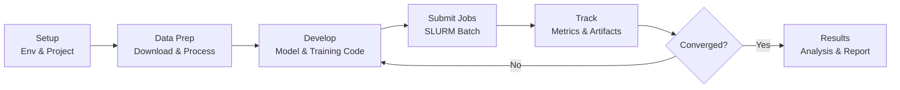

<!-- last-reviewed: 2026-03-30 -->
# ML Project Template

A starting-point structure and checklist for running ML experiments on OSC.

## Workflow Overview


```mermaid
flowchart LR
    A[Setup\nEnv & Project] --> B[Data Prep\nDownload & Process]
    B --> C[Develop\nModel & Training Code]
    C --> D[Submit Jobs\nSLURM Batch]
    D --> E[Track\nMetrics & Artifacts]
    E --> F{Converged?}
    F -->|No| C
    F -->|Yes| G[Results\nAnalysis & Report]
```

## Recommended Directory Layout

```
~/projects/my_ml_project/
├── README.md                 # Project documentation
├── requirements.txt          # Python dependencies
├── .gitignore               # See template below
├── data/                    # Small data files, data scripts
│   ├── download_data.sh
│   └── preprocess.py
├── src/                     # Source code
│   ├── __init__.py
│   ├── models/
│   ├── data/
│   ├── utils/
│   └── train.py             # Training entry point
├── scripts/                 # SLURM job scripts
│   ├── train_baseline.sh
│   └── hyperparameter_search.sh
├── configs/                 # Experiment configs (YAML)
│   ├── default.yaml
│   └── experiment1.yaml
├── notebooks/               # Exploratory analysis only
├── tests/
├── logs/
├── checkpoints/
└── results/
```

## Data Organization on Scratch

Store large datasets and job outputs on scratch, not in your home directory:

```
/fs/scratch/PAS1234/$USER/
├── datasets/               # Large datasets
│   ├── imagenet/
│   ├── cifar10/
│   └── custom_dataset/
└── my_ml_project/         # Project-specific data
    ├── processed_data/
    ├── checkpoints/       # Model checkpoints
    └── results/           # Experiment outputs
```

!!! warning "Scratch is purged after 60 days of inactivity"
    Copy final results and best checkpoints to your home or project directory. See [Clusters Overview](../osc-basics/osc-clusters-overview.md) for storage details.

## .gitignore

Use the Python `.gitignore` template from [GitHub's gitignore repo](https://github.com/github/gitignore/blob/main/Python.gitignore). Add project-specific patterns for data, checkpoints, and logs as needed.

## Checklist

- [ ] **Environment** — uv venv (or plain venv) created and documented in `pyproject.toml` or `requirements.txt` ([Environment Management](../working-on-osc/osc-environment-management.md))
- [ ] **PyTorch** — installed with correct CUDA version, verified on GPU node ([PyTorch & GPU Setup](pytorch-setup.md))
- [ ] **Training script** — uses `argparse`, device setup, checkpointing, and logging
- [ ] **Job scripts** — SLURM batch scripts for training and sweeps ([Job Submission](../working-on-osc/osc-job-submission.md))
- [ ] **Experiment tracking** — MLflow, W&B, or DVC configured ([Data & Experiment Tracking](data-experiment-tracking.md))
- [ ] **Reproducibility** — random seeds set, configs saved with checkpoints
- [ ] **Data on scratch** — large files on `/fs/scratch/`, not `$HOME`
- [ ] **Version control** — code committed, large files in `.gitignore`

## Configuration Management

### YAML Config Cascade (jsonargparse)

For PyTorch Lightning projects, [LightningCLI](https://lightning.ai/docs/pytorch/stable/cli/lightning_cli.html) uses [jsonargparse](https://jsonargparse.readthedocs.io/) for config management. It's lighter than Hydra and comes automatically when you install Lightning with `pip install lightning[extra]`. Configs [compose in layers](https://jsonargparse.readthedocs.io/en/stable/#compose-config-from-multiple-files) — each layer overrides the previous:

```
trainer.yaml (shared defaults: logger, callbacks, precision)
  ↓
stage.yaml (model class, data module, stage-specific settings)
  ↓
overlay.yaml (scale variant: small/large hidden dims)
  ↓
CLI args (one-off overrides: --model.init_args.lr=0.01)
```

Example usage:

```bash
# Base + stage + overlay + CLI override
python -m myproject fit \
    --config configs/trainer.yaml \
    --config configs/stages/autoencoder.yaml \
    --config configs/overlays/small.yaml \
    --model.init_args.lr 0.001
```

#### Config File Layout

```
configs/
├── trainer.yaml          # Shared: precision, logger, callbacks, gradient_clip
├── stages/
│   ├── autoencoder.yaml  # model: class_path + init_args, data: class_path + init_args
│   ├── classifier.yaml
│   └── evaluation.yaml
└── overlays/
    ├── small.yaml        # hidden_dims: [32, 16], latent_dim: 16
    └── large.yaml        # hidden_dims: [128, 64], latent_dim: 48
```

#### Model Convention: Typed `__init__` Signatures

jsonargparse [introspects your model's `__init__`](https://jsonargparse.readthedocs.io/en/stable/#classes-sub-commands-and-டype-hints) to generate CLI args and validate YAML. Use type hints on all parameters so jsonargparse can validate them:

```python
class MyModel(pl.LightningModule):
    def __init__(
        self,
        hidden_dims: list[int] | None = None,
        latent_dim: int = 48,
        lr: float = 0.003,
        dropout: float = 0.1,
    ):
        super().__init__()
        self.save_hyperparameters()
```

This means every hyperparameter is automatically:

- Settable from YAML or CLI
- Type-checked at parse time
- Saved to checkpoints via [`save_hyperparameters()`](https://lightning.ai/docs/pytorch/stable/common/lightning_module.html#save-hyperparameters)
- Logged to experiment trackers (when a logger is attached to the Trainer)

### When to Use Hydra Instead

jsonargparse comes with LightningCLI and handles config composition natively. If you're **not** using Lightning, [Hydra](https://hydra.cc/) is a popular alternative with its own config composition, sweep features, and a larger ecosystem. They solve overlapping problems, so pick one per project.

## Structured Logging with structlog

[structlog](https://www.structlog.org/) produces machine-parseable, key-value log events instead of free-form strings. This makes it easier to filter and aggregate logs from SLURM jobs:

```bash
uv add structlog
```

```python
import structlog

log = structlog.get_logger()

# Structured events — no format strings
log.info("training_started", dataset="cora", model="gcn", lr=0.01)
log.info("epoch_complete", epoch=42, train_loss=0.234, val_f1=0.891)
log.warning("gpu_memory_high", allocated_gb=28.5, total_gb=32.0)
```

**Why structlog over print/logging:**

- **Parseable** — each log line is a structured event with typed fields, not a free-form string. Easy to grep, filter, or pipe to JSON.
- **[Context binding](https://www.structlog.org/en/stable/contextvars.html)** — set context once at the entry point, and it propagates to all log calls:
  ```python
  structlog.contextvars.bind_contextvars(
      job_id=os.environ.get("SLURM_JOB_ID"),
      dataset="cora",
  )
  # All subsequent log.info() calls include job_id and dataset
  ```

stdlib `logging` works fine for simple scripts. structlog adds the most value when you have many SLURM jobs to compare and need to programmatically parse log output.
