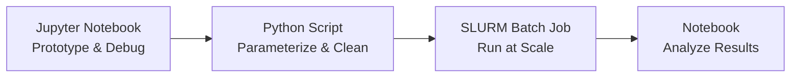
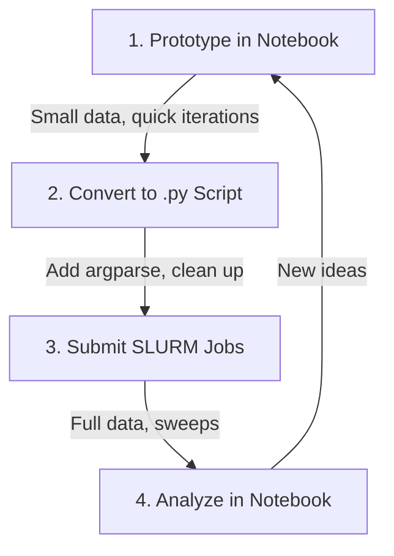

<!-- last-reviewed: 2026-02-19 -->
# Notebook-to-Script Workflow

How to iterate quickly in Jupyter notebooks and run large-scale experiments as Python scripts on OSC.

## Overview

A common research workflow looks like this:

1. **Explore and prototype** in a Jupyter notebook (small data, quick feedback)
2. **Convert** working code into a parameterized `.py` script
3. **Run experiments at scale** via SLURM batch jobs on OSC

This page walks through each stage with concrete examples.



## Stage 1: Prototype in a Notebook

### Launching Jupyter on OSC via OnDemand

The easiest way to use notebooks on OSC is through the [OSC OnDemand portal](https://ondemand.osc.edu):

1. Log in at [ondemand.osc.edu](https://ondemand.osc.edu)
2. Navigate to **Interactive Apps > Jupyter**
3. Select your project account, number of cores, and time limit
4. Click **Launch** and wait for the session to start
5. Click **Connect to Jupyter** when the session is ready

!!! tip "Use debug resources for prototyping"
    When iterating on code, request minimal resources (1-2 cores, 1 GPU if needed, 1-2 hours). Save large allocations for production runs.

### Prototyping Best Practices

Keep your notebook focused on experimentation:

```python
# Cell 1 — Imports and configuration
import torch
import torch.nn as nn
from torch.utils.data import DataLoader
import matplotlib.pyplot as plt
import numpy as np

# Use a small subset for fast iteration
DATA_DIR = "/fs/scratch/PAS1234/$USER/datasets/my_data"
SUBSET_SIZE = 500   # Small subset for prototyping
DEVICE = "cuda" if torch.cuda.is_available() else "cpu"
```

```python
# Cell 2 — Load a small data sample
dataset = MyDataset(DATA_DIR, max_samples=SUBSET_SIZE)
loader = DataLoader(dataset, batch_size=32, shuffle=True)

print(f"Dataset size: {len(dataset)}")
sample, label = dataset[0]
print(f"Sample shape: {sample.shape}, Label: {label}")
```

```python
# Cell 3 — Define and test model
model = MyModel(num_classes=10).to(DEVICE)
batch = next(iter(loader))
inputs, labels = batch[0].to(DEVICE), batch[1].to(DEVICE)
output = model(inputs)
print(f"Output shape: {output.shape}")
```

```python
# Cell 4 — Train for a few epochs to verify everything works
optimizer = torch.optim.Adam(model.parameters(), lr=1e-3)
criterion = nn.CrossEntropyLoss()

for epoch in range(3):
    total_loss = 0
    for inputs, labels in loader:
        inputs, labels = inputs.to(DEVICE), labels.to(DEVICE)
        optimizer.zero_grad()
        loss = criterion(model(inputs), labels)
        loss.backward()
        optimizer.step()
        total_loss += loss.item()
    print(f"Epoch {epoch}: loss={total_loss/len(loader):.4f}")
```

```python
# Cell 5 — Visualize results to confirm correctness
plt.plot(losses)
plt.xlabel("Step")
plt.ylabel("Loss")
plt.title("Training Loss")
plt.show()
```

!!! warning "Don't run full experiments in notebooks"
    Notebooks are great for prototyping, but they have drawbacks for long runs:

    - If the browser tab closes or your OnDemand session times out, you lose running state
    - Notebooks aren't easily parameterized for sweeps
    - Reproducibility is harder to guarantee (cell execution order matters)
    - They consume interactive resources that could be used for batch jobs

## Stage 2: Convert to a Python Script

Once your notebook code works on a small sample, extract it into a standalone `.py` script.

### Manual Conversion

Pull the working cells into a clean script with `argparse` for configuration:

`src/train.py`:

```python
"""Training script — converted from prototyping notebook."""
import argparse
import os
import torch
import torch.nn as nn
from torch.utils.data import DataLoader
from src.models.model import MyModel
from src.data.dataset import MyDataset


def parse_args():
    parser = argparse.ArgumentParser(description="Train MyModel")
    parser.add_argument("--data-dir", type=str, required=True)
    parser.add_argument("--output-dir", type=str, default="results")
    parser.add_argument("--epochs", type=int, default=100)
    parser.add_argument("--batch-size", type=int, default=64)
    parser.add_argument("--lr", type=float, default=1e-3)
    parser.add_argument("--num-classes", type=int, default=10)
    parser.add_argument("--num-workers", type=int, default=4)
    parser.add_argument("--seed", type=int, default=42)
    parser.add_argument("--resume", type=str, default=None,
                        help="Path to checkpoint to resume from")
    return parser.parse_args()


def train(args):
    # Reproducibility
    torch.manual_seed(args.seed)

    device = torch.device("cuda" if torch.cuda.is_available() else "cpu")
    print(f"Using device: {device}")

    # Data
    train_dataset = MyDataset(os.path.join(args.data_dir, "train"))
    val_dataset = MyDataset(os.path.join(args.data_dir, "val"))
    train_loader = DataLoader(train_dataset, batch_size=args.batch_size,
                              shuffle=True, num_workers=args.num_workers)
    val_loader = DataLoader(val_dataset, batch_size=args.batch_size,
                            shuffle=False, num_workers=args.num_workers)

    # Model, optimizer, loss
    model = MyModel(num_classes=args.num_classes).to(device)
    optimizer = torch.optim.Adam(model.parameters(), lr=args.lr)
    criterion = nn.CrossEntropyLoss()
    start_epoch = 0

    # Resume from checkpoint
    if args.resume:
        ckpt = torch.load(args.resume, map_location=device)
        model.load_state_dict(ckpt["model_state_dict"])
        optimizer.load_state_dict(ckpt["optimizer_state_dict"])
        start_epoch = ckpt["epoch"] + 1
        print(f"Resumed from epoch {start_epoch}")

    # Training loop
    os.makedirs(args.output_dir, exist_ok=True)
    best_val_acc = 0.0

    for epoch in range(start_epoch, args.epochs):
        model.train()
        train_loss = 0
        for inputs, labels in train_loader:
            inputs, labels = inputs.to(device), labels.to(device)
            optimizer.zero_grad()
            loss = criterion(model(inputs), labels)
            loss.backward()
            optimizer.step()
            train_loss += loss.item()

        # Validation
        model.eval()
        correct, total = 0, 0
        with torch.no_grad():
            for inputs, labels in val_loader:
                inputs, labels = inputs.to(device), labels.to(device)
                preds = model(inputs).argmax(dim=1)
                correct += (preds == labels).sum().item()
                total += labels.size(0)
        val_acc = correct / total

        print(f"Epoch {epoch}: train_loss={train_loss/len(train_loader):.4f}  "
              f"val_acc={val_acc:.4f}")

        # Checkpoint
        if val_acc > best_val_acc:
            best_val_acc = val_acc
            torch.save({
                "epoch": epoch,
                "model_state_dict": model.state_dict(),
                "optimizer_state_dict": optimizer.state_dict(),
                "val_acc": val_acc,
            }, os.path.join(args.output_dir, "best_model.pt"))

    print(f"Done. Best val_acc: {best_val_acc:.4f}")


if __name__ == "__main__":
    train(parse_args())
```

### Automated Conversion with `nbconvert`

You can also export a notebook directly and then clean it up:

```bash
# Convert notebook to .py file
jupyter nbconvert --to script notebooks/prototype.ipynb

# This creates notebooks/prototype.py
# Then edit it to add argparse, remove interactive cells, etc.
```

### Key Differences: Notebook vs. Script

| Aspect | Notebook | Script |
|--------|----------|--------|
| Configuration | Hardcoded variables in cells | `argparse` or config files |
| Data size | Small subset | Full dataset |
| Visualization | Inline `plt.show()` | Save to file (`plt.savefig()`) |
| Output | Cell output visible | Print statements, log files |
| Execution | Manual cell-by-cell | `python train.py --args` |
| Reproducibility | Cell order dependent | Deterministic top-to-bottom |

## Stage 3: Run at Scale on OSC

### Basic Experiment Job

`scripts/run_experiment.sh`:

```bash
#!/bin/bash
#SBATCH --job-name=train_exp
#SBATCH --account=PAS1234
#SBATCH --gpus-per-node=1
#SBATCH --cpus-per-task=4
#SBATCH --mem=32G
#SBATCH --time=08:00:00
#SBATCH --output=logs/train_%j.out

module load python/3.9-2022.05
module load cuda/11.8.0
source ~/venvs/myproject/bin/activate

SCRATCH=/fs/scratch/PAS1234/$USER/my_project

python src/train.py \
    --data-dir $SCRATCH/datasets/my_data \
    --output-dir $SCRATCH/results/baseline \
    --epochs 100 \
    --batch-size 64 \
    --lr 1e-3 \
    --seed 42
```

```bash
# Create logs directory and submit
mkdir -p logs
sbatch scripts/run_experiment.sh
```

### Hyperparameter Sweeps with Job Arrays

Use SLURM job arrays to run many configurations in parallel. For sweep script templates and job array patterns, see the [Job Submission Guide](../working-on-osc/osc-job-submission.md#job-arrays).

### Using Config Files Instead of CLI Args

For complex experiments, YAML config files are cleaner than long argument lists:

`configs/baseline.yaml`:

```yaml
data_dir: /fs/scratch/PAS1234/user/datasets/my_data
output_dir: /fs/scratch/PAS1234/user/results/baseline
epochs: 100
batch_size: 64
lr: 0.001
num_classes: 10
seed: 42
```

Load in your script with a library like [OmegaConf](https://github.com/omry/omegaconf) or plain PyYAML:

```python
import yaml

with open(args.config) as f:
    cfg = yaml.safe_load(f)
```

## Stage 4: Analyze Results Back in a Notebook

After experiments finish, use a notebook to compare runs and generate figures:

```python
# Cell — Load and compare sweep results
import os, json
import pandas as pd
import matplotlib.pyplot as plt

results_dir = "/fs/scratch/PAS1234/user/my_project/results"
rows = []
for run in os.listdir(results_dir):
    metrics_path = os.path.join(results_dir, run, "metrics.json")
    if os.path.exists(metrics_path):
        with open(metrics_path) as f:
            m = json.load(f)
        m["run"] = run
        rows.append(m)

df = pd.DataFrame(rows)
print(df.sort_values("val_acc", ascending=False).head(10))
```

```python
# Cell — Plot comparison
fig, ax = plt.subplots()
for lr, group in df.groupby("lr"):
    group.plot(x="batch_size", y="val_acc", ax=ax, label=f"lr={lr}", marker="o")
ax.set_ylabel("Validation Accuracy")
ax.set_title("Hyperparameter Sweep Results")
plt.savefig("figures/sweep_results.png", dpi=150)
plt.show()
```

## Summary: The Full Cycle



| Stage | Tool | Data Size | Resources |
|-------|------|-----------|-----------|
| Prototype | Jupyter via OnDemand | Small subset | 1-2 cores, optional GPU |
| Convert | Editor / `nbconvert` | N/A | N/A |
| Run at scale | `sbatch` / job arrays | Full dataset | Multi-GPU, long walltime |
| Analyze results | Jupyter via OnDemand | Result files | 1-2 cores |

## Next Steps

- Review [Job Submission](../working-on-osc/osc-job-submission.md) for SLURM details
- Set up [Data & Experiment Tracking](data-experiment-tracking.md) for experiment logging with MLflow or W&B
- Use a [pipeline orchestrator](../working-on-osc/pipeline-orchestration.md) for multi-step pipelines
- Learn about [PyTorch & GPU Setup](pytorch-setup.md) for training at scale
