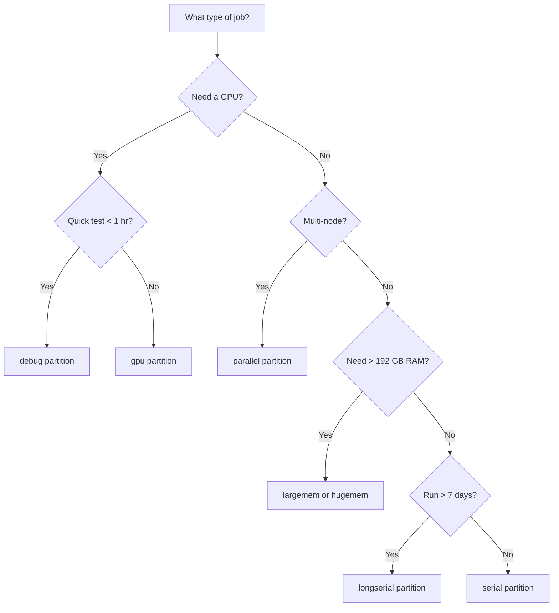

# OSC Clusters Overview

Understand OSC's high-performance computing clusters, available resources, and how to choose the right configuration for your workloads.

## HPC Terminology Glossary

Before diving into OSC's clusters, familiarize yourself with these key HPC terms:

| Term | Definition |
|------|-----------|
| **Cluster** | A collection of interconnected computers (nodes) that work together as a single system |
| **Node** | A single computer within a cluster, containing CPUs, memory, and sometimes GPUs |
| **Login Node** | A shared entry point for connecting to the cluster — used for file editing, job submission, and light tasks only |
| **Compute Node** | A node dedicated to running jobs — accessed through the job scheduler, not directly |
| **Core / CPU** | A single processing unit; modern nodes have many cores (e.g., 40–96 per node) |
| **GPU** | A graphics processing unit used for accelerated computing, especially deep learning |
| **Partition** | A logical grouping of nodes with specific resource limits and policies (also called a queue) |
| **Allocation** | A grant of compute time (measured in core-hours) assigned to a project account |
| **Batch Job** | A job submitted via a script that runs without user interaction |
| **Interactive Job** | A job that provides a live shell session on a compute node |
| **Scheduler** | Software (SLURM at OSC) that manages job queues and allocates resources |
| **Module** | A system for loading and managing software packages (e.g., `module load python/3.9-2022.05`) |
| **Scratch Space** | High-performance temporary storage for active jobs — files are purged after inactivity |
| **Home Directory** | Persistent personal storage with limited quota (`~/` or `/users/`) |
| **Project Space** | Shared storage for a research group, tied to a project allocation |
| **Walltime** | The maximum clock time a job is allowed to run |
| **Core-Hours** | The billing unit for compute time: cores × hours (e.g., 4 cores × 2 hours = 8 core-hours) |

## OSC Clusters

OSC operates two primary clusters available to researchers. Both use the SLURM job scheduler and share the same filesystem.

### Pitzer

Pitzer is OSC's newer and more powerful cluster, ideal for GPU-accelerated and large-scale workloads.

| Specification | Details |
|---------------|---------|
| **Launched** | 2018 (expanded 2020) |
| **Total Nodes** | ~800 |
| **CPU Type** | Intel Xeon 6148 (Skylake) and 8268 (Cascade Lake) |
| **Cores per Node** | 40 (Skylake) or 48 (Cascade Lake) |
| **RAM per Node** | 192 GB standard, 768 GB on large-memory nodes |
| **GPU Nodes** | NVIDIA V100 (32 GB) and A100 (40 GB / 80 GB) |
| **GPUs per GPU Node** | Up to 4 V100s or up to 4 A100s |
| **Interconnect** | Intel Omni-Path / HDR InfiniBand |
| **Operating System** | CentOS 7 |

!!! tip "Recommended for ML workloads"
    Pitzer's A100 GPUs provide the best performance for deep learning training. Request them with `--gpus-per-node=a100:1`.

### Owens

Owens is OSC's older cluster, well-suited for CPU-intensive workloads and smaller GPU jobs.

| Specification | Details |
|---------------|---------|
| **Launched** | 2016 |
| **Total Nodes** | ~800 |
| **CPU Type** | Intel Xeon E5-2680 v4 (Broadwell) |
| **Cores per Node** | 28 |
| **RAM per Node** | 128 GB standard, 384 GB or 768 GB on large-memory nodes |
| **GPU Nodes** | NVIDIA P100 (16 GB) |
| **GPUs per GPU Node** | 1 P100 |
| **Interconnect** | Intel Omni-Path |
| **Operating System** | CentOS 7 |

### Cluster Comparison

| Feature | Pitzer | Owens |
|---------|--------|-------|
| **Generation** | Newer (2018+) | Older (2016) |
| **Cores per Node** | 40–48 | 28 |
| **RAM per Node** | 192 GB+ | 128 GB+ |
| **GPU Options** | V100, A100 | P100 |
| **GPU Memory** | 32–80 GB | 16 GB |
| **Multi-GPU Nodes** | Up to 4 GPUs | 1 GPU |
| **Best For** | GPU training, large jobs | CPU work, smaller GPU jobs |
| **Queue Wait Times** | Can be longer (popular) | Often shorter |

!!! note "Both clusters share the same filesystem"
    Your home directory, project space, and scratch space are accessible from both Pitzer and Owens. You do not need to copy files between clusters.

## Partitions and Queues

Each cluster has multiple partitions with different resource limits and policies.

### Pitzer Partitions

| Partition | Max Walltime | Max Nodes | GPU Access | Use Case |
|-----------|-------------|-----------|------------|----------|
| `serial` | 168:00:00 (7 days) | 1 | No | Single-node CPU jobs |
| `parallel` | 168:00:00 (7 days) | 20+ | No | Multi-node MPI jobs |
| `gpu` | 48:00:00 (2 days) | Variable | Yes (V100, A100) | GPU-accelerated workloads |
| `debug` | 01:00:00 (1 hour) | 2 | Yes | Quick testing and debugging |
| `longserial` | 336:00:00 (14 days) | 1 | No | Long-running single-node jobs |
| `largemem` | 168:00:00 (7 days) | 1 | No | Jobs requiring 384+ GB RAM |
| `hugemem` | 168:00:00 (7 days) | 1 | No | Jobs requiring 768+ GB RAM |

### Owens Partitions

| Partition | Max Walltime | Max Nodes | GPU Access | Use Case |
|-----------|-------------|-----------|------------|----------|
| `serial` | 168:00:00 (7 days) | 1 | No | Single-node CPU jobs |
| `parallel` | 168:00:00 (7 days) | 20+ | No | Multi-node MPI jobs |
| `gpu` | 168:00:00 (7 days) | Variable | Yes (P100) | GPU-accelerated workloads |
| `debug` | 01:00:00 (1 hour) | 2 | Yes | Quick testing and debugging |
| `longserial` | 336:00:00 (14 days) | 1 | No | Long-running single-node jobs |
| `hugemem` | 168:00:00 (7 days) | 1 | No | Jobs requiring 768+ GB RAM |

### Choosing the Right Partition



!!! tip "Start with `debug` for testing"
    Always test your job scripts on the `debug` partition first. Debug jobs start quickly and help you catch errors before committing to long runs.

## Resource Limits and Quotas

### Compute Allocations

Every project has an allocation of core-hours. Check your balance with:

```bash
# Check your project's remaining core-hours
sbalance

# Or for a specific account
sbalance -a PAS1234
```

!!! warning "Monitor your allocation"
    When your allocation runs out, jobs will no longer be scheduled. Check `sbalance` regularly and request additional time through your PI if needed.

### Storage Quotas

OSC provides three types of storage, each with different purposes and limits:

| Storage | Path | Quota | Purge Policy | Backed Up | Use For |
|---------|------|-------|-------------|-----------|---------|
| **Home** | `~/` or `/users/<username>` | 500 GB | None | Yes | Code, configs, small datasets |
| **Scratch** | `/fs/scratch/<project>` | 100 TB (project) | Files deleted after **90 days** of inactivity | No | Active job data, temporary files |
| **Project** | `/fs/ess/<project>` | Varies by allocation | None | Yes | Shared datasets, results, models |

Check your current usage:

```bash
# Check home directory quota
quota -s

# Check project storage usage
du -sh /fs/ess/PAS1234

# Check scratch usage
du -sh /fs/scratch/PAS1234
```

!!! danger "Scratch is purged automatically"
    Files on scratch that have not been accessed for 90 days are automatically deleted. **Never store important results only on scratch.** Copy final results to your home or project directory.

### Job Limits per User

Typical per-user limits (these may vary by project):

| Limit | Value |
|-------|-------|
| Max running jobs | ~256 |
| Max queued jobs | ~1000 |
| Max GPUs per user | Varies by partition |
| Max cores per job | Depends on partition and allocation |

## Choosing the Right Resources

### For ML/DL Training (GPU)

```bash
#SBATCH --partition=gpu
#SBATCH --gpus-per-node=a100:1    # A100 for best performance
#SBATCH --cpus-per-task=8          # CPU cores for data loading
#SBATCH --mem=64G                  # Enough RAM for data pipeline
#SBATCH --time=24:00:00            # Adjust based on training time
```

!!! tip "Match CPU cores to GPU"
    Request 4–8 CPU cores per GPU to keep the data pipeline fast enough to feed the GPU.

### For Data Processing (CPU)

```bash
#SBATCH --partition=serial
#SBATCH --cpus-per-task=16         # Many cores for parallel processing
#SBATCH --mem=64G                  # Adjust based on dataset size
#SBATCH --time=04:00:00
```

### For Quick Testing (Debug)

```bash
#SBATCH --partition=debug
#SBATCH --gpus-per-node=1          # Optional: test GPU code
#SBATCH --cpus-per-task=4
#SBATCH --time=00:30:00            # Max 1 hour
```

### For Multi-GPU Training

```bash
#SBATCH --partition=gpu
#SBATCH --gpus-per-node=4          # 4 GPUs on one node
#SBATCH --cpus-per-task=32         # 8 cores per GPU
#SBATCH --mem=192G
#SBATCH --time=48:00:00
```

### Resource Request Guidelines

| Workload | Partition | GPUs | CPUs | Memory | Typical Walltime |
|----------|-----------|------|------|--------|-----------------|
| Small test | `debug` | 0–1 | 2–4 | 8–16 GB | 15–30 min |
| CPU preprocessing | `serial` | 0 | 8–16 | 32–64 GB | 1–4 hours |
| Single GPU training | `gpu` | 1 | 4–8 | 32–64 GB | 4–24 hours |
| Multi-GPU training | `gpu` | 2–4 | 16–32 | 128–192 GB | 12–48 hours |
| Large-memory job | `largemem` | 0 | 8–48 | 384–768 GB | 2–24 hours |
| Hyperparameter sweep | `gpu` (array) | 1 per task | 4–8 | 32 GB | 2–8 hours per task |

## Troubleshooting

### "Invalid account" Error

```
sbatch: error: Batch job submission failed: Invalid account or account/partition combination specified
```

Your project account may not have access to the partition you requested. Check:

```bash
# List your accounts
sacctmgr show associations user=$USER format=Account,Partition
```

### Cannot See GPUs

If `nvidia-smi` shows no GPUs, make sure you requested GPU resources:

```bash
#SBATCH --partition=gpu
#SBATCH --gpus-per-node=1
```

And load the CUDA module in your script:

```bash
module load cuda/11.8.0
```

### Jobs Pending with "Resources" Reason

Your job is requesting more resources than are currently available. Try:

- Reducing the number of GPUs or nodes
- Shortening the walltime (shorter jobs fit into gaps more easily)
- Using a different partition (e.g., Owens instead of Pitzer)

## Next Steps

- [Set up your OSC account](osc-account-setup.md) if you haven't already
- Learn to [connect via SSH](osc-ssh-connection.md)
- [Submit your first job](../working-on-osc/osc-job-submission.md)
- Review [OSC best practices](../working-on-osc/osc-best-practices.md)

## Resources

- [OSC Pitzer Documentation](https://www.osc.edu/resources/technical_support/supercomputers/pitzer)
- [OSC Owens Documentation](https://www.osc.edu/resources/technical_support/supercomputers/owens)
- [OSC Storage Overview](https://www.osc.edu/resources/getting_started/howto/howto_use_osc_storage)
- [SLURM Documentation](https://slurm.schedmd.com/documentation.html)
