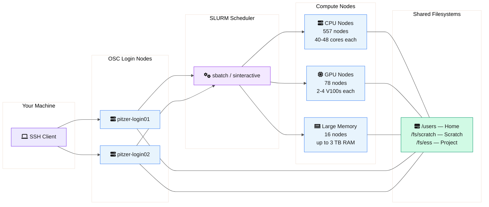
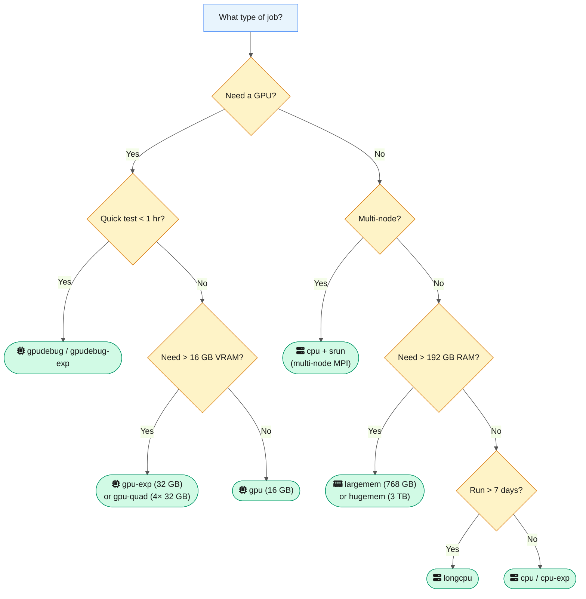
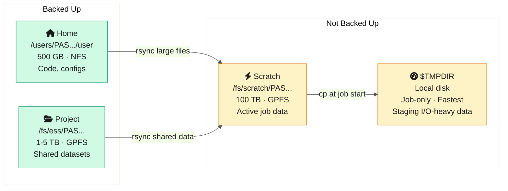

<!-- last-reviewed: 2026-03-30 -->
# OSC Clusters Overview

Understand OSC's high-performance computing clusters, available resources, and how to choose the right configuration for your workloads.

## HPC Terminology Glossary

Before diving into OSC's clusters, familiarize yourself with these key HPC terms:

| Term | Definition |
|------|-----------|
| **Cluster** | A collection of interconnected computers (nodes) that work together as a single system |
| **Node** | A single computer within a cluster, containing CPUs, memory, and sometimes GPUs |
| **Login Node** | A shared entry point for connecting to the cluster — used for file editing, job submission, and light tasks only |
| **Compute Node** | A node dedicated to running jobs — accessed through the job scheduler, not directly |
| **Core / CPU** | A single processing unit; modern nodes have many cores (e.g., 40–48 per node on Pitzer) |
| **GPU** | A graphics processing unit used for accelerated computing, especially deep learning |
| **Partition** | A logical grouping of nodes with specific resource limits and policies (also called a queue) |
| **Allocation** | A grant of compute time (measured in core-hours) assigned to a project account |
| **Batch Job** | A job submitted via a script that runs without user interaction |
| **Interactive Job** | A job that provides a live shell session on a compute node |
| **Scheduler** | Software (SLURM at OSC) that manages job queues and allocates resources |
| **Module** | A system for loading and managing software packages (e.g., `module load python/3.12`) |
| **Scratch Space** | High-performance temporary storage for active jobs — files are purged after inactivity |
| **Home Directory** | Persistent personal storage with limited quota (`~/` or `/users/`) |
| **Project Space** | Shared storage for a research group, tied to a project allocation |
| **Walltime** | The maximum clock time a job is allowed to run |
| **Core-Hours** | The billing unit for compute time: cores × hours (e.g., 4 cores × 2 hours = 8 core-hours) |

## Cluster Architecture

When you SSH into OSC, you land on a **login node** — a shared gateway for editing files and submitting jobs. Compute-intensive work runs on **compute nodes** allocated by the SLURM scheduler. All nodes share the same filesystems (home, scratch, project).


```mermaid
%%{init: {'theme': 'base', 'themeVariables': {'primaryColor': '#e8f4fd', 'primaryTextColor': '#1a1a1a', 'lineColor': '#555'}}}%%
flowchart LR
    subgraph Your Machine
        A["fa:fa-laptop SSH Client"]:::external
    end
    subgraph OSC Login Nodes
        B["fa:fa-server pitzer-login01"]:::process
        C["fa:fa-server pitzer-login02"]:::process
    end
    subgraph SLURM Scheduler
        D["fa:fa-cogs sbatch / sinteractive"]:::infra
    end
    subgraph Compute Nodes
        E["fa:fa-server CPU Nodes\n557 nodes\n40-48 cores each"]:::process
        F["fa:fa-microchip GPU Nodes\n78 nodes\n2-4 V100s each"]:::process
        G["fa:fa-memory Large Memory\n16 nodes\nup to 3 TB RAM"]:::process
    end
    subgraph Shared Filesystems
        H["fa:fa-hard-drive /users — Home\n/fs/scratch — Scratch\n/fs/ess — Project"]:::data
    end

    A --> B & C
    B & C --> D
    D --> E & F & G
    E & F & G --- H
    B & C --- H

    classDef process fill:#e8f4fd,stroke:#3b82f6
    classDef external fill:#ede9fe,stroke:#7c3aed
    classDef infra fill:#f3e8ff,stroke:#9333ea
    classDef data fill:#d1fae5,stroke:#059669
```

!!! warning "Do not run compute on login nodes"
    Login nodes are shared by all users. Running training, preprocessing, or heavy builds on them slows everyone down and may get your processes killed. Use `sinteractive` or `sbatch` for anything beyond editing and job submission.

## OSC Clusters

OSC currently operates three clusters. All use the SLURM job scheduler and share the same filesystems.

### Pitzer (Primary)

Pitzer is the lab's primary cluster. All specs below are verified against live `sinfo` output (March 2026).

| Node Type | Nodes | CPUs | RAM | GPUs | Partition |
|-----------|-------|------|-----|------|-----------|
| Standard (2018 Skylake) | 217 | 40 | 192 GB | — | `cpu` |
| Standard (2020 Cascade Lake) | 340 | 48 | 192 GB | — | `cpu-exp` |
| Dual GPU (2018 Skylake) | 32 | 40 | 384 GB | 2× V100 16 GB | `gpu` |
| Dual GPU (2020 Cascade Lake) | 42 | 48 | 384 GB | 2× V100 32 GB | `gpu-exp` |
| Quad GPU (2020 Cascade Lake) | 4 | 48 | 768 GB | 4× V100 32 GB + NVLink | `gpu-quad` |
| Large Memory (2018) | 4 | 80 | 3 TB | — | `hugemem` |
| Large Memory (2020) | 12 | 48 | 768 GB | — | `largemem` |

**Total:** 651 nodes, ~29,000 cores. **Interconnect:** Mellanox EDR InfiniBand (100 Gbps). **OS:** RHEL 9.

Source: [OSC Pitzer Documentation](https://www.osc.edu/resources/technical_support/supercomputers/pitzer)

!!! tip "Which GPU partition?"
    - **`gpu`** (32 nodes) — V100 16 GB, 40 CPUs. Fine for most training.
    - **`gpu-exp`** (42 nodes) — V100 32 GB, 48 CPUs. Use when you need more GPU memory (larger models, bigger batches).
    - **`gpu-quad`** (4 nodes) — 4× V100 32 GB with NVLink, 768 GB RAM. For multi-GPU or very large models.

### Ascend & Cardinal (Newer Clusters)

OSC has deployed two newer clusters with more powerful GPUs. Both are now in production and accepting jobs.

| Cluster | GPU | GPU Memory | Notes |
|---------|-----|-----------|-------|
| **Ascend** | NVIDIA A100 | 40 GB / 80 GB | Best for large-model training, transformer workloads |
| **Cardinal** | NVIDIA H100 | 94 GB | Latest generation, highest throughput |

Access may require a separate allocation request. Check [OSC's systems page](https://www.osc.edu/resources/technical_support/supercomputers) for current availability and how to request access.

!!! info "Owens is decommissioned"
    Owens was fully shut down in February 2025. If you see references to Owens in older scripts or documentation, replace `owens.osc.edu` with `pitzer.osc.edu`. All Owens data was migrated to the shared filesystem.

## Partitions and Queues

Each partition groups nodes with the same resource profile and time limits. The table below is from live `sinfo` output (March 2026):

### Pitzer Partitions

| Partition | Max Walltime | Nodes | GPUs | Use Case |
|-----------|-------------|-------|------|----------|
| `cpu` | 7 days | 217 | — | Single-node CPU jobs (Skylake, 40 cores) |
| `cpu-exp` | 7 days | 340 | — | Single-node CPU jobs (Cascade Lake, 48 cores) |
| `longcpu` | 14 days | 217 | — | Long-running CPU jobs |
| `gpu` | 7 days | 32 | 2× V100 16 GB | GPU training |
| `gpu-exp` | 7 days | 42 | 2× V100 32 GB | GPU training (more memory) |
| `gpu-quad` | 7 days | 4 | 4× V100 32 GB | Multi-GPU training |
| `gpudebug` | 1 hour | 32 | V100 | Quick GPU testing (high priority) |
| `gpudebug-exp` | 1 hour | 42 | V100-32G | Quick GPU testing |
| `debug-cpu` | 1 hour | 217 | — | Quick CPU testing (high priority) |
| `largemem` | 7 days | 12 | — | Jobs needing 768 GB RAM |
| `hugemem` | 7 days | 4 | — | Jobs needing up to 3 TB RAM |
| `gpubackfill` | 4 hours | 32 | V100 | Free GPU time in scheduling gaps |
| `gpubackfill-exp` | 4 hours | 42 | V100-32G | Free GPU time in scheduling gaps |

!!! tip "Backfill partitions are free"
    `gpubackfill` and `gpubackfill-exp` don't charge your allocation. The tradeoff is a 4-hour walltime limit. Great for short experiments and hyperparameter exploration.

### Choosing the Right Partition


```mermaid
%%{init: {'theme': 'base', 'themeVariables': {'primaryColor': '#e8f4fd', 'primaryTextColor': '#1a1a1a', 'lineColor': '#555'}}}%%
flowchart TD
    A["What type of job?"]:::process --> B@{ shape: diam, label: "Need a GPU?" }
    B:::decision -->|Yes| C@{ shape: diam, label: "Quick test < 1 hr?" }
    C:::decision -->|Yes| E@{ shape: stadium, label: "fa:fa-microchip gpudebug / gpudebug-exp" }
    E:::success
    C -->|No| F@{ shape: diam, label: "Need > 16 GB VRAM?" }
    F:::decision -->|Yes| G@{ shape: stadium, label: "fa:fa-microchip gpu-exp (32 GB)\nor gpu-quad (4× 32 GB)" }
    G:::success
    F -->|No| H@{ shape: stadium, label: "fa:fa-microchip gpu (16 GB)" }
    H:::success
    B -->|No| D@{ shape: diam, label: "Multi-node?" }
    D:::decision -->|Yes| I@{ shape: stadium, label: "fa:fa-server cpu + srun\n(multi-node MPI)" }
    I:::success
    D -->|No| J@{ shape: diam, label: "Need > 192 GB RAM?" }
    J:::decision -->|Yes| K@{ shape: stadium, label: "fa:fa-memory largemem (768 GB)\nor hugemem (3 TB)" }
    K:::success
    J -->|No| L@{ shape: diam, label: "Run > 7 days?" }
    L:::decision -->|Yes| M@{ shape: stadium, label: "fa:fa-server longcpu" }
    M:::success
    L -->|No| N@{ shape: stadium, label: "fa:fa-server cpu / cpu-exp" }
    N:::success

    classDef process fill:#e8f4fd,stroke:#3b82f6
    classDef decision fill:#fef3c7,stroke:#d97706
    classDef success fill:#d1fae5,stroke:#059669
```

!!! tip "Start with `gpudebug` for testing"
    Always test your job scripts on a debug partition first. Debug jobs start quickly (often within seconds) and help you catch errors before committing to long runs.

## Storage Tiers

OSC provides four storage tiers, all visible from every login and compute node. Each serves a different purpose.


```mermaid
%%{init: {'theme': 'base', 'themeVariables': {'primaryColor': '#e8f4fd', 'primaryTextColor': '#1a1a1a', 'lineColor': '#555'}}}%%
flowchart LR
    subgraph Backed Up
        HOME["fa:fa-house Home\n/users/PAS.../user\n500 GB · NFS\nCode, configs"]:::backed
        PROJECT["fa:fa-folder-open Project\n/fs/ess/PAS...\n1-5 TB · GPFS\nShared datasets"]:::backed
    end
    subgraph Not Backed Up
        SCRATCH["fa:fa-bolt Scratch\n/fs/scratch/PAS...\n100 TB · GPFS\nActive job data"]:::notbacked
        TMPDIR["fa:fa-gauge-high $TMPDIR\nLocal disk\nJob-only · Fastest\nStaging I/O-heavy data"]:::notbacked
    end

    HOME -->|"rsync large files"| SCRATCH
    SCRATCH -->|"cp at job start"| TMPDIR
    PROJECT -->|"rsync shared data"| SCRATCH

    classDef backed fill:#d1fae5,stroke:#059669
    classDef notbacked fill:#fef3c7,stroke:#d97706
```

### Storage Details

| Tier | Path | Filesystem | Quota | Purge | Backed Up | Performance |
|------|------|-----------|-------|-------|-----------|-------------|
| **Home** | `/users/<project>/<user>` | NetApp NFS | 500 GB, 1M files | None (archived after 18 months inactive) | Yes (daily, 2 tape copies) | ~40 GB/s read/write |
| **Project** | `/fs/ess/<project>` | GPFS | 1–5 TB (varies by allocation) | None | Yes (daily, 2 tape copies) | ~60 GB/s read, ~50 GB/s write |
| **Scratch** | `/fs/scratch/<project>` | GPFS | 100 TB, 25M files | **60 days** inactivity, purged Wednesdays | No | ~170 GB/s read, ~70 GB/s write |
| **$TMPDIR** | Local compute node disk | Local | Varies by node | Deleted when job ends | No | Fastest (local I/O) |

Source: [OSC Storage Environment](https://www.osc.edu/supercomputing/storage-environment-at-osc/available-file-systems)

!!! danger "Scratch purge: 60 days, not recoverable"
    Files on scratch that have not been accessed for **60 days** are automatically deleted every Wednesday. This is not recoverable — scratch is not backed up. Copy final results and trained models to home or project space.

    **Do not** use scripts to artificially touch files and reset access times — this violates OSC policy and can result in account suspension.

### Which Storage for What

| Data Type | Store On | Why |
|-----------|----------|-----|
| Source code, configs, small scripts | **Home** | Backed up, persistent, git-managed |
| Shared datasets (lab-wide) | **Project** (`/fs/ess/`) | Backed up, shared across users |
| Training data, checkpoints, logs | **Scratch** | High throughput, large quota |
| I/O-heavy training data during a job | **$TMPDIR** | Fastest reads, avoids NFS/GPFS contention |
| Final results, trained models to keep | **Home** or **Project** | Backed up, won't be purged |

Check your current usage:

```bash
# Home quota
quota -s

# Project storage usage
du -sh /fs/ess/PAS1234

# Scratch usage
du -sh /fs/scratch/PAS1234
```

### Shared Project Directories

Use project space for datasets and environments that the whole lab needs:

```
/fs/ess/PAS1234/
├── datasets/           # Shared datasets
├── envs/               # Shared conda/venv environments
├── username1/          # Individual work directories
└── username2/
```

Keep a README in the project root documenting what each directory contains. For creating shared conda or venv environments, see [Environment Management](../working-on-osc/osc-environment-management.md).

## Compute Allocations

Every project has an allocation of core-hours. Check your balance with:

```bash
# Check your project's remaining core-hours
sbalance

# Or for a specific account
sbalance -a PAS1234
```

!!! warning "Monitor your allocation"
    When your allocation runs out, jobs will no longer be scheduled. Check `sbalance` regularly and request additional time through your PI if needed.

### Resource Request Guidelines

For complete SBATCH job script templates (GPU training, CPU processing, debug, multi-GPU), see the [Job Submission Guide](../working-on-osc/osc-job-submission.md).

!!! tip "Match CPU cores to GPU"
    Request 4–8 CPU cores per GPU to keep the data pipeline fast enough to feed the GPU. See the [PyTorch Performance Tuning Guide](https://pytorch.org/tutorials/recipes/recipes/tuning_guide.html) for data loading optimization.

| Workload | Partition | GPUs | CPUs | Memory | Typical Walltime |
|----------|-----------|------|------|--------|-----------------|
| Quick test | `gpudebug` | 0–1 | 2–4 | 8–16 GB | 15–30 min |
| CPU preprocessing | `cpu` | 0 | 8–16 | 32–64 GB | 1–4 hours |
| Single GPU training | `gpu` or `gpu-exp` | 1 | 4–8 | 32–64 GB | 4–24 hours |
| Multi-GPU training | `gpu-quad` | 2–4 | 16–32 | 128–192 GB | 12–48 hours |
| Large-memory job | `largemem` | 0 | 8–48 | 384–768 GB | 2–24 hours |
| Hyperparameter sweep | `gpu` (array) | 1 per task | 4–8 | 32 GB | 2–8 hours per task |

## Troubleshooting

### "Invalid account" Error

```
sbatch: error: Batch job submission failed: Invalid account or account/partition combination specified
```

Your project account may not have access to the partition you requested. Check:

```bash
# List your accounts and partitions
sacctmgr show associations user=$USER format=Account,Partition
```

### Cannot See GPUs

If `nvidia-smi` shows no GPUs, make sure you requested GPU resources:

```bash
#SBATCH --partition=gpu
#SBATCH --gpus-per-node=1
```

!!! note "You do NOT need `module load cuda` for PyPI torch"
    If you installed PyTorch from PyPI (via `pip install` or `uv add`), the wheels bundle their own CUDA libraries. Only load a CUDA module if you are compiling custom CUDA extensions. See [PyTorch & GPU Setup](../ml-workflows/pytorch-setup.md).

### Jobs Pending with "Resources" Reason

Your job is requesting more resources than are currently available. Try:

- Reducing the number of GPUs or nodes
- Shortening the walltime (shorter jobs fit into backfill gaps more easily due to [SLURM backfill scheduling](https://slurm.schedmd.com/sched_config.html))
- Using `gpubackfill` or `gpubackfill-exp` for short experiments (4-hour max, doesn't charge allocation)

## Next Steps

- [Set up your OSC account](osc-account-setup.md) if you haven't already
- Learn to [connect via SSH](osc-ssh-connection.md)
- [Submit your first job](../working-on-osc/osc-job-submission.md)

## Resources

- [OSC Pitzer Documentation](https://www.osc.edu/resources/technical_support/supercomputers/pitzer)
- [OSC Storage Environment](https://www.osc.edu/supercomputing/storage-environment-at-osc/available-file-systems)
- [OSC Systems Overview](https://www.osc.edu/resources/technical_support/supercomputers) (Pitzer, Ascend, Cardinal)
- [SLURM Documentation](https://slurm.schedmd.com/documentation.html)
