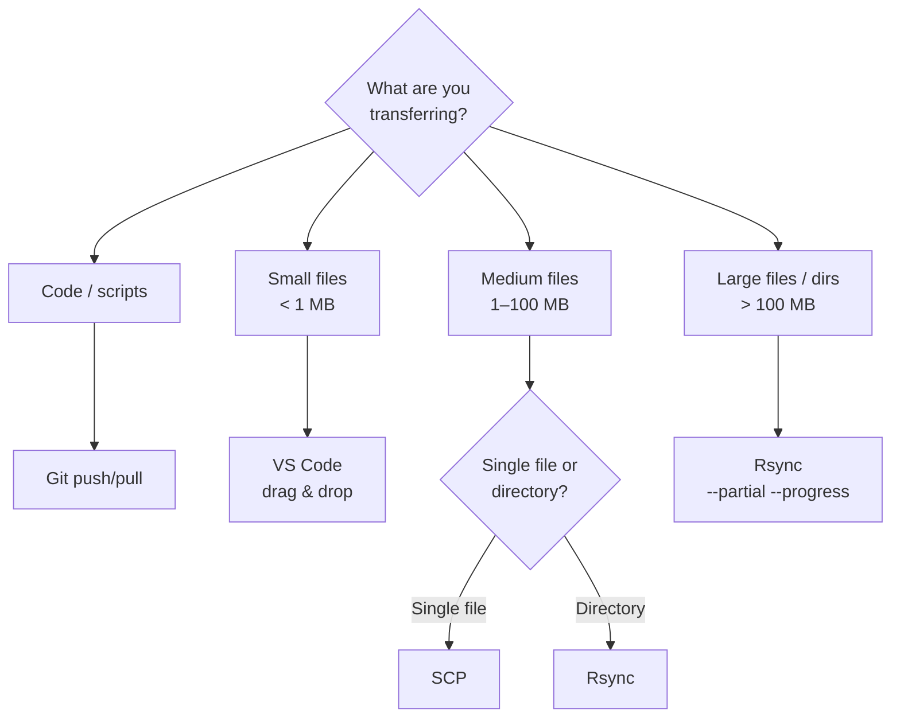

<!-- last-reviewed: 2026-02-19 -->
# File Transfer Guide

Learn efficient methods to transfer files between your local machine and OSC.

## Quick Reference

| Method | Best For | Speed | Ease of Use |
|--------|----------|-------|-------------|
| VS Code | Small files (<1 MB), editing | Medium | ⭐⭐⭐⭐⭐ |
| SCP | Single files, medium size | Medium | ⭐⭐⭐⭐ |
| Rsync | Large files (>100 MB), directory sync | Fast | ⭐⭐⭐ |
| SFTP | Interactive browsing | Medium | ⭐⭐⭐⭐ |
| OnDemand | Web uploads (<100 MB) | Medium | ⭐⭐⭐⭐⭐ |
| Git | Code and scripts only | Fast | ⭐⭐⭐⭐ |



## Method 1: VS Code (Easiest)

If you're using [Remote Development](osc-remote-development.md), VS Code makes file transfer simple.

### Drag and Drop
1. Connect to OSC via Remote-SSH
2. Drag files from your local file explorer into VS Code's file browser
3. Files upload automatically

### Download Files
1. Right-click any file in VS Code
2. Select "Download..."
3. Choose destination

### Upload Files
1. Right-click in the file browser
2. Select "Upload..."
3. Choose files to upload

## Method 2: SCP (Secure Copy)

SCP is built into SSH and works from the command line.

### Basic Usage

```bash
# Upload file to OSC
scp local_file.txt pitzer:~/

# Upload to specific directory
scp local_file.txt pitzer:~/projects/data/

# Download file from OSC
scp pitzer:~/remote_file.txt ./

# Download to specific directory
scp pitzer:~/remote_file.txt ~/Downloads/
```

### Copy Directories

```bash
# Upload directory
scp -r local_directory/ pitzer:~/remote_directory/

# Download directory
scp -r pitzer:~/remote_directory/ ./local_directory/
```

### Multiple Files

```bash
# Upload multiple files
scp file1.txt file2.txt file3.txt pitzer:~/data/

# Download multiple files
scp pitzer:~/data/*.csv ./
```

### With Progress

```bash
# Show progress (not supported by default SCP)
# Use rsync instead (see below)
```

## Method 3: Rsync (Recommended for Large Transfers)

Rsync is the most efficient method for large files and directories.

### Why Rsync?

- ✅ Resumes interrupted transfers
- ✅ Only transfers changed files
- ✅ Shows progress
- ✅ Can preserve permissions and timestamps
- ✅ Compression during transfer

### Basic Rsync

```bash
# Upload directory to OSC
rsync -avz --progress local_directory/ pitzer:~/remote_directory/

# Download directory from OSC
rsync -avz --progress pitzer:~/remote_directory/ ./local_directory/
```

### Rsync Options Explained

- `-a` (archive): Preserves permissions, timestamps, symbolic links
- `-v` (verbose): Show files being transferred
- `-z` (compress): Compress during transfer
- `--progress`: Show transfer progress
- `-h` (human-readable): Show sizes in KB, MB, GB
- `--exclude`: Exclude files/patterns
- `--delete`: Delete files in destination not in source

### Common Rsync Commands

```bash
# Sync with human-readable progress
rsync -avzh --progress source/ pitzer:~/destination/

# Exclude certain files
rsync -avz --progress --exclude='*.log' --exclude='.git/' source/ pitzer:~/destination/

# Dry run (see what would be transferred)
rsync -avzn --progress source/ pitzer:~/destination/

# Sync and delete files not in source
rsync -avz --progress --delete source/ pitzer:~/destination/

# Resume interrupted transfer
rsync -avz --progress --partial source/ pitzer:~/destination/
```

??? tip "Rsync Exclude Patterns"

    Create `.rsync-exclude` file:

    ```
    # Exclude patterns
    *.log
    *.tmp
    .git/
    __pycache__/
    *.pyc
    node_modules/
    .DS_Store
    ```

    Use it:
    ```bash
    rsync -avz --progress --exclude-from=.rsync-exclude source/ pitzer:~/destination/
    ```

??? tip "Large Dataset Sync"

    ```bash
    # For multi-GB datasets
    rsync -avzh --progress \
      --partial --partial-dir=.rsync-partial \
      --exclude='*.log' \
      ./dataset/ pitzer:~/projects/data/dataset/
    ```

    Options:

    - `--partial`: Keep partial files if transfer interrupted
    - `--partial-dir`: Store partial files in hidden directory

## Method 4: SFTP (Interactive)

SFTP provides an interactive file transfer session.

### Start SFTP Session

```bash
sftp pitzer
```

### SFTP Commands

```bash
# Navigate remote directory
cd /path/to/directory
pwd

# Navigate local directory
lcd /local/path
lpwd

# List files
ls              # Remote files
lls             # Local files

# Upload file
put local_file.txt

# Upload directory
put -r local_directory

# Download file
get remote_file.txt

# Download directory
get -r remote_directory

# Exit
quit
```

### Example SFTP Session

```bash
$ sftp pitzer
sftp> cd projects/data
sftp> lcd ~/Documents/research_data
sftp> put experiment_results.csv
Uploading experiment_results.csv to /home/username/projects/data/experiment_results.csv
sftp> get model_weights.pth
Fetching /home/username/projects/data/model_weights.pth to model_weights.pth
sftp> quit
```

## Method 5: OSC OnDemand (Web Interface)

OSC OnDemand provides a web-based file browser.

### Access OnDemand

1. Visit [https://ondemand.osc.edu](https://ondemand.osc.edu)
2. Log in with your OSU credentials
3. Click "Files" → "Home Directory" (or any other location)

### Upload Files

1. Navigate to destination directory
2. Click "Upload" button
3. Select files or drag-and-drop
4. Wait for upload to complete

### Download Files

1. Navigate to the file
2. Check the checkbox next to the file
3. Click "Download"

### Limitations

- Good for small to medium files (< 100 MB)
- Not ideal for very large datasets
- Can be slow for many files

## Method 6: Git (For Code)

For code and small files, use Git:

```bash
# On local machine
git add .
git commit -m "Update code"
git push origin main

# On OSC
git pull origin main
```

### Best Practices with Git

- ✅ Use for code, scripts, configs
- ✅ Use for small data files (< 10 MB)
- ❌ Don't commit large datasets
- ❌ Don't commit binary files (model checkpoints)
- ❌ Don't commit generated files

Use `.gitignore`:
```gitignore
# Python
__pycache__/
*.pyc
.venv/

# Data
*.csv
*.h5
*.hdf5
*.npy
data/
datasets/

# Models
*.pth
*.ckpt
checkpoints/
```

## Best Practices

### 1. Organize Your Files

On OSC:
```
~/
├── projects/
│   ├── project1/
│   │   ├── code/
│   │   ├── data/
│   │   └── results/
│   └── project2/
├── scratch/        # Temporary large files
└── shared/         # Shared with lab members
```

### 2. Use Scratch Space for Large Data

```bash
# Scratch space (faster, more space, but not backed up)
cd $TMPDIR          # Temporary scratch
cd /fs/scratch/     # Persistent scratch (your project)
```

### 3. Compress Before Transfer

```bash
# On local machine
tar -czf dataset.tar.gz dataset/
rsync -avz --progress dataset.tar.gz pitzer:~/

# On OSC
ssh pitzer
tar -xzf dataset.tar.gz
```

??? tip "Checksum Verification for Large Transfers"

    ```bash
    # Generate checksum locally
    sha256sum large_file.zip > checksum.txt

    # Transfer both
    rsync -avz --progress large_file.zip checksum.txt pitzer:~/

    # Verify on OSC
    ssh pitzer
    sha256sum -c checksum.txt
    ```

### 5. Use .rsyncignore

Create project-level `.rsyncignore`:

```
.git/
__pycache__/
*.pyc
.vscode/
.ipynb_checkpoints/
*.log
```

Sync command:
```bash
rsync -avz --progress --exclude-from=.rsyncignore ./ pitzer:~/project/
```

## Troubleshooting

### Transfer Interrupted

**Rsync** resumes automatically:
```bash
rsync -avz --progress --partial source/ pitzer:~/destination/
```

**SCP** doesn't resume - use rsync instead.

### Permission Denied

```bash
# Check permissions on OSC
ssh pitzer
ls -la ~/destination/
chmod 755 ~/destination/  # Fix if needed
```

### Slow Transfer Speed

**Causes**:
- Network congestion
- Large number of small files
- Uncompressed transfer

**Solutions**:
```bash
# Compress during transfer
rsync -avz --progress source/ pitzer:~/destination/

# Archive first, then transfer
tar -czf archive.tar.gz source/
rsync -avz --progress archive.tar.gz pitzer:~/
```

### Connection Drops During Transfer

Use `tmux` or `screen`:

```bash
# Start tmux session
tmux new -s transfer

# Run rsync
rsync -avz --progress large_dataset/ pitzer:~/data/

# Detach: Ctrl+b, then d
# Reattach later: tmux attach -t transfer
```

### Disk Quota Exceeded

```bash
# Check quota on OSC
ssh pitzer
quota -s

# Clean up if needed
du -sh ~/*/  # See directory sizes
```

## Next Steps

- Set up [Remote Development](osc-remote-development.md)
- Explore [Job Submission](../working-on-osc/osc-job-submission.md)

## Resources

- [OSC Getting Connected](https://www.osc.edu/resources/getting_started/getting_connected)
- [Rsync Manual](https://linux.die.net/man/1/rsync)
