---
tags:
  - Resources
  - AI
---
<!-- last-reviewed: 2026-04-23 -->
# Concept Map & Knowledge Graph

This page provides two visual overviews: an **interactive concept map** built from the real cross-links between every page (so you can see the actual structure of the docs, not a curated snapshot), and a **knowledge graph** demonstrating how AI coding assistants persist structured knowledge across sessions.

## How These Docs Are Organized

The site has eight sections that form a progression:

| Section | Purpose |
|---------|---------|
| **Getting Started** | Local development setup: WSL, VS Code, Python, AI tools |
| **OSC Basics** | Connecting to OSC: accounts, SSH, remote development |
| **Working on OSC** | Day-to-day work: environments, job submission, pipelines |
| **ML Workflows** | Machine learning stack: PyTorch, PyG, experiment tracking |
| **GitHub** | Git fundamentals, repo management, SSH auth, CI/CD, troubleshooting |
| **Contributing** | How to contribute to lab docs, issues, PRs, and project management |
| **Assignments** | Course assignments and project templates |
| **Resources** | Troubleshooting, useful links, and this concept map |
| **Tags** | Browse all pages by topic tag |

## Docs Concept Map

Every dot is a page. Every arrow is a cross-link one page makes to another — the graph is rebuilt from the actual Markdown on every build, so it's always in sync with the docs. **Click a node to open the page. Hover to highlight neighbors. Uncheck a section to hide it.**

<div id="concept-graph" class="concept-graph"></div>

!!! tip "Reading the graph"
    - Hub pages (Job Submission, PyTorch, Environment Management, SSH Connection, Git Fundamentals) sit near the center — lots of inbound arrows.
    - Clusters by color: blue = Getting Started, orange = OSC, purple = ML Workflows, green = GitHub/Contributing, scarlet = Assignments, grey = Resources.
    - If you see a lonely orphan node with no edges, that's a sign a page isn't cross-linked well — fix it by adding relevant links in pages that should reference it.

## Hub Pages

These five pages are referenced most often across the documentation. If you're looking for something, there's a good chance one of these is the right starting point.

| Page | Role |
|------|------|
| [Job Submission](../working-on-osc/osc-job-submission.md) | Central reference for SLURM scripts, partitions, and job arrays |
| [PyTorch & GPU Setup](../ml-workflows/pytorch-setup.md) | GPU environment setup, CUDA troubleshooting, performance tuning |
| [Environment Management](../working-on-osc/osc-environment-management.md) | Modules, virtual environments, uv, and dependency management |
| [Data & Experiment Tracking](../ml-workflows/data-experiment-tracking.md) | W&B, DVC, and the Parquet datalake pattern |
| [SSH Connection](../osc-basics/osc-ssh-connection.md) | SSH keys, config, ProxyJump, and connection troubleshooting |
| [Git Fundamentals](../github/git-fundamentals.md) | Git mental model, branching, collaborative workflows, worktrees |

## What Is a Knowledge Graph?

A **knowledge graph** stores information as a network of **entities** (things) connected by **relations** (how they relate). Each entity can have **observations** — facts or notes attached to it.

This is different from flat notes or documents:

- **Entities** are named objects with a type (e.g., "PyTorch Setup" of type `infrastructure`)
- **Relations** connect entities directionally (e.g., "MapViz Build" *enables* "DuckDB-WASM Plan")
- **Observations** are free-text facts attached to an entity, like log entries

Knowledge graphs are used in AI systems to give agents **persistent, structured memory**. Claude Code's [MCP memory server](../getting-started/agent-workflows.md) maintains a knowledge graph in `~/.claude/knowledge-graph.json` that persists across coding sessions. When you use the `/save` skill or Claude learns something about your project, it stores that knowledge as entities and relations — so it can recall context in future sessions without re-reading every file.

### NDJSON Format

The knowledge graph is stored as newline-delimited JSON (NDJSON). Each line is either an entity or a relation:

```json
{"type": "entity", "name": "Database Architecture", "entityType": "architecture_decision", "observations": ["KD-GAT and Map-Viz converge on DuckDB + Parquet pattern"]}
{"type": "relation", "from": "Mosaic vgplot API", "to": "KD-GAT", "relationType": "used_by"}
```

## Lab Knowledge Graph

The diagram below is auto-generated from `~/.claude/knowledge-graph.json` using `scripts/generate-kg-mermaid.py`. It shows the 13 entities and their relationships from our lab's Claude Code memory server.

```mermaid
graph TB
    Database_Architecture["Database Architecture"]:::architecture_decision
    Context_Management_Rules["Context Management Rules"]:::convention
    Modular_Context_Architecture["Modular Context Architecture"]:::architecture_decision
    Context_Update_Log["Context Update Log"]:::changelog
    KD_GAT_Shell_Environment["KD-GAT Shell Environment"]:::canonical_answer
    Claude_Config_Best_Practices["Claude Config Best Practices"]:::architecture_decision
    KD_GAT_CI_CD_Pipeline["KD-GAT CI/CD Pipeline"]:::infrastructure
    KD_GAT_Quarto_Site["KD-GAT Quarto Site"]:::infrastructure
    Mosaic_vgplot_API["Mosaic vgplot API"]:::technology
    MapViz_Observable_Build["MapViz-Observable-Build"]:::milestone
    MapViz_DuckDB_WASM_Plan["MapViz-DuckDB-WASM-Plan"]:::architecture_decision
    pyarrow_parquet_stdout["pyarrow-parquet-stdout"]:::learning
    Mosaic_vgplot["Mosaic vgplot"]:::library

    MapViz_Observable_Build -->|enables| MapViz_DuckDB_WASM_Plan
    MapViz_DuckDB_WASM_Plan -->|depends_on| MapViz_Observable_Build

    classDef architecture_decision fill:#4A90D9,stroke:#2A5F9E,color:#fff,stroke-width:2px
    classDef canonical_answer fill:#27AE60,stroke:#1E8449,color:#fff,stroke-width:2px
    classDef changelog fill:#95A5A6,stroke:#717D7E,color:#fff,stroke-width:2px
    classDef convention fill:#9B59B6,stroke:#6C3483,color:#fff,stroke-width:2px
    classDef infrastructure fill:#E67E22,stroke:#BA4A00,color:#fff,stroke-width:2px
    classDef learning fill:#E91E90,stroke:#B3166E,color:#fff,stroke-width:2px
    classDef library fill:#1ABC9C,stroke:#0E8C73,color:#fff,stroke-width:2px
    classDef milestone fill:#F1C40F,stroke:#B7950B,color:#fff,stroke-width:2px
    classDef technology fill:#1ABC9C,stroke:#0E8C73,color:#fff,stroke-width:2px
```



**Legend:**

| Color | Entity Type | Example |
|-------|-------------|---------|
| :blue_square: Blue | Architecture Decision | Database Architecture, Modular Context Architecture |
| :purple_square: Purple | Convention | Context Management Rules |
| :orange_square: Orange | Infrastructure | KD-GAT CI/CD Pipeline, Quarto Site |
| Teal | Technology / Library | Mosaic vgplot |
| Pink | Learning | pyarrow-parquet-stdout |
| Yellow | Milestone | MapViz-Observable-Build |
| Grey | Changelog | Context Update Log |
| :green_square: Green | Canonical Answer | KD-GAT Shell Environment |

!!! note "Regenerating this diagram"
    To update the knowledge graph diagram after adding new entities:
    ```bash
    python scripts/generate-kg-mermaid.py
    ```
    Copy the output into the Mermaid code fence above.

## Contributing

When you add a new page to the docs:

1. Consider whether it should appear in the concept map above (skip minor/niche pages)
2. If it's a key learning page, add a node in the appropriate `subgraph` and connect it with prerequisite edges
3. Run `mkdocs build --strict` to verify no broken links

For the full guide to editing this site, see [How This Site Works](../contributing/how-this-site-works.md).
