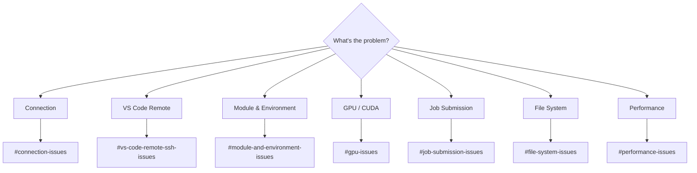

---
tags:
  - OSC
  - SSH
  - GPU
---
<!-- last-reviewed: 2026-02-19 -->
# Troubleshooting Guide

Common issues and solutions for working on OSC.



## Connection Issues

### SSH Connection Failed

**Problem:** Cannot connect to OSC
```
ssh: connect to host pitzer.osc.edu port 22: Connection refused
```

**Solutions:**

1. **Check if on OSU network or VPN**
   ```bash
   # Install and connect to OSU VPN
   # Download from: https://osuitsm.service-now.com/
   ```

2. **Verify hostname**
   ```bash
   # Correct hostnames:
   pitzer.osc.edu
   owens.osc.edu
   
   # Not: pitzer.org or pitzer.com
   ```

3. **Check system status**
   - Visit: https://www.osc.edu/resources/system-status

4. **Try alternative cluster**
   ```bash
   ssh username@owens.osc.edu  # If pitzer is down
   ```

### SSH Key Authentication Failed

**Problem:** Permission denied with SSH key
```
Permission denied (publickey,gssapi-keyex,gssapi-with-mic)
```

**Solutions:**

1. **Verify key is added to OSC**
   - Log into my.osc.edu
   - Check "SSH Public Keys"
   - Wait 10 minutes after adding

2. **Check key permissions**
   ```bash
   chmod 700 ~/.ssh
   chmod 600 ~/.ssh/id_ed25519
   chmod 644 ~/.ssh/id_ed25519.pub
   ```

3. **Verify SSH config**
   ```bash
   cat ~/.ssh/config
   # Should have:
   # IdentityFile ~/.ssh/id_ed25519
   ```

4. **Test with verbose output**
   ```bash
   ssh -v pitzer
   # Look for which key is being tried
   ```

### VS Code Remote Connection Hangs

**Problem:** "Setting up SSH Host..." hangs

See [VS Code Remote-SSH Issues](#vs-code-remote-ssh-issues) below for detailed solutions covering connection timeouts, extension host crashes, slow performance, and ProxyCommand issues.

## VS Code Remote-SSH Issues

Detailed troubleshooting for VS Code Remote-SSH connections to OSC. For general SSH issues, see [Connection Issues](#connection-issues) above. For Remote-SSH setup, see [Remote Development](../osc-basics/osc-remote-development.md).

### Connection Timeout

**Problem:** "Setting up SSH Host..." hangs or times out

**Solutions:**

1. **Verify SSH works outside VS Code first**
   ```bash
   ssh pitzer  # Must work before Remote-SSH will
   ```

2. **Delete the remote VS Code server**
   ```bash
   ssh pitzer
   rm -rf ~/.vscode-server
   ```

3. **Check disk quota** — VS Code Server needs ~500 MB
   ```bash
   ssh pitzer
   quota -s
   ```

4. **Restart VS Code completely** — close all windows, then reopen

### Extension Host Crash

**Problem:** "The VS Code Server failed to start" or extension host keeps crashing

**Solutions:**

1. **Clear the extensions directory**
   ```bash
   ssh pitzer
   rm -rf ~/.vscode-server/extensions
   ```

2. **Reduce installed remote extensions** — each extension increases memory usage. Only install essentials remotely (Python, Pylance, Jupyter)

3. **Check for disk quota** — extensions can fill your home directory
   ```bash
   du -sh ~/.vscode-server/
   ```

### Slow Performance

**Problem:** Typing lag, slow file loading, or frequent disconnects

**Solutions:**

1. **Exclude large directories from the file watcher**

    Add to `.vscode/settings.json`:
    ```json
    {
      "files.watcherExclude": {
        "**/data": true,
        "**/checkpoints": true,
        "**/__pycache__": true,
        "**/node_modules": true,
        "**/.git/objects": true
      }
    }
    ```

2. **Disable unused remote extensions** — open Extensions (`Ctrl+Shift+X`), filter to installed on SSH, and disable anything not needed

3. **Work on the native filesystem** — avoid opening folders on `/fs/scratch/` if possible; prefer `~/projects/`

### ProxyCommand Issues

**Problem:** VS Code fails when SSH config uses `ProxyCommand` or `ProxyJump`

**Solutions:**

1. **Use `ProxyJump` instead of `ProxyCommand`** — VS Code handles `ProxyJump` better:
   ```ssh-config
   Host pitzer
       HostName pitzer.osc.edu
       User your.username
       ProxyJump bastion.osc.edu
   ```

2. **Set `RemoteCommand` to none** in your SSH config for the host entry

### Workspace Trust

**Problem:** VS Code asks about workspace trust on every connection

**Solution:** When prompted, choose "Trust" for your home directory or project folder. You can also add trusted folders in VS Code settings:
```json
{
  "security.workspace.trust.untrustedFiles": "open"
}
```

## Module and Environment Issues

### Module Not Found

**Problem:** `module: command not found`

**Solution:**
```bash
# Module system not initialized
# Add to ~/.bashrc:
source /etc/profile.d/modules.sh

# Or reinitialize shell
bash --login
```

### Module Load Fails

**Problem:** Module not found
```
Module 'xyz' not found
```

**Solutions:**

1. **Search for correct name**
   ```bash
   module spider xyz
   module avail | grep xyz
   ```

2. **Check dependencies**
   ```bash
   module spider xyz/version
   # Shows required modules to load first
   ```

### Virtual Environment Won't Activate

**Problem:** Environment doesn't activate

**Solutions:**

1. **Verify path**
   ```bash
   ls ~/venvs/myproject/bin/activate
   ```

2. **Recreate if corrupted**
   ```bash
   rm -rf ~/venvs/myproject
   module load python/3.11
   python -m venv ~/venvs/myproject
   ```

3. **Check Python module loaded**
   ```bash
   module list | grep python
   module load python/3.11
   ```

### Package Installation Fails

**Problem:** pip install fails

**Solutions:**

1. **Update pip**
   ```bash
   pip install --upgrade pip
   ```

2. **Check disk quota**
   ```bash
   quota -s
   # If over quota, clean up
   ```

3. **Install to user directory**
   ```bash
   pip install --user package_name
   ```

4. **Clear pip cache**
   ```bash
   pip cache purge
   ```

## GPU Issues

### CUDA Not Available

**Problem:** `torch.cuda.is_available()` returns False

Quick checks: verify you're on a GPU node (`nvidia-smi`), that the CUDA module is loaded (`module load cuda/11.8.0`), and that PyTorch was installed with CUDA support. For full diagnostic steps and reinstall commands, see [PyTorch & GPU Setup — Troubleshooting](../ml-workflows/pytorch-setup.md#troubleshooting).

### CUDA Out of Memory

**Problem:** `RuntimeError: CUDA out of memory`

Start by reducing batch size or clearing the cache with `torch.cuda.empty_cache()`. For a complete list of solutions (gradient accumulation, mixed precision, gradient checkpointing), see [PyTorch & GPU Setup — CUDA Out of Memory](../ml-workflows/pytorch-setup.md#cuda-out-of-memory).

### GPU Utilization Low

**Problem:** GPU usage < 50% during training

- Increase `num_workers` in your DataLoader to match `--cpus-per-task`
- Enable `pin_memory=True`
- Use a larger batch size if memory allows
- Profile to find the actual bottleneck — see [PyTorch & GPU Setup — Slow Training](../ml-workflows/pytorch-setup.md#slow-training)

## Job Submission Issues

### Job Pending Forever

**Problem:** Job stuck in PD (pending) state

**Check reason:**
```bash
squeue -u $USER
# Look at REASON column
```

**Common reasons and solutions:**

1. **QOSMaxGRESPerUser**
   - Too many GPU jobs running
   - Wait or cancel old jobs: `scancel <job_id>`

2. **Resources**
   - Requesting too many resources
   - Reduce resources requested

3. **ReqNodeNotAvail**
   - Maintenance window approaching
   - Reduce time limit or wait

4. **Priority**
   - Other jobs have higher priority
   - Wait in queue

### Job Fails Immediately

**Problem:** Job exits with error immediately

**Solutions:**

1. **Check error logs**
   ```bash
   cat logs/job_<jobid>.err
   tail -50 logs/job_<jobid>.out
   ```

2. **Common causes:**

   **Module not loaded:**
   ```bash
   # Add to job script
   module load python/3.11
   ```

   **Environment not activated:**
   ```bash
   source ~/venvs/myproject/bin/activate
   ```

   **File not found:**
   ```bash
   # Use absolute paths
   python ~/projects/myproject/train.py
   ```

   **Permission denied:**
   ```bash
   chmod +x script.sh
   ```

3. **Test interactively first**
   ```bash
   srun -p debug --pty bash
   # Run commands manually
   ```

### Job Times Out

**Problem:** Job killed after time limit

**Solutions:**

1. **Increase time limit**
   ```bash
   #SBATCH --time=08:00:00  # Instead of 02:00:00
   ```

2. **Implement checkpointing**
   ```python
   # Save checkpoint every N epochs
   if epoch % 10 == 0:
       torch.save(checkpoint, 'checkpoint.pth')
   ```

3. **Resume from checkpoint**
   ```python
   if os.path.exists('checkpoint.pth'):
       checkpoint = torch.load('checkpoint.pth')
       model.load_state_dict(checkpoint['model'])
       start_epoch = checkpoint['epoch']
   ```

## File System Issues

### Disk Quota Exceeded

**Problem:** Cannot write files
```
Disk quota exceeded
```

**Solutions:**

1. **Check quota**
   ```bash
   quota -s
   ```

2. **Find large directories**
   ```bash
   du -sh ~/*/  | sort -hr | head -10
   ```

3. **Clean up**
   ```bash
   # Remove old virtual environments
   rm -rf ~/venvs/old_project
   
   # Clean pip cache
   pip cache purge
   
   # Clean conda cache
   conda clean --all
   
   # Remove old checkpoints
   rm checkpoints/epoch_*.pth
   
   # Clear Python cache
   find . -type d -name __pycache__ -exec rm -rf {} +
   ```

4. **Use scratch space**
   ```bash
   # Move large data to scratch
   mv large_dataset/ /fs/scratch/PAS1234/$USER/
   ```

### File Permission Denied

**Problem:** Cannot access file

**Solutions:**

1. **Check permissions**
   ```bash
   ls -la file.txt
   ```

2. **Fix permissions**
   ```bash
   chmod 644 file.txt      # Read/write for owner
   chmod 755 directory/    # Directory permissions
   ```

3. **Check ownership**
   ```bash
   ls -l file.txt
   # File should be owned by you
   ```

## Data Transfer Issues

### rsync/scp Fails

**Problem:** Transfer interrupted or failed

**Solutions:**

1. **Use rsync with resume**
   ```bash
   rsync -avz --progress --partial source/ pitzer:~/dest/
   ```

2. **Check disk space on destination**
   ```bash
   ssh pitzer
   quota -s
   ```

3. **Check network connection**
   ```bash
   ping pitzer.osc.edu
   ```

4. **Use tmux for long transfers**
   ```bash
   tmux new -s transfer
   rsync -avz source/ pitzer:~/dest/
   # Ctrl+b, then d to detach
   ```

### Slow File Transfer

**Solutions:**

1. **Compress during transfer**
   ```bash
   rsync -avz source/ pitzer:~/dest/
   # -z enables compression
   ```

2. **Archive first, then transfer**
   ```bash
   tar -czf archive.tar.gz large_directory/
   rsync -avz --progress archive.tar.gz pitzer:~/
   ```

3. **Use multiple parallel transfers**
   ```bash
   # Split into parts and transfer separately
   ```

## Python/PyTorch Issues

### Import Error

**Problem:** `ModuleNotFoundError: No module named 'torch'`

**Solutions:**

1. **Verify environment activated**
   ```bash
   which python
   # Should point to venv, not system Python
   ```

2. **Reinstall package**
   ```bash
   pip install torch
   ```

3. **Check Python version**
   ```bash
   python --version
   # Should match venv Python version
   ```

### Jupyter Kernel Issues

**Problem:** Jupyter can't find kernel

**Solutions:**

1. **Install ipykernel**
   ```bash
   pip install ipykernel
   ```

2. **Add environment as kernel**
   ```bash
   python -m ipykernel install --user --name=myproject
   ```

3. **List kernels**
   ```bash
   jupyter kernelspec list
   ```

## Performance Issues

For GPU performance troubleshooting (slow training, profiling, DataLoader optimization), see [PyTorch & GPU Setup](../ml-workflows/pytorch-setup.md#troubleshooting).

### Out of Memory (RAM)

**Problem:** Job killed due to RAM

**Solutions:**

1. **Request more memory**
   ```bash
   #SBATCH --mem=64G  # Instead of 32G
   ```

2. **Reduce data in memory**
   ```python
   # Don't load entire dataset at once
   # Use generators or data loaders
   ```

3. **Monitor memory usage**
   ```bash
   top -u $USER
   ```

## Getting More Help

- **OSC Support**: Email [oschelp@osc.edu](mailto:oschelp@osc.edu) or call (614) 292-9248
- **System Status**: [osc.edu/resources/system-status](https://www.osc.edu/resources/system-status)
- **Lab**: Ask lab members on Slack/Teams, or consult your PI
- See [Useful Links](useful-links.md) for OSC portals and support contacts

## Debug Checklist

When things go wrong:

- [ ] Check system status
- [ ] Verify SSH connection works
- [ ] Confirm modules loaded
- [ ] Verify environment activated
- [ ] Check disk quota
- [ ] Review error logs
- [ ] Test interactively before batch jobs
- [ ] Search error message online
- [ ] Contact OSC support if needed

For cluster details and resource limits, see [Clusters Overview](../osc-basics/osc-clusters-overview.md). For job script patterns, see [Job Submission](../working-on-osc/osc-job-submission.md).

