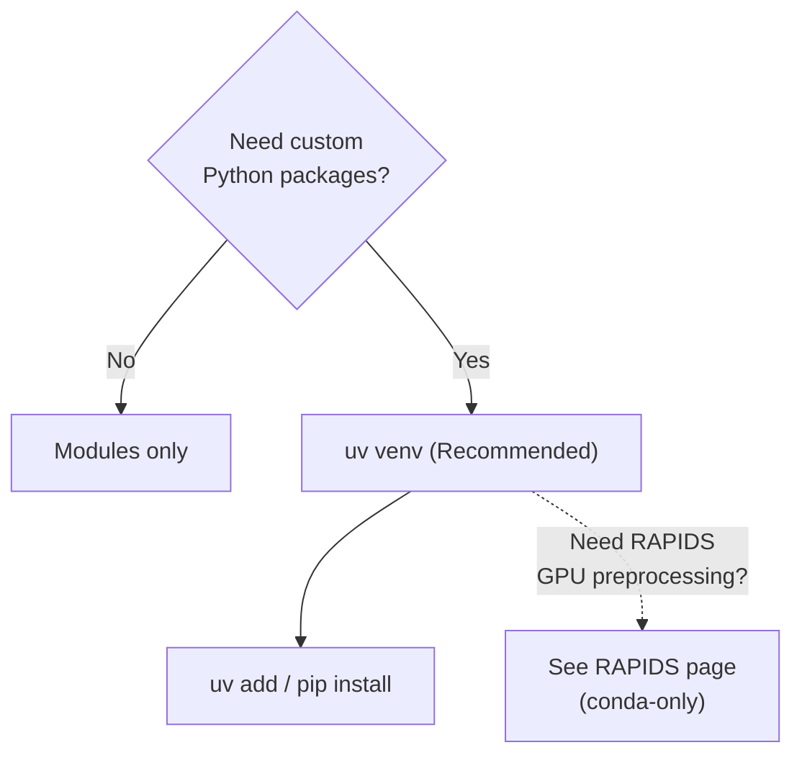

---
tags:
  - OSC
  - uv
---
<!-- last-reviewed: 2026-02-26 -->
# Environment Management

Learn how to manage software environments on OSC using modules and virtual environments.

## Overview

OSC uses two main systems for environment management:
1. **Module System**: Load pre-installed software
2. **Virtual Environments**: Isolated Python environments with custom packages



## Module System

### What are Modules?

Modules are pre-installed software packages maintained by OSC. They handle:
- Software dependencies
- Environment variables
- Library paths
- Version management

### Basic Module Commands

```bash
# List available modules
module avail

# Search for specific software
module spider python
module spider pytorch
module spider cuda

# Load a module
module load python/3.12

# Load specific version
module load cuda/12.4

# List loaded modules
module list

# Show module information
module show python/3.12

# Unload a module
module unload python

# Unload all modules
module purge

# Swap modules
module swap python/3.11 python/3.12
```

### Commonly Used Modules

#### Python
```bash
# Python 3.12 (recommended)
module load python/3.12
```

#### CUDA (for custom extensions only)
```bash
# Only needed if compiling custom CUDA extensions — PyPI torch bundles CUDA
module load cuda/12.4
```

!!! tip "Most PyTorch users do NOT need this"
    PyTorch wheels on PyPI bundle their own NVIDIA libraries. You only need
    `module load cuda` if you are compiling custom CUDA extensions (e.g. custom
    C++/CUDA ops). Run `module avail cuda` to see available versions.

#### Git
```bash
module load git
```

#### Other Useful Modules
```bash
module load cmake
module load gcc
module load intel
```

### Module Dependencies

Some modules load dependencies automatically:

```bash
# Load Python (includes conda)
module load python/3.12

# Check what was loaded
module list
```

### Finding Module Information

```bash
# Search for software
module spider python

# Get detailed info
module spider python/3.12

# Example output shows:
# - Available versions
# - Dependencies required
# - How to load it
```

## Python Virtual Environments

Virtual environments isolate project dependencies so different projects can use different package versions without conflicts.

### Creating Virtual Environments

#### Method 1: uv (Recommended)

`uv` is the recommended tool for project-level dependency management on OSC. You **must** use OSC's system Python — not uv's managed Python downloads, which can segfault on RHEL 9.

```bash
# Install uv (one-time)
curl -LsSf https://astral.sh/uv/install.sh | sh

# Create a venv using OSC's system Python (critical!)
uv venv --python /apps/python/3.12/bin/python3

# Activate
source .venv/bin/activate

# Install from pyproject.toml
uv sync

# Or add packages directly
uv add numpy pandas matplotlib
```

!!! warning "uv on OSC: critical caveats"
    - **Always use `--python /apps/python/3.12/bin/python3`** when creating venvs. uv's standalone Python builds are not compatible with OSC's RHEL 9 libraries and will segfault.
    - **Do NOT load `module load python/3.12` and then use `uv venv`** — uv ignores module-loaded Python by default. You must pass the explicit path.
    - **PyTorch from PyPI works** — PyPI wheels bundle NVIDIA libraries, so you don't need `module load cuda`. But PyG extensions need a flat wheel index configured in `pyproject.toml`. See [PyG Setup](../ml-workflows/pyg-setup.md) for details.

For PyTorch-specific installation (matching CUDA versions, GPU verification), see [PyTorch & GPU Setup](../ml-workflows/pytorch-setup.md).

#### Method 2: venv + pip

If you don't use `uv`, the standard library `venv` module works fine:

```bash
# Load Python module
module load python/3.12

# Create virtual environment
python -m venv ~/venvs/myproject

# Activate environment
source ~/venvs/myproject/bin/activate

# Verify activation (prompt changes)
which python
# Should show: /home/username/venvs/myproject/bin/python

# Install packages
pip install numpy pandas matplotlib

# Deactivate when done
deactivate
```

### Managing Environments

#### List Environments

```bash
# uv / venv: Check directory
ls ~/venvs/
ls .venv/  # uv convention (project-local)
```

#### Export/Import Environments

```bash
# Export requirements (venv + pip)
pip freeze > requirements.txt

# Install from requirements
pip install -r requirements.txt

# uv uses pyproject.toml — no separate export needed
# uv sync installs from pyproject.toml + uv.lock
```

### Organizing Virtual Environments

Create a standard structure:

```bash
# Create venvs directory
mkdir -p ~/venvs

# Create project-specific environments
python -m venv ~/venvs/project1
python -m venv ~/venvs/project2
python -m venv ~/venvs/ml_research
```

??? note "Legacy: conda (RAPIDS only)"

    Conda is only needed for RAPIDS GPU preprocessing, which requires conda-only packages.
    For all other workflows, use **uv** or **venv + pip**.

    ```bash
    # Load conda
    module load python/3.12

    # Create conda environment
    conda create -n myproject python=3.12

    # Activate
    conda activate myproject

    # Deactivate
    conda deactivate

    # Remove environment
    conda remove -n myproject --all
    ```

    For RAPIDS setup, see [GPU Preprocessing (RAPIDS)](../ml-workflows/rapids-gpu-preprocessing.md).

## Using Environments in Job Scripts

### venv in SLURM Job

```bash
#!/bin/bash
#SBATCH --job-name=my_job
#SBATCH --time=02:00:00

# Load module
module load python/3.12

# Activate virtual environment
source ~/venvs/myproject/bin/activate

# Verify environment
which python
pip list

# Run code
python train.py

# Deactivate (optional, job ends anyway)
deactivate
```

### Multiple Module Loading

```bash
#!/bin/bash
#SBATCH --job-name=gpu_job
#SBATCH --gpus-per-node=1

# Load all required modules
module purge                    # Start clean
module load python/3.12
module load cuda/12.4           # Only needed for custom CUDA extensions
module load git

# Activate environment
source ~/venvs/pytorch_gpu/bin/activate

# Run code
python train_gpu.py
```

## Creating Reusable Module Scripts

### Load Modules Script

Create `~/scripts/load_ml_modules.sh`:

```bash
#!/bin/bash
# Load modules for ML work

module purge
module load python/3.12
# module load cuda/12.4  # Only needed for custom CUDA extensions — PyPI torch bundles CUDA
module load git

echo "Modules loaded for ML work"
module list
```

Use in job scripts:
```bash
source ~/scripts/load_ml_modules.sh
source ~/venvs/pytorch/bin/activate
python train.py
```

### Activation Script

Create `~/scripts/activate_ml_env.sh`:

```bash
#!/bin/bash
# Complete environment setup for ML

# Load modules
module purge
module load python/3.12
# module load cuda/12.4  # Only needed for custom CUDA extensions — PyPI torch bundles CUDA

# Activate virtual environment
source ~/venvs/ml_project/bin/activate

# Set environment variables
export PYTHONUNBUFFERED=1
export CUDA_VISIBLE_DEVICES=0

echo "Environment activated"
```

Use it:
```bash
source ~/scripts/activate_ml_env.sh
```

??? note "Advanced: Shared Lab Environments"

    For lab collaboration, create shared environments in project space:

    ```bash
    # Create in project space
    python -m venv /fs/project/PAS1234/envs/lab_shared

    # Set permissions (if needed)
    chmod -R g+rwX /fs/project/PAS1234/envs/lab_shared

    # Activate
    source /fs/project/PAS1234/envs/lab_shared/bin/activate
    ```

For PyTorch-specific environment setup (CUDA versions, GPU verification, etc.), see [PyTorch & GPU Setup](../ml-workflows/pytorch-setup.md).

## Managing Disk Space

### Check Environment Sizes

```bash
# Check venv sizes
du -sh ~/venvs/*
du -sh .venv/
```

### Clean Up

```bash
# Remove unused venv
rm -rf ~/venvs/old_project

# Clean pip/uv cache
pip cache purge
uv cache clean

# Remove old packages
pip uninstall <package>
```

### Disk Quota

```bash
# Check your quota
quota -s

# Find large directories
du -sh ~/*/  | sort -hr | head -10
```

??? note ".bashrc Convenience Aliases"

    Add to `~/.bashrc` for automatic setup:

    ```bash
    # Alias for activating environments
    alias activate-ml='source ~/venvs/ml_project/bin/activate'
    alias activate-pytorch='source ~/venvs/pytorch/bin/activate'

    # Environment variables
    export PYTHONUNBUFFERED=1
    ```

    **Warning**: Don't load modules in `.bashrc` that conflict or slow down login.

## Best Practices

### 1. Use Descriptive Environment Names

```bash
# Good
~/venvs/pytorch_gpu_project
~/venvs/transformers_research
~/venvs/computer_vision

# Avoid
~/venvs/env1
~/venvs/test
~/venvs/myenv
```

### 2. Document Your Environment

Create `environment_setup.md` in your project:

```markdown
# Environment Setup

## Environment
- uv venv with Python 3.12

## Setup
\`\`\`bash
uv venv --python /apps/python/3.12/bin/python3
source .venv/bin/activate
uv sync
\`\`\`
```

### 3. Keep Dependencies Tracked

=== "uv (Recommended)"

    ```bash
    # pyproject.toml is the preferred dependency specification with uv.
    # uv.lock is auto-generated — commit both to git.
    git add pyproject.toml uv.lock
    git commit -m "Update dependencies"

    # If you need a requirements.txt (e.g. for CI or collaborators without uv):
    uv pip compile pyproject.toml -o requirements.txt
    ```

=== "pip+venv"

    ```bash
    pip freeze > requirements.txt
    git add requirements.txt
    git commit -m "Update dependencies"
    ```

### 4. Use Separate Environments per Project

Don't share environments between unrelated projects:

```bash
# Per-project environments
~/venvs/
  ├── project_A/
  ├── project_B/
  └── project_C/
```

### 5. Test Before Submitting Jobs

```bash
# Test interactively first
srun -p debug --pty bash
source ~/venvs/myproject/bin/activate
python train.py --epochs 1

# Then submit batch job
```

## Troubleshooting

### Module Not Found

**Problem**: `module: command not found`

**Solution**: Module system not initialized. Check `/etc/profile.d/modules.sh` is sourced.

### Module Load Fails

**Problem**: `Module xyz not found`

**Solutions**:
```bash
# Search for correct name
module spider xyz

# Check available versions
module avail xyz
```

### Virtual Environment Not Activating

**Problem**: Environment won't activate

**Solutions**:
```bash
# Verify environment exists
ls ~/venvs/myproject/bin/activate

# Recreate if corrupted
rm -rf ~/venvs/myproject
python -m venv ~/venvs/myproject
```

### Package Installation Fails

**Problem**: `pip install` fails

**Solutions**:
```bash
# Update pip
pip install --upgrade pip

# Install with user flag
pip install --user package_name

# Check disk quota
quota -s
```

### CUDA Not Available in PyTorch

**Problem**: `torch.cuda.is_available()` returns False

Verify you're on a GPU node (`nvidia-smi`) and check `torch.cuda.is_available()`. If you installed PyTorch from PyPI, you do **not** need `module load cuda` -- PyPI wheels bundle CUDA. For full diagnostic steps and PyTorch reinstall commands, see [PyTorch & GPU Setup — Troubleshooting](../ml-workflows/pytorch-setup.md#troubleshooting).

### Conflicting Modules

**Problem**: Modules conflict with each other

**Solution**:
```bash
# Start fresh
module purge

# Load modules in correct order
module load python/3.12
module load cuda/12.4
```

??? note "Quick Reference"

    ```bash
    # Modules
    module load python/3.12          # Load Python
    module load cuda/12.4            # Only for custom CUDA extensions (not needed for PyPI torch)
    module list                      # Show loaded
    module purge                     # Unload all

    # uv (recommended)
    uv venv --python /apps/python/3.12/bin/python3  # Create
    source .venv/bin/activate        # Activate
    uv sync                          # Install from pyproject.toml
    uv add <package>                 # Add a dependency

    # venv + pip
    python -m venv ~/venvs/name      # Create
    source ~/venvs/name/bin/activate # Activate
    deactivate                       # Deactivate
    pip freeze > requirements.txt    # Export
    ```

## Secrets and API Keys

Never put passwords or API keys in source code. Use environment variables instead:

```bash
# Set in your shell or job script (don't commit this line to Git)
export API_KEY="your_key_here"
```

```python
import os
api_key = os.environ["API_KEY"]
```

- Add credential files to `.gitignore`
- Set restrictive permissions on sensitive data: `chmod 700 ~/projects/sensitive_data`

## Next Steps

- Set up [PyTorch on OSC](../ml-workflows/pytorch-setup.md)
- Learn [Job Submission](osc-job-submission.md)

## Resources

- [OSC Batch Execution Environment](https://www.osc.edu/supercomputing/batch-processing-at-osc/batch-execution-environment)
- [Python venv Documentation](https://docs.python.org/3/library/venv.html)
