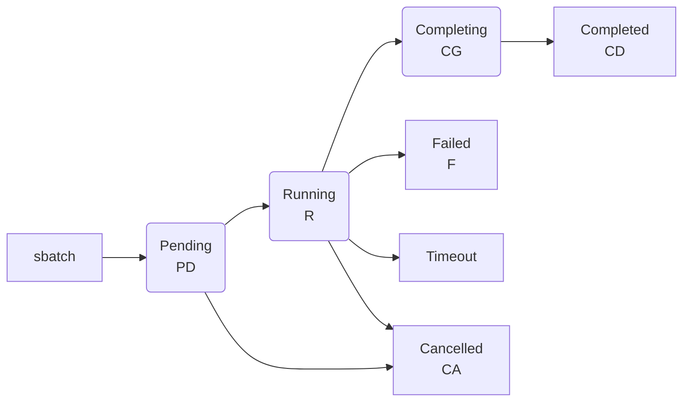

---
tags:
  - SLURM
  - OSC
  - GPU
---
<!-- last-reviewed: 2026-02-19 -->
# Job Submission Guide

Learn how to submit and manage jobs on OSC using the SLURM job scheduler.

## Overview

OSC uses SLURM (Simple Linux Utility for Resource Management) to schedule and manage jobs on compute nodes.

## Quick Start

### Interactive Job (Testing)

```bash
# Request interactive session for testing
srun -p debug -c 4 --time=30:00 --pty bash

# With GPU
srun -p gpu --gpus-per-node=1 --time=30:00 --pty bash
```

### Batch Job (Production)

Create `job.sh`:
```bash
#!/bin/bash
#SBATCH --job-name=my_job
#SBATCH --nodes=1
#SBATCH --ntasks-per-node=4
#SBATCH --time=02:00:00
#SBATCH --output=job_%j.out

# Your commands here
python train.py
```

Submit:
```bash
sbatch job.sh
```

## SLURM Basics

### Essential Commands

```bash
# Submit batch job
sbatch job_script.sh

# Interactive session
srun -p partition --pty bash

# List your jobs
squeue -u $USER

# Cancel job
scancel <job_id>

# Cancel all your jobs
scancel -u $USER

# Job details
scontrol show job <job_id>

# Job efficiency (after completion)
seff <job_id>
```

### Job States

- **PD** (Pending): Waiting for resources
- **R** (Running): Job is running
- **CG** (Completing): Job is finishing
- **CD** (Completed): Job finished successfully
- **F** (Failed): Job failed
- **CA** (Cancelled): Job was cancelled



## Creating Job Scripts

### Anatomy of a SLURM Script

Every SLURM batch script has three sections:

```bash
#!/bin/bash                            # 1. Shebang line
#SBATCH --job-name=my_job              # 2. SBATCH directives
#SBATCH --account=PAS1234
#SBATCH --time=02:00:00

module load python/3.11         # 3. Execution block
source ~/venvs/myproject/bin/activate
python train.py
```

!!! note "Replace `PAS1234`"
    `PAS1234` is a placeholder. Use your actual OSC project code, found at [my.osc.edu](https://my.osc.edu) under your project list. See [Account Setup](../osc-basics/osc-account-setup.md#check-your-projects) for details.

**Section 1 — Shebang line:** Must be the very first line. Tells the system to use Bash.

**Section 2 — SBATCH directives:** Lines starting with `#SBATCH` configure job resources. They look like comments to Bash, but SLURM reads them.

**Section 3 — Execution block:** Everything after the directives is your actual script — module loading, environment activation, and commands.

!!! warning "Directives must come before any executable line"
    SLURM stops reading `#SBATCH` directives at the first non-comment, non-blank line. Any directive placed after an executable command (like `echo` or `module load`) is **silently ignored**.

    ```bash
    #!/bin/bash
    #SBATCH --job-name=my_job       # ✅ Read by SLURM
    #SBATCH --time=02:00:00         # ✅ Read by SLURM

    module load python/3.11  # First executable line

    #SBATCH --mem=64G               # ❌ SILENTLY IGNORED
    ```

#### SBATCH Directive Reference

| Directive | Required | Description | Example |
|-----------|----------|-------------|---------|
| `--job-name` | No | Name shown in `squeue` | `--job-name=train_v2` |
| `--account` | **Yes** | Project allocation to charge | `--account=PAS1234` |
| `--nodes` | No | Number of nodes (default: 1) | `--nodes=1` |
| `--ntasks-per-node` | No | Tasks per node (default: 1) | `--ntasks-per-node=1` |
| `--cpus-per-task` | No | CPU cores per task | `--cpus-per-task=4` |
| `--gpus-per-node` | No | GPUs per node | `--gpus-per-node=1` |
| `--mem` | No | Total memory per node | `--mem=32G` |
| `--mem-per-cpu` | No | Memory per CPU core | `--mem-per-cpu=4G` |
| `--time` | **Yes** | Maximum walltime | `--time=04:00:00` |
| `--partition` | No | Partition/queue | `--partition=gpu` |
| `--output` | No | Stdout file (`%j` = job ID) | `--output=logs/job_%j.out` |
| `--error` | No | Stderr file | `--error=logs/job_%j.err` |
| `--mail-type` | No | Email notification triggers | `--mail-type=END,FAIL` |
| `--mail-user` | No | Email address | `--mail-user=user@osu.edu` |
| `--array` | No | Job array specification | `--array=1-10` |
| `--dependency` | No | Job dependency | `--dependency=afterok:12345` |
| `--exclusive` | No | Exclusive node access | `--exclusive` |
| `--constraint` | No | Node feature constraint | `--constraint=a100` |

### Basic Job Script Template

```bash
#!/bin/bash
#SBATCH --job-name=my_job          # Job name
#SBATCH --account=PAS1234          # Project account
#SBATCH --nodes=1                  # Number of nodes
#SBATCH --ntasks-per-node=1        # Tasks per node
#SBATCH --cpus-per-task=4          # CPUs per task
#SBATCH --time=02:00:00            # Time limit (HH:MM:SS)
#SBATCH --output=logs/job_%j.out   # Standard output (%j = job ID)
#SBATCH --error=logs/job_%j.err    # Standard error
#SBATCH --mail-type=END,FAIL       # Email on END or FAIL
#SBATCH --mail-user=user@osu.edu   # Email address

# Print job info
echo "Job started at: $(date)"
echo "Running on node: $(hostname)"
echo "Job ID: $SLURM_JOB_ID"

# Load modules
module load python/3.11

# Activate environment
source ~/venvs/myproject/bin/activate

# Run your code
python train.py --epochs 100

# Print completion
echo "Job ended at: $(date)"
```

### GPU Job Script

```bash
#!/bin/bash
#SBATCH --job-name=gpu_training
#SBATCH --account=PAS1234
#SBATCH --nodes=1
#SBATCH --ntasks-per-node=1
#SBATCH --gpus-per-node=1          # Number of GPUs
#SBATCH --time=04:00:00
#SBATCH --output=logs/gpu_job_%j.out

# Load modules
module load python/3.11
module load cuda/11.8.0

# Activate environment
source ~/venvs/pytorch/bin/activate

# Set environment variables
export CUDA_VISIBLE_DEVICES=0

# Verify GPU
nvidia-smi

# Run training
python train.py --device cuda --epochs 100
```

### Multi-GPU Job Script

```bash
#!/bin/bash
#SBATCH --job-name=multi_gpu
#SBATCH --account=PAS1234
#SBATCH --nodes=1
#SBATCH --gpus-per-node=4          # Use 4 GPUs
#SBATCH --time=08:00:00
#SBATCH --output=logs/multi_gpu_%j.out

module load python/3.11
module load cuda/11.8.0
source ~/venvs/pytorch/bin/activate

# Run with PyTorch DDP (torchrun replaces the deprecated torch.distributed.launch)
torchrun --nproc_per_node=4 train.py --distributed
```

### Common Job Patterns

#### CPU-Only Data Processing

For data preprocessing, feature extraction, or file conversion jobs that don't need a GPU:

```bash
#!/bin/bash
#SBATCH --job-name=data_preprocess
#SBATCH --account=PAS1234
#SBATCH --partition=serial
#SBATCH --cpus-per-task=16
#SBATCH --mem=64G
#SBATCH --time=04:00:00
#SBATCH --output=logs/preprocess_%j.out

module load python/3.11
source ~/venvs/myproject/bin/activate

# Use all allocated CPUs
export OMP_NUM_THREADS=$SLURM_CPUS_PER_TASK

python preprocess.py \
    --input-dir data/raw/ \
    --output-dir data/processed/ \
    --workers $SLURM_CPUS_PER_TASK
```

#### Checkpoint-Resume Pattern

For long training jobs that may hit walltime limits or need to recover from failures:

```bash
#!/bin/bash
#SBATCH --job-name=train_resume
#SBATCH --account=PAS1234
#SBATCH --partition=gpu
#SBATCH --gpus-per-node=1
#SBATCH --cpus-per-task=8
#SBATCH --mem=64G
#SBATCH --time=24:00:00
#SBATCH --output=logs/train_%j.out

module load python/3.11
module load cuda/11.8.0
source ~/venvs/pytorch/bin/activate

# Automatically resume from latest checkpoint if one exists
CHECKPOINT_DIR="checkpoints/"
LATEST=$(ls -t ${CHECKPOINT_DIR}/*.pt 2>/dev/null | head -1)

if [ -n "$LATEST" ]; then
    echo "Resuming from checkpoint: $LATEST"
    python train.py --resume "$LATEST"
else
    echo "Starting fresh training"
    python train.py
fi
```

Your Python training script should save checkpoints periodically:

```python
# In your training loop
for epoch in range(start_epoch, num_epochs):
    train_one_epoch(model, dataloader, optimizer)

    # Save checkpoint every 5 epochs
    if epoch % 5 == 0:
        torch.save({
            'epoch': epoch,
            'model_state_dict': model.state_dict(),
            'optimizer_state_dict': optimizer.state_dict(),
            'loss': loss,
        }, f'checkpoints/checkpoint_epoch_{epoch}.pt')
```

!!! tip "Resubmit automatically"
    Combine the checkpoint-resume pattern with a resubmission wrapper to chain long training runs:
    ```bash
    # At the end of your job script, resubmit itself if not done
    if [ ! -f "training_complete.flag" ]; then
        sbatch $0
    fi
    ```

#### Long-Running Job with Email Alerts

Get notified when important jobs start, finish, or fail:

```bash
#!/bin/bash
#SBATCH --job-name=long_training
#SBATCH --account=PAS1234
#SBATCH --partition=gpu
#SBATCH --gpus-per-node=1
#SBATCH --time=48:00:00
#SBATCH --output=logs/long_train_%j.out
#SBATCH --mail-type=BEGIN,END,FAIL
#SBATCH --mail-user=name.1@osu.edu

module load python/3.11
module load cuda/11.8.0
source ~/venvs/pytorch/bin/activate

echo "Training started at $(date) on $(hostname)"
python train.py --config configs/full_training.yaml
echo "Training finished at $(date)"
```

## Partitions (Queues)

For partition details (time limits, GPU availability, node counts), see the [Clusters Overview](../osc-basics/osc-clusters-overview.md).

## Resource Requests

### CPUs and Memory

```bash
# Request 8 CPUs
#SBATCH --cpus-per-task=8

# Request 32 GB memory
#SBATCH --mem=32G

# Request memory per CPU
#SBATCH --mem-per-cpu=4G
```

### GPUs

```bash
# Request 1 GPU (any type)
#SBATCH --gpus-per-node=1

# Request specific GPU type
#SBATCH --gpus-per-node=v100:1     # V100 GPU
#SBATCH --gpus-per-node=a100:1     # A100 GPU

# Request multiple GPUs
#SBATCH --gpus-per-node=2
```

### Time Limits

```bash
# Format: HH:MM:SS
#SBATCH --time=00:30:00   # 30 minutes
#SBATCH --time=02:00:00   # 2 hours
#SBATCH --time=24:00:00   # 24 hours

# Or use days-hours format
#SBATCH --time=2-12:00:00  # 2 days, 12 hours
```

## Job Arrays

Run multiple similar jobs efficiently:

### Basic Job Array

```bash
#!/bin/bash
#SBATCH --job-name=array_job
#SBATCH --array=1-10              # Run 10 jobs
#SBATCH --time=01:00:00
#SBATCH --output=logs/job_%A_%a.out  # %A = array ID, %a = task ID

# Use array task ID
python train.py --seed $SLURM_ARRAY_TASK_ID
```

### Advanced Job Array

```bash
#!/bin/bash
#SBATCH --array=1-100%10          # 100 jobs, max 10 concurrent

# Define parameters for each task
learning_rates=(0.001 0.01 0.1)
batch_sizes=(16 32 64)

# Get parameters for this task
idx=$SLURM_ARRAY_TASK_ID
lr=${learning_rates[$((idx % 3))]}
bs=${batch_sizes[$((idx / 3 % 3))]}

python train.py --lr $lr --batch-size $bs
```

## Job Dependencies

Chain jobs together:

```bash
# Submit first job
job1=$(sbatch --parsable job1.sh)

# Submit second job after first completes
sbatch --dependency=afterok:$job1 job2.sh

# Submit after job completes (success or failure)
sbatch --dependency=afterany:$job1 job3.sh

# Submit after multiple jobs complete
sbatch --dependency=afterok:$job1:$job2 job4.sh
```

!!! tip "Consider a pipeline orchestrator for complex pipelines"
    If you have multi-step pipelines with many dependencies, a tool like Nextflow or Prefect can manage job submission, dependency tracking, and partial reruns automatically. See [Pipeline Orchestration](pipeline-orchestration.md).

## Monitoring Jobs

### Check Job Status

```bash
# List your jobs
squeue -u $USER

# Detailed view
squeue -u $USER --format="%.18i %.9P %.30j %.8u %.2t %.10M %.6D %R"

# Watch job status
watch -n 10 squeue -u $USER
```

### View Job Details

```bash
# Current job info
scontrol show job <job_id>

# Job accounting info (after completion)
sacct -j <job_id> --format=JobID,JobName,Partition,State,Elapsed,MaxRSS

# Job efficiency
seff <job_id>
```

### Monitor Running Job

```bash
# SSH to compute node
squeue -u $USER  # Get node name
ssh <nodename>   # e.g., ssh p0123

# Monitor resources
top
htop
nvidia-smi  # For GPU jobs
```

### View Job Output

```bash
# Tail output file while job runs
tail -f logs/job_12345.out

# Follow with automatic refresh
watch -n 5 tail -20 logs/job_12345.out
```

## Environment Variables

SLURM provides useful environment variables:

```bash
# In your job script
echo "Job ID: $SLURM_JOB_ID"
echo "Job name: $SLURM_JOB_NAME"
echo "Node list: $SLURM_JOB_NODELIST"
echo "Number of nodes: $SLURM_JOB_NUM_NODES"
echo "CPUs per task: $SLURM_CPUS_PER_TASK"
echo "Array task ID: $SLURM_ARRAY_TASK_ID"
echo "Working directory: $SLURM_SUBMIT_DIR"
```

Use in Python:
```python
import os

job_id = os.environ.get('SLURM_JOB_ID')
task_id = os.environ.get('SLURM_ARRAY_TASK_ID', '0')
```

## Advanced Topics

### Email Notifications

```bash
#SBATCH --mail-type=BEGIN          # Email when job starts
#SBATCH --mail-type=END            # Email when job ends
#SBATCH --mail-type=FAIL           # Email on failure
#SBATCH --mail-type=ALL            # Email for all events
#SBATCH --mail-user=user@osu.edu
```

??? note "Job Requeue"

    ```bash
    # Allow job to be requeued if node fails
    #SBATCH --requeue

    # In your script, handle requeue
    if [ -f checkpoint.pth ]; then
        python train.py --resume checkpoint.pth
    else
        python train.py
    fi
    ```

??? note "Exclusive Node Access"

    ```bash
    # Request exclusive access to node
    #SBATCH --exclusive
    ```

??? note "Node Constraints"

    ```bash
    # Request specific node features
    #SBATCH --constraint=skylake

    # Exclude specific nodes
    #SBATCH --exclude=p0010,p0011
    ```

## Best Practices

1. **Test with debug partition first** — `#SBATCH --partition=debug` with a short time limit before submitting long jobs.
2. **Don't over-request resources** — request only the CPUs, memory, and time you need. Over-requesting wastes allocation and increases queue wait time.
3. **Organize output files** — create a `logs/` directory and use `--output=logs/job_%j.out`.
4. **Check job efficiency after completion** — run `seff <job_id>` and aim for >80% CPU efficiency.

## Troubleshooting

### Job Pending Forever

```bash
# Check reason
squeue -u $USER

# Common reasons and solutions:
# - QOSMaxGRESPerUser: Too many GPU jobs running
# - ReqNodeNotAvail: Maintenance window soon
# - Resources: Requesting too many resources
# - Priority: Other jobs have higher priority
```

**Solution**: Reduce resources or wait.

### Job Fails Immediately

```bash
# Check output files
cat logs/job_<jobid>.err

# Common causes:
# - Module not loaded
# - Python environment not activated
# - File not found
# - Permission denied
```

### Out of Memory

```bash
# Request more memory
#SBATCH --mem=64G

# Or reduce batch size in code
```

### Job Timeout

```bash
# Increase time limit
#SBATCH --time=08:00:00

# Or optimize your code
```

### GPU Not Detected

```bash
# Verify GPU requested
#SBATCH --gpus-per-node=1

# Check CUDA module loaded
module load cuda/11.8.0

# Verify in code
nvidia-smi
```

## Example Workflows

### Hyperparameter Search

```bash
#!/bin/bash
#SBATCH --job-name=hyperparam_search
#SBATCH --array=1-27
#SBATCH --output=logs/hp_%A_%a.out
#SBATCH --gpus-per-node=1
#SBATCH --time=04:00:00

# Define hyperparameter grid
lrs=(0.001 0.01 0.1)
batch_sizes=(16 32 64)
dropouts=(0.1 0.3 0.5)

# Map array task ID to hyperparameters
idx=$SLURM_ARRAY_TASK_ID
lr_idx=$((idx % 3))
bs_idx=$(((idx / 3) % 3))
dropout_idx=$(((idx / 9) % 3))

lr=${lrs[$lr_idx]}
bs=${batch_sizes[$bs_idx]}
dropout=${dropouts[$dropout_idx]}

# Run training
python train.py \
    --lr $lr \
    --batch-size $bs \
    --dropout $dropout \
    --experiment-name "hp_search_${SLURM_ARRAY_TASK_ID}"
```

### Multi-Stage Pipeline

```bash
# Stage 1: Data preprocessing
job1=$(sbatch --parsable preprocess.sh)

# Stage 2: Training (after preprocessing)
job2=$(sbatch --dependency=afterok:$job1 --parsable train.sh)

# Stage 3: Evaluation (after training)
sbatch --dependency=afterok:$job2 evaluate.sh
```

## Next Steps

- Learn [Environment Management](osc-environment-management.md)
- Set up [PyTorch on OSC](../ml-workflows/pytorch-setup.md)
- Automate pipelines with [Pipeline Orchestration](pipeline-orchestration.md)

## Resources

- [OSC SLURM Documentation](https://www.osc.edu/supercomputing/batch-processing-at-osc/slurm_migration)
- [SLURM Official Documentation](https://slurm.schedmd.com/)
