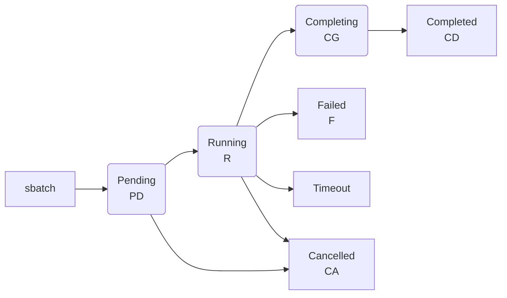

<!-- last-reviewed: 2026-03-30 -->
# Job Submission Guide

Learn how to submit and manage jobs on OSC using the SLURM job scheduler.

## Overview

OSC uses SLURM (Simple Linux Utility for Resource Management) to schedule and manage jobs on compute nodes.

## Quick Start

### Interactive Job (Testing)

```bash
# Simplest way to get a compute node
sinteractive -A PAS1234 -c 4 -t 01:00:00

# With GPU
sinteractive -A PAS1234 -c 4 -g 1 -t 01:00:00
```

### Batch Job (Production)

Create `job.sh`:
```bash
#!/bin/bash
#SBATCH --job-name=my_job
#SBATCH --nodes=1
#SBATCH --ntasks-per-node=4
#SBATCH --time=02:00:00
#SBATCH --output=job_%j.out

# Your commands here
python train.py
```

Submit:
```bash
sbatch job.sh
```

## SLURM Basics

### Essential Commands

```bash
# Submit batch job
sbatch job_script.sh

# Interactive session
srun -p partition --pty bash

# List your jobs
squeue -u $USER

# Cancel job
scancel <job_id>

# Cancel all your jobs
scancel -u $USER

# Job details
scontrol show job <job_id>

# Job efficiency (after completion)
seff <job_id>
```

### Job States

- **PD** (Pending): Waiting for resources
- **R** (Running): Job is running
- **CG** (Completing): Job is finishing
- **CD** (Completed): Job finished successfully
- **F** (Failed): Job failed
- **CA** (Cancelled): Job was cancelled


```mermaid
flowchart LR
    A[sbatch] --> B(Pending\nPD)
    B --> C(Running\nR)
    C --> D(Completing\nCG)
    D --> E[Completed\nCD]
    C --> F[Failed\nF]
    C --> G[Timeout]
    B --> H[Cancelled\nCA]
    C --> H
```

## Interactive Sessions

Interactive sessions give you a shell on a compute node — your own dedicated resources with no contention from other users. Use them for anything heavier than editing code or submitting jobs.

### `sinteractive` (Recommended)

The simplest way to get a compute node:

```bash
# Basic: 1 core, debug partition, default time
sinteractive -A PAS1234

# Specify resources
sinteractive -A PAS1234 -c 4 -t 02:00:00

# With GPU
sinteractive -A PAS1234 -c 4 -g 1 -t 01:00:00

# On a specific cluster
sinteractive -A PAS1234 -c 4 -t 02:00:00 -p cpu
```

!!! note "Replace `PAS1234`"
    Use your actual OSC project code. See [Account Setup](../osc-basics/osc-account-setup.md#check-your-projects).

You'll see output like:

```
salloc: Pending job allocation 14269
salloc: job 14269 has been allocated resources
salloc: Granted job allocation 14269
[user@p0591 ~]$
```

Your prompt changes to show the compute node hostname (e.g., `p0591`). When done, type `exit` to release the node.

### `srun` (Alternative)

```bash
# CPU-only
srun -p debug -c 4 --time=30:00 --account=PAS1234 --pty bash

# With GPU
srun -p gpu --gpus-per-node=1 --time=01:00:00 --account=PAS1234 --pty bash
```

### Login Node vs. Compute Node

Your home directory (`~/`) is the **same NFS mount** from both login and compute nodes — same files, same paths, same permissions. You don't need to copy anything.

| Task | Where to Run | Why |
|------|-------------|-----|
| Edit code, browse files, git | Login node | Lightweight, no allocation needed |
| Submit jobs (`sbatch`) | Login node | Just sends a request to SLURM |
| AI coding tools (Claude Code, etc.) | Login node | Bottleneck is network API latency, not local CPU |
| Run tests (`pytest`) | Compute node | Can use significant CPU/memory |
| Preprocessing scripts | Compute node | CPU-intensive, may run for minutes |
| `quarto render`, `mkdocs build` | Compute node | Builds can be CPU-heavy |
| Anything with a GPU | Compute node | GPUs only available on compute nodes |

!!! tip "Cost of interactive sessions"
    A 1-core interactive session for 2 hours costs **2 core-hours** — roughly the same as a single core running for 2 hours in a batch job. A 4-core session for 2 hours costs 8 core-hours. For perspective, a typical 4-hour GPU training run on 4 cores costs 16 core-hours. Interactive sessions are cheap, but don't leave them idle — `exit` when you're done.

## Creating Job Scripts

### Anatomy of a SLURM Script

Every SLURM batch script has three sections:

```bash
#!/bin/bash                            # 1. Shebang line
#SBATCH --job-name=my_job              # 2. SBATCH directives
#SBATCH --account=PAS1234
#SBATCH --time=02:00:00

module load python/3.12         # 3. Execution block
source .venv/bin/activate       # uv (recommended) — or ~/venvs/myproject/bin/activate for pip+venv
python train.py
```

!!! note "Replace `PAS1234`"
    `PAS1234` is a placeholder. Use your actual OSC project code, found at [my.osc.edu](https://my.osc.edu) under your project list. See [Account Setup](../osc-basics/osc-account-setup.md#check-your-projects) for details.

**Section 1 — Shebang line:** Must be the very first line. Tells the system to use Bash.

**Section 2 — SBATCH directives:** Lines starting with `#SBATCH` configure job resources. They look like comments to Bash, but SLURM reads them.

**Section 3 — Execution block:** Everything after the directives is your actual script — module loading, environment activation, and commands.

!!! warning "Directives must come before any executable line"
    SLURM stops reading `#SBATCH` directives at the first non-comment, non-blank line. Any directive placed after an executable command (like `echo` or `module load`) is **silently ignored**.

    ```bash
    #!/bin/bash
    #SBATCH --job-name=my_job       # ✅ Read by SLURM
    #SBATCH --time=02:00:00         # ✅ Read by SLURM

    module load python/3.12  # First executable line

    #SBATCH --mem=64G               # ❌ SILENTLY IGNORED
    ```

#### SBATCH Directive Reference

Every `#SBATCH` line declares one resource or behavior. They are grouped below by function.

##### Identity & Accounting

| Directive | Description |
|-----------|-------------|
| `--job-name=NAME` | Label shown in `squeue` output. Keep it short and descriptive (e.g., `train_exp03`). Default: script filename. |
| `--account=PAS1234` | **Required.** The OSC project allocation to charge. Find yours at [my.osc.edu](https://my.osc.edu) → Projects. |

##### Compute Resources

| Directive | Description |
|-----------|-------------|
| `--nodes=N` | Number of physical nodes. Use `1` for single-node jobs (the common case). Multi-node only needed for distributed training or Ray clusters. Default: `1`. |
| `--ntasks-per-node=N` | Independent processes per node. For most Python ML jobs, leave at `1` — parallelism comes from `--cpus-per-task` and `--gpus-per-node` instead. Use `>1` only with `srun`/MPI or `torchrun`. Default: `1`. |
| `--cpus-per-task=N` | CPU cores allocated to each task. Controls how many DataLoader workers, preprocessing threads, or parallel operations your job can run. Set `num_workers` in your DataLoader up to this value. |
| `--gpus-per-node=N` | GPUs allocated per node. Accepts a count (`1`, `2`) or a type:count (`v100:1`, `v100-32g:1`). Only valid on GPU partitions. |
| `--mem=SIZE` | Total RAM per node (e.g., `32G`, `64G`). **Mutually exclusive** with `--mem-per-cpu`. Pitzer standard nodes have 192 GB; GPU nodes share this across up to 4 GPUs. |
| `--mem-per-cpu=SIZE` | RAM per CPU core (e.g., `4G`). Useful when you want memory to scale with CPU count. Cannot combine with `--mem`. |

!!! tip "Choosing CPUs and memory for GPU jobs"
    The [Clusters Overview](../osc-basics/osc-clusters-overview.md#resource-request-guidelines) recommends 4–8 CPU cores and 32–64 GB memory per GPU for single-GPU training. The CPUs feed data to the GPU via DataLoader workers. If `nvidia-smi` shows low GPU utilization, increase CPUs and `num_workers` first — the GPU is likely waiting on data (see [PyTorch Performance Tuning Guide](https://pytorch.org/tutorials/recipes/recipes/tuning_guide.html)).

##### Time & Scheduling

| Directive | Description |
|-----------|-------------|
| `--time=HH:MM:SS` | **Required.** Maximum walltime. SLURM kills the job when this expires. Formats: `02:00:00` (2 hours), `2-12:00:00` (2 days 12 hours). Shorter requests get scheduled faster due to backfill scheduling. |
| `--partition=NAME` | Queue to submit to. Common: `gpu` (7-day max), `cpu` (CPU only), `gpudebug`/`debug-cpu` (1-hour max, high priority for testing). See [Clusters Overview](../osc-basics/osc-clusters-overview.md) for full list. Default: cluster-dependent. |

##### Output & Logging

| Directive | Description |
|-----------|-------------|
| `--output=PATH` | File for stdout. Supports substitution: `%j` → job ID, `%A` → array job ID, `%a` → array task ID. Example: `logs/train_%j.out`. Default: `slurm-%j.out` in submit directory. |
| `--error=PATH` | File for stderr. Same substitutions as `--output`. If omitted, stderr merges into the `--output` file. |

!!! tip "Create the logs directory first"
    SLURM does **not** create parent directories for output files. If you use `--output=logs/job_%j.out`, run `mkdir -p logs` before submitting. If the directory doesn't exist, the job fails immediately and no output file is written.

##### Notifications

| Directive | Description |
|-----------|-------------|
| `--mail-type=EVENTS` | When to send email. Values: `BEGIN`, `END`, `FAIL`, `ALL`. Comma-separate multiples: `END,FAIL`. |
| `--mail-user=EMAIL` | Destination address. Use your `name.N@osu.edu` address. |

##### Advanced Scheduling

| Directive | Description |
|-----------|-------------|
| `--array=RANGE` | Run a job array. `1-10` runs 10 jobs; `1-100%10` runs 100 with max 10 concurrent. Each job gets a unique `$SLURM_ARRAY_TASK_ID`. See [Job Arrays](#job-arrays). |
| `--dependency=COND:ID` | Wait for another job. `afterok:12345` starts only if job 12345 succeeds. `afterany:12345` starts regardless. See [Job Dependencies](#job-dependencies). |
| `--exclusive` | Reserve the entire node — no sharing with other users. Useful for benchmarking or memory-sensitive workloads. Expensive: charges all node cores. |
| `--constraint=FEATURE` | Request nodes with a specific feature tag. Check available features with `sinfo -o "%N %f"`. |
| `--signal=B:SIG@TIME` | Send a signal to the job before walltime expires. `--signal=B:USR1@300` sends `SIGUSR1` five minutes before timeout — used for graceful checkpointing. See [Graceful Timeout Handling](#graceful-timeout-handling). |
| `--requeue` | Allow SLURM to requeue the job if the node fails. Combine with checkpoint-resume logic. |

### Basic Job Script Template

```bash
#!/bin/bash
#SBATCH --job-name=my_job          # Job name
#SBATCH --account=PAS1234          # Project account
#SBATCH --nodes=1                  # Number of nodes
#SBATCH --ntasks-per-node=1        # Tasks per node
#SBATCH --cpus-per-task=4          # CPUs per task
#SBATCH --time=02:00:00            # Time limit (HH:MM:SS)
#SBATCH --output=logs/job_%j.out   # Standard output (%j = job ID)
#SBATCH --error=logs/job_%j.err    # Standard error
#SBATCH --mail-type=END,FAIL       # Email on END or FAIL
#SBATCH --mail-user=user@osu.edu   # Email address

# Print job info
echo "Job started at: $(date)"
echo "Running on node: $(hostname)"
echo "Job ID: $SLURM_JOB_ID"

# Load modules
module load python/3.12

# Activate environment
source .venv/bin/activate  # uv (recommended) — or ~/venvs/myproject/bin/activate for pip+venv

# Run your code
python train.py --epochs 100

# Print completion
echo "Job ended at: $(date)"
```

### GPU Job Script

```bash
#!/bin/bash
#SBATCH --job-name=gpu_training
#SBATCH --account=PAS1234
#SBATCH --nodes=1
#SBATCH --ntasks-per-node=1
#SBATCH --gpus-per-node=1          # Number of GPUs
#SBATCH --time=04:00:00
#SBATCH --output=logs/gpu_job_%j.out

# Load modules
module load python/3.12
# module load cuda/12.4  # Only needed for custom CUDA extensions — PyPI torch bundles CUDA

# Activate environment
source ~/venvs/pytorch/bin/activate

# Set environment variables
export CUDA_VISIBLE_DEVICES=0

# Verify GPU
nvidia-smi

# Run training
python train.py --device cuda --epochs 100
```

### Multi-GPU Job Script

```bash
#!/bin/bash
#SBATCH --job-name=multi_gpu
#SBATCH --account=PAS1234
#SBATCH --nodes=1
#SBATCH --gpus-per-node=4          # Use 4 GPUs
#SBATCH --time=08:00:00
#SBATCH --output=logs/multi_gpu_%j.out

module load python/3.12
# module load cuda/12.4  # Only needed for custom CUDA extensions — PyPI torch bundles CUDA
source ~/venvs/pytorch/bin/activate

# Run with PyTorch DDP (torchrun replaces the deprecated torch.distributed.launch)
torchrun --nproc_per_node=4 train.py --distributed
```

### Common Job Patterns

#### CPU-Only Data Processing

For data preprocessing, feature extraction, or file conversion jobs that don't need a GPU:

```bash
#!/bin/bash
#SBATCH --job-name=data_preprocess
#SBATCH --account=PAS1234
#SBATCH --partition=cpu
#SBATCH --cpus-per-task=16
#SBATCH --mem=64G
#SBATCH --time=04:00:00
#SBATCH --output=logs/preprocess_%j.out

module load python/3.12
source .venv/bin/activate  # uv (recommended) — or ~/venvs/myproject/bin/activate for pip+venv

# Use all allocated CPUs
export OMP_NUM_THREADS=$SLURM_CPUS_PER_TASK

python preprocess.py \
    --input-dir data/raw/ \
    --output-dir data/processed/ \
    --workers $SLURM_CPUS_PER_TASK
```

#### Checkpoint-Resume Pattern

For long training jobs that may hit walltime limits or need to recover from failures:

```bash
#!/bin/bash
#SBATCH --job-name=train_resume
#SBATCH --account=PAS1234
#SBATCH --partition=gpu
#SBATCH --gpus-per-node=1
#SBATCH --cpus-per-task=8
#SBATCH --mem=64G
#SBATCH --time=24:00:00
#SBATCH --output=logs/train_%j.out

module load python/3.12
# module load cuda/12.4  # Only needed for custom CUDA extensions — PyPI torch bundles CUDA
source ~/venvs/pytorch/bin/activate

# Automatically resume from latest checkpoint if one exists
CHECKPOINT_DIR="checkpoints/"
LATEST=$(ls -t ${CHECKPOINT_DIR}/*.pt 2>/dev/null | head -1)

if [ -n "$LATEST" ]; then
    echo "Resuming from checkpoint: $LATEST"
    python train.py --resume "$LATEST"
else
    echo "Starting fresh training"
    python train.py
fi
```

Your Python training script should save checkpoints periodically:

```python
# In your training loop
for epoch in range(start_epoch, num_epochs):
    train_one_epoch(model, dataloader, optimizer)

    # Save checkpoint every 5 epochs
    if epoch % 5 == 0:
        torch.save({
            'epoch': epoch,
            'model_state_dict': model.state_dict(),
            'optimizer_state_dict': optimizer.state_dict(),
            'loss': loss,
        }, f'checkpoints/checkpoint_epoch_{epoch}.pt')
```

!!! tip "Resubmit automatically"
    Combine the checkpoint-resume pattern with a resubmission wrapper to chain long training runs:
    ```bash
    # At the end of your job script, resubmit itself if not done
    if [ ! -f "training_complete.flag" ]; then
        sbatch $0
    fi
    ```

#### Graceful Timeout Handling

When a job hits its walltime, SLURM sends `SIGTERM` followed by `SIGKILL` after a short grace period ([SLURM docs](https://slurm.schedmd.com/sbatch.html#OPT_signal)) — any in-flight training step is lost. Use `--signal` to get advance warning and save a checkpoint before the kill:

```bash
#!/bin/bash
#SBATCH --job-name=train_graceful
#SBATCH --account=PAS1234
#SBATCH --partition=gpu
#SBATCH --gpus-per-node=1
#SBATCH --time=08:00:00
#SBATCH --signal=B:USR1@300            # Send USR1 five minutes before timeout
#SBATCH --output=logs/train_%j.out

source .venv/bin/activate

python train.py --epochs 500 --checkpoint-dir checkpoints/
```

In your Python code, catch the signal and save state:

```python
import signal
import sys

def handle_timeout(signum, frame):
    """Save checkpoint when SLURM sends USR1 before walltime."""
    print("Received USR1 — saving checkpoint before timeout")
    save_checkpoint(model, optimizer, epoch, "checkpoints/timeout_ckpt.pt")
    sys.exit(0)

signal.signal(signal.SIGUSR1, handle_timeout)
```

!!! tip "PyTorch Lightning handles this automatically"
    If you use PyTorch Lightning, the [`SLURMEnvironment` plugin](https://lightning.ai/docs/pytorch/stable/clouds/cluster_advanced.html) catches `SIGUSR1` and triggers checkpoint saving — no manual signal handling needed. Just add `--signal=B:USR1@300` to your SBATCH header.

#### Data Staging for I/O-Heavy Jobs

OSC has [three storage tiers](https://www.osc.edu/supercomputing/storage-environment-at-osc/available-file-systems) with different performance characteristics. Staging data to faster storage before training reduces I/O bottleneck:

```
Home (NFS, permanent)       → Slow random reads, limited quota
  ↓ rsync
Scratch (GPFS, 60-day purge) → Fast parallel I/O, large quota
  ↓ cp
$TMPDIR (local disk, job-only) → Fastest, but ephemeral — deleted when job ends
```

For training jobs that read many small files (e.g., image datasets, graph tensors), copy data to `$TMPDIR` at job start:

```bash
#!/bin/bash
#SBATCH --job-name=train_staged
#SBATCH --account=PAS1234
#SBATCH --partition=gpu
#SBATCH --gpus-per-node=1
#SBATCH --time=08:00:00
#SBATCH --output=logs/train_%j.out

source .venv/bin/activate

# Stage data: scratch → local SSD
SCRATCH_DATA="/fs/scratch/PAS1234/$USER/datasets/my_data"
LOCAL_DATA="$TMPDIR/my_data"

if [ -d "$SCRATCH_DATA" ]; then
    echo "Staging data to local SSD..."
    cp -r "$SCRATCH_DATA" "$LOCAL_DATA"
    DATA_ROOT="$LOCAL_DATA"
else
    echo "Using scratch directly"
    DATA_ROOT="$SCRATCH_DATA"
fi

python train.py --data-root "$DATA_ROOT"
```

!!! tip "When to stage data"
    - **Consider staging** if your dataset is many small files (images, `.pt` graph tensors) — NFS metadata operations are a common bottleneck for small-file workloads.
    - **Skip staging** if your data is a few large files (Parquet, HDF5) — GPFS is optimized for sequential reads.
    - **Check `$TMPDIR` size** — local disk capacity varies by node. Use `df -h $TMPDIR` at job start to verify.

#### CUDA Memory Configuration

For GPU training jobs, set the PyTorch CUDA memory allocator to avoid fragmentation-related OOM errors:

```bash
# Add to your job script, before python
export PYTORCH_CUDA_ALLOC_CONF=expandable_segments:True,garbage_collection_threshold:0.8
```

| Setting | What It Does |
|---------|-------------|
| `expandable_segments:True` | Allocates GPU memory in growable segments instead of fixed blocks. Reduces fragmentation when tensors vary in size. See [PyTorch CUDA memory management](https://pytorch.org/docs/stable/notes/cuda.html#memory-management). |
| `garbage_collection_threshold:0.8` | Triggers CUDA garbage collection when the ratio of allocated memory to reserved memory drops below this threshold (i.e., when fragmentation is high). Default is `0.0` (disabled). |

!!! tip "When to use this"
    Recommended for models with variable-size inputs (graph neural networks, NLP with dynamic padding) where tensor sizes change between iterations, causing memory fragmentation.

#### Long-Running Job with Email Alerts

Get notified when important jobs start, finish, or fail:

```bash
#!/bin/bash
#SBATCH --job-name=long_training
#SBATCH --account=PAS1234
#SBATCH --partition=gpu
#SBATCH --gpus-per-node=1
#SBATCH --time=48:00:00
#SBATCH --output=logs/long_train_%j.out
#SBATCH --mail-type=BEGIN,END,FAIL
#SBATCH --mail-user=name.1@osu.edu

module load python/3.12
# module load cuda/12.4  # Only needed for custom CUDA extensions — PyPI torch bundles CUDA
source ~/venvs/pytorch/bin/activate

echo "Training started at $(date) on $(hostname)"
python train.py --config configs/full_training.yaml
echo "Training finished at $(date)"
```

## Partitions (Queues)

For partition details (time limits, GPU availability, node counts), see the [Clusters Overview](../osc-basics/osc-clusters-overview.md).

## Resource Requests

### CPUs and Memory

```bash
# Request 8 CPUs
#SBATCH --cpus-per-task=8

# Request 32 GB memory
#SBATCH --mem=32G

# Request memory per CPU
#SBATCH --mem-per-cpu=4G
```

### GPUs

```bash
# Request 1 GPU (any type)
#SBATCH --gpus-per-node=1

# Request specific GPU type (Pitzer)
#SBATCH --gpus-per-node=v100:1       # V100 16 GB (gpu partition)
#SBATCH --gpus-per-node=v100-32g:1   # V100 32 GB (gpu-exp partition)

# Request multiple GPUs
#SBATCH --gpus-per-node=2
```

### Time Limits

```bash
# Format: HH:MM:SS
#SBATCH --time=00:30:00   # 30 minutes
#SBATCH --time=02:00:00   # 2 hours
#SBATCH --time=24:00:00   # 24 hours

# Or use days-hours format
#SBATCH --time=2-12:00:00  # 2 days, 12 hours
```

## Job Arrays

Run multiple similar jobs efficiently:

### Basic Job Array

```bash
#!/bin/bash
#SBATCH --job-name=array_job
#SBATCH --array=1-10              # Run 10 jobs
#SBATCH --time=01:00:00
#SBATCH --output=logs/job_%A_%a.out  # %A = array ID, %a = task ID

# Use array task ID
python train.py --seed $SLURM_ARRAY_TASK_ID
```

### Advanced Job Array

```bash
#!/bin/bash
#SBATCH --array=1-100%10          # 100 jobs, max 10 concurrent

# Define parameters for each task
learning_rates=(0.001 0.01 0.1)
batch_sizes=(16 32 64)

# Get parameters for this task
idx=$SLURM_ARRAY_TASK_ID
lr=${learning_rates[$((idx % 3))]}
bs=${batch_sizes[$((idx / 3 % 3))]}

python train.py --lr $lr --batch-size $bs
```

## Job Dependencies

Chain jobs together:

```bash
# Submit first job
job1=$(sbatch --parsable job1.sh)

# Submit second job after first completes
sbatch --dependency=afterok:$job1 job2.sh

# Submit after job completes (success or failure)
sbatch --dependency=afterany:$job1 job3.sh

# Submit after multiple jobs complete
sbatch --dependency=afterok:$job1:$job2 job4.sh
```

!!! tip "Consider a pipeline orchestrator for complex pipelines"
    If you have multi-step pipelines with many dependencies, Ray can manage task scheduling, dependency tracking, and fault tolerance from Python. See [Pipeline Orchestration](pipeline-orchestration.md).

## Monitoring Jobs

### Check Job Status

```bash
# List your jobs
squeue -u $USER

# Detailed view
squeue -u $USER --format="%.18i %.9P %.30j %.8u %.2t %.10M %.6D %R"

# Watch job status
watch -n 10 squeue -u $USER
```

### View Job Details

```bash
# Current job info
scontrol show job <job_id>

# Job accounting info (after completion)
sacct -j <job_id> --format=JobID,JobName,Partition,State,Elapsed,MaxRSS

# Job efficiency
seff <job_id>
```

### Monitor Running Job

```bash
# SSH to compute node
squeue -u $USER  # Get node name
ssh <nodename>   # e.g., ssh p0123

# Monitor resources
top
htop
nvidia-smi  # For GPU jobs
```

### View Job Output

```bash
# Tail output file while job runs
tail -f logs/job_12345.out

# Follow with automatic refresh
watch -n 5 tail -20 logs/job_12345.out
```

## Environment Variables

SLURM provides useful environment variables:

```bash
# In your job script
echo "Job ID: $SLURM_JOB_ID"
echo "Job name: $SLURM_JOB_NAME"
echo "Node list: $SLURM_JOB_NODELIST"
echo "Number of nodes: $SLURM_JOB_NUM_NODES"
echo "CPUs per task: $SLURM_CPUS_PER_TASK"
echo "Array task ID: $SLURM_ARRAY_TASK_ID"
echo "Working directory: $SLURM_SUBMIT_DIR"
```

Use in Python:
```python
import os

job_id = os.environ.get('SLURM_JOB_ID')
task_id = os.environ.get('SLURM_ARRAY_TASK_ID', '0')
```

## Best Practices

1. **Test with debug partition first** — `--partition=gpudebug` (1-hour max, high priority) before submitting long jobs.
2. **Don't over-request resources** — request only the CPUs, memory, and time you need. Over-requesting wastes allocation and increases queue wait time.
3. **Organize output files** — `mkdir -p logs` and use `--output=logs/job_%j.out`. SLURM won't create directories for you.
4. **Check job efficiency after completion** — run `seff <job_id>` and aim for >80% CPU efficiency and >50% GPU utilization.
5. **Set `PYTORCH_CUDA_ALLOC_CONF`** — add `export PYTORCH_CUDA_ALLOC_CONF=expandable_segments:True` to every GPU job. See [CUDA Memory Configuration](#cuda-memory-configuration).
6. **Use `--signal` for long training runs** — `--signal=B:USR1@300` gives you 5 minutes to checkpoint before timeout. See [Graceful Timeout Handling](#graceful-timeout-handling).
7. **Stage data for I/O-heavy jobs** — copy many-small-files datasets to `$TMPDIR` at job start. See [Data Staging](#data-staging-for-io-heavy-jobs).

## Troubleshooting

### Job Pending Forever

```bash
# Check reason
squeue -u $USER

# Common reasons and solutions:
# - QOSMaxGRESPerUser: Too many GPU jobs running
# - ReqNodeNotAvail: Maintenance window soon
# - Resources: Requesting too many resources
# - Priority: Other jobs have higher priority
```

**Solution**: Reduce resources or wait.

### Job Fails Immediately

```bash
# Check output files
cat logs/job_<jobid>.err

# Common causes:
# - Module not loaded
# - Python environment not activated
# - File not found
# - Permission denied
```

### Out of Memory

```bash
# Request more memory
#SBATCH --mem=64G

# Or reduce batch size in code
```

### Job Timeout

```bash
# Increase time limit
#SBATCH --time=08:00:00

# Or optimize your code
```

### GPU Not Detected

```bash
# Verify GPU requested
#SBATCH --gpus-per-node=1

# Verify GPU is visible
nvidia-smi

# Check in Python
python -c "import torch; print(torch.cuda.is_available())"
```

!!! note
    If you installed PyTorch from PyPI, you do **not** need `module load cuda`. PyPI wheels bundle CUDA. Only load a CUDA module if you are compiling custom CUDA extensions.

## Example Workflows

### Hyperparameter Search

```bash
#!/bin/bash
#SBATCH --job-name=hyperparam_search
#SBATCH --array=1-27
#SBATCH --output=logs/hp_%A_%a.out
#SBATCH --gpus-per-node=1
#SBATCH --time=04:00:00

# Define hyperparameter grid
lrs=(0.001 0.01 0.1)
batch_sizes=(16 32 64)
dropouts=(0.1 0.3 0.5)

# Map array task ID to hyperparameters
idx=$SLURM_ARRAY_TASK_ID
lr_idx=$((idx % 3))
bs_idx=$(((idx / 3) % 3))
dropout_idx=$(((idx / 9) % 3))

lr=${lrs[$lr_idx]}
bs=${batch_sizes[$bs_idx]}
dropout=${dropouts[$dropout_idx]}

# Run training
python train.py \
    --lr $lr \
    --batch-size $bs \
    --dropout $dropout \
    --experiment-name "hp_search_${SLURM_ARRAY_TASK_ID}"
```

### Multi-Stage Pipeline

```bash
# Stage 1: Data preprocessing
job1=$(sbatch --parsable preprocess.sh)

# Stage 2: Training (after preprocessing)
job2=$(sbatch --dependency=afterok:$job1 --parsable train.sh)

# Stage 3: Evaluation (after training)
sbatch --dependency=afterok:$job2 evaluate.sh
```

## Next Steps

- Learn [Environment Management](osc-environment-management.md)
- Set up [PyTorch on OSC](../ml-workflows/pytorch-setup.md)
- Automate pipelines with [Pipeline Orchestration](pipeline-orchestration.md)

## Resources

- [OSC SLURM Documentation](https://www.osc.edu/supercomputing/batch-processing-at-osc/slurm_migration)
- [SLURM Official Documentation](https://slurm.schedmd.com/)
