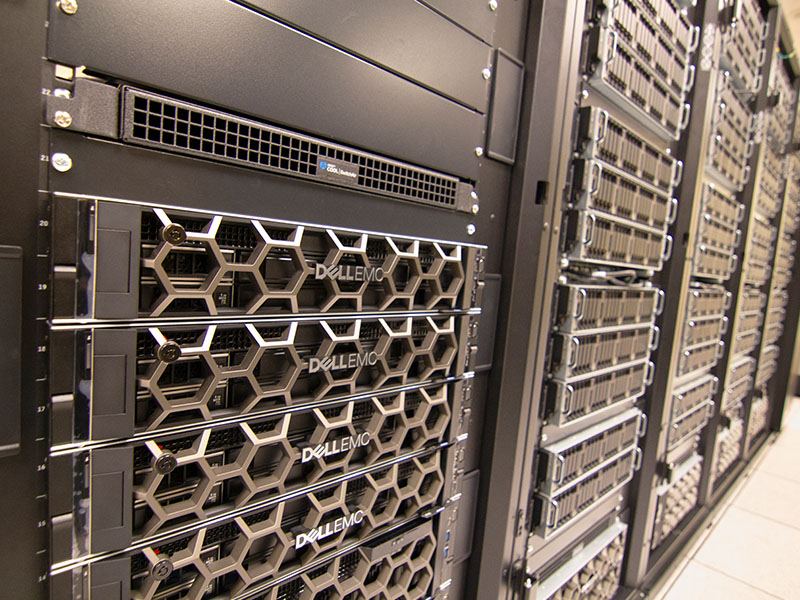
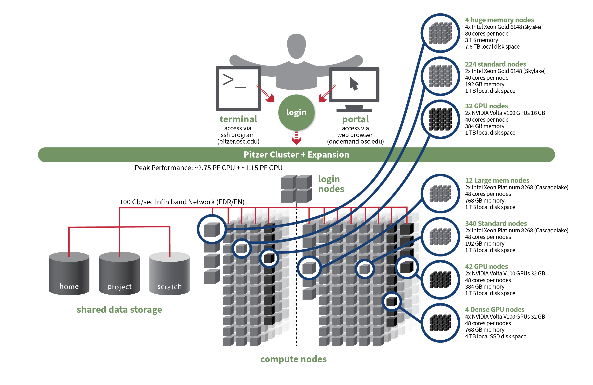
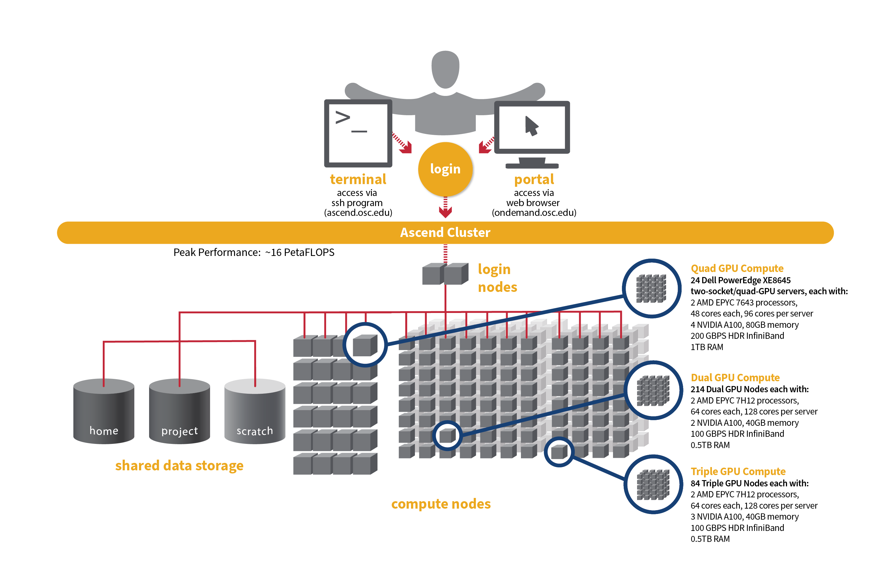
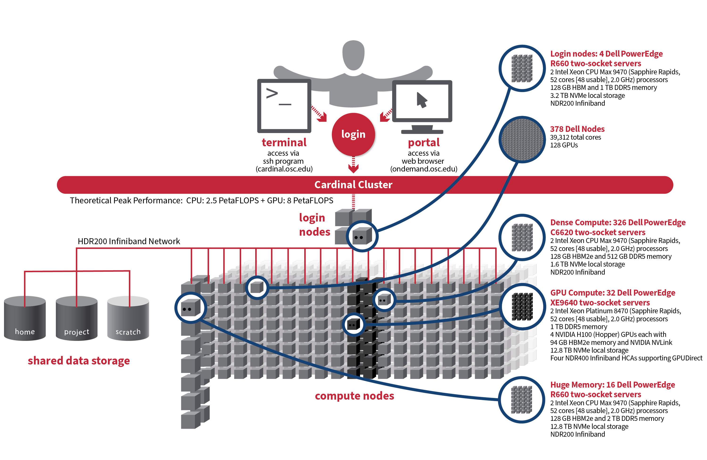

## Why HPC?

|         | Your Laptop      | OSC Cluster                     |
|---------|------------------|---------------------------------|
| CPUs    | 4--8 cores       | 48--120 cores/node              |
| RAM     | 8--16 GB         | 192 GB--1 TB per node           |
| GPUs    | Maybe 1 consumer | V100, A100, H100 (up to 4/node) |
| Storage | 256 GB--1 TB     | 500 GB home + 100 TB scratch    |
| Runtime | Hours--days      | Minutes--hours                  |

Training a model on your laptop = waiting overnight. Same job on OSC = done by lunch.

## What is OSC?

:::: {.columns}

::: {.column width="65%"}
-   **Ohio Supercomputer Center** — shared HPC facility for Ohio researchers
-   Three clusters: **Pitzer**, **Ascend**, **Cardinal**
-   Shared filesystem across all clusters
-   **SLURM** scheduler manages all jobs
-   Free for OSU researchers with an allocation
:::

::: {.column width="35%"}
{width="100%"}

{width="100%"}
:::

::::

## Cluster Architecture

```{mermaid}
flowchart LR
    A[Your Laptop] -->|SSH| B[Login Node]
    B -->|sbatch| C[SLURM]
    C --> D[CPU Nodes]
    C --> E[GPU Nodes]
```

Login nodes are for editing and submitting — **never run compute here**.

## Pitzer Cluster

{width="85%"}

::: {.aside}
Image: Ohio Supercomputer Center (osc.edu)
:::

## Ascend Cluster

{width="85%"}

::: {.aside}
Image: Ohio Supercomputer Center (osc.edu)
:::

## Cardinal Cluster

{width="85%"}

::: {.aside}
Image: Ohio Supercomputer Center (osc.edu)
:::

## The Three Clusters

|            | Pitzer          | Ascend              | Cardinal          |
|------------|-----------------|---------------------|-------------------|
| Launched   | 2018            | 2022                | 2024              |
| Nodes      | 658             | 322                 | 378               |
| CPUs       | Xeon Skylake    | AMD EPYC Milan      | Xeon Sapphire     |
| Cores/node | 40--48          | 88--120             | 96                |
| GPUs       | V100 32 GB      | A100 40/80 GB       | H100 94 GB        |
| GPU nodes  | 78              | 322                 | 32                |
| SSH        | pitzer.osc.edu  | ascend.osc.edu      | cardinal.osc.edu  |

## Which Cluster?

-   **Starting out / debugging**: Pitzer (familiar, stable, `debug` partition)
-   **GPU training (most ML work)**: Ascend (776 A100s, best GPU availability)
-   **Cutting-edge / large models**: Cardinal (H100s, NVLink, newest hardware)
-   **CPU-only preprocessing**: Any cluster

Our lab account **PAS1266** works on all three.

## Three Ways to Use OSC

```{mermaid}
flowchart TB
    A["Level 1\nOnDemand (Web)"] --> D[Notebooks + GUI]
    B["Level 2\nTerminal (SSH)"] --> E[Scripts + CLI]
    C["Level 3\nBatch (SLURM)"] --> F[Automated Jobs]
```

## Level 1: OnDemand (Web Browser)

:::: {.columns}

::: {.column width="65%"}
Go to **ondemand.osc.edu** — log in with OSC credentials.

| Feature | What It Does |
|---------|-------------|
| **File Manager** | Upload, download, browse files |
| **Shell Access** | Browser-based terminal |
| **Job Composer** | Build and submit jobs via forms |
| **Interactive Apps** | Jupyter, VS Code, RStudio, Desktop |

No SSH setup needed. Great for getting started.
:::

::: {.column width="35%"}
{width="70%"}
:::

::::

## OnDemand: Interactive Apps

:::: {.columns}

::: {.column width="50%"}
-   {height="1.2em" style="vertical-align: middle;"} **Jupyter Notebook** — select cluster, cores, hours, launch
-   {height="1.2em" style="vertical-align: middle;"} **VS Code** — full editor on a compute node
-   **Interactive Desktop** — Linux GUI on a compute node
:::

::: {.column width="50%"}
Each app requests compute resources for you — no SLURM commands needed.

Great for exploratory work, quick experiments, and learning.
:::

::::

## OnDemand: Job Composer

1.  Jobs → Job Composer → New Job
2.  Choose a template or paste your script
3.  Set account (`PAS1266`), partition, resources
4.  Click "Submit" — monitor status in the dashboard

Good for one-off jobs. For repeated runs, scripts are faster (Level 2).

## Level 2: Terminal (SSH)

``` bash
ssh pitzer.osc.edu
# or with SSH config:
ssh pitzer
```

Add to `~/.ssh/config`:

``` ssh-config
Host pitzer
    HostName pitzer.osc.edu
    User your.username
    IdentityFile ~/.ssh/id_ed25519
    ServerAliveInterval 60
    ServerAliveCountMax 3
```

## Getting a Compute Node

You land on a **login node** — shared, no heavy compute allowed.

To get your own resources, use `sinteractive`:

``` bash
# Basic: 1 core, default time
sinteractive -A PAS1266

# Customized: 4 cores, 2 hours
sinteractive -A PAS1266 -c 4 -t 02:00:00

# With GPU
sinteractive -A PAS1266 -c 4 -g 1 -t 01:00:00
```

You'll get dropped into a shell on a compute node.

## What to Do on a Compute Node

``` bash
# Now you're on a compute node (e.g., p0591)
[user@p0591 ~]$

# Run Claude Code CLI
claude

# Run a Python script
source .venv/bin/activate
python train.py

# Run tests, preprocessing, anything CPU-intensive
pytest tests/
python preprocess_data.py
```

When done: `exit` to release the node.

## Login Node vs. Compute Node

Your home directory (`~/`) is the **same NFS mount** everywhere — same files, same paths.

| Task | Where | Why |
|------|-------|-----|
| Edit code, git, browse files | Login node | Lightweight, no wait |
| AI tools (Claude Code, Copilot) | Login node | Network-bound, not CPU |
| Submit jobs (`sbatch`) | Login node | Just a SLURM request |
| Run tests (`pytest`) | Compute node | CPU-intensive |
| Preprocessing scripts | Compute node | May run for minutes |
| `quarto render`, builds | Compute node | Can be CPU-heavy |
| Anything with a GPU | Compute node | GPUs only there |

A 1-core, 2-hour session costs just **2 core-hours**. But don't leave it idle!

## VS Code Remote-SSH

:::: {.columns}

::: {.column width="60%"}
For daily development, VS Code Remote-SSH is the best option.

1.  Install the **Remote-SSH** extension
2.  Add SSH config (previous slide)
3.  `Ctrl+Shift+P` → "Remote-SSH: Connect to Host"
4.  First connection: \~2 min, \~500 MB download
:::

::: {.column width="40%"}
{width="50%"}

Terminal in VS Code runs on the **login node**. For compute, use `sinteractive` from that terminal.
:::

::::

## Three Storage Tiers

```{mermaid}
flowchart TB
    A["Home ~/\n500 GB, backed up"] --> D[Your Code]
    B["Project /fs/ess/\nVaries, backed up"] --> E[Shared Data]
    C["Scratch /fs/scratch/\n100 TB, 90-day purge"] --> F[Temp Results]
```

## File System Rules

-   **Home** (`~/`): code, configs, small files — 500 GB, backed up
-   **Project** (`/fs/ess/PAS####`): shared datasets, environments — backed up
-   **Scratch** (`/fs/scratch/PAS####`): large temp data — **purged after 90 days**
-   **Never** store important results only on scratch

## File Transfer

| Method  | Best For     | Command                         |
|---------|--------------|---------------------------------|
| VS Code | Small files  | Drag & drop in file explorer    |
| OnDemand | Small files | File Manager in browser         |
| `scp`   | Single files | `scp file.txt pitzer:~/`        |
| `rsync` | Large dirs   | `rsync -avz dir/ pitzer:~/dir/` |
| `git`   | Code only    | `git clone` on OSC              |

Use `rsync` for anything over 100 MB — it supports resume.

## Level 3: Batch Jobs (SLURM)

:::: {.columns}

::: {.column width="60%"}
For longer runs, write a job script and submit it:

``` bash
sbatch job_script.sh      # submit
squeue -u $USER           # check status
scancel <job_id>          # cancel
seff <job_id>             # efficiency report
```

Jobs run unattended — you can log out and come back later.
:::

::: {.column width="40%"}
{width="80%"}
:::

::::

## Job Script Anatomy

``` bash
#!/bin/bash
#SBATCH --job-name=train_model
#SBATCH --account=PAS1266
#SBATCH --time=04:00:00
#SBATCH --partition=gpu
#SBATCH --gpus-per-node=1
#SBATCH --cpus-per-task=4
#SBATCH --mem=32G
#SBATCH --output=logs/job_%j.out

source .venv/bin/activate
python train.py
```

All `#SBATCH` directives **must** come before any command.

## Key SBATCH Directives

| Directive         | Example         | Required?            |
|-------------------|-----------------|----------------------|
| `--account`       | `PAS1266`       | Yes                  |
| `--time`          | `04:00:00`      | Yes                  |
| `--partition`     | `gpu`           | No (default: serial) |
| `--gpus-per-node` | `1` or `v100:1` | No                   |
| `--cpus-per-task` | `4`             | No (default: 1)      |
| `--mem`           | `32G`           | No                   |

Rule of thumb: **4--8 CPU cores per GPU**.

## Job Lifecycle

```{mermaid}
flowchart LR
    A[sbatch] --> B[Pending]
    B --> C[Running]
    C --> D[Completed]
    C --> E[Failed]
    B --> F[Cancelled]
```

## Environment Setup

:::: {.columns}

::: {.column width="55%"}
``` bash
# Load Python
module load python/3.12

# Install uv (one-time)
curl -LsSf https://astral.sh/uv/install.sh | sh

# Create venv (use OSC's Python!)
uv venv --python \
  /apps/python/3.12/bin/python3

# Activate and install
source .venv/bin/activate
uv add torch torchvision pandas
```
:::

::: {.column width="45%"}
{width="40%"}

Do **not** use `module load python` then `uv venv` — uv ignores module-loaded Python.
:::

::::

## Module Commands

``` bash
module avail               # list all software
module spider python       # search for a package
module load python/3.12    # load Python
module list                # show loaded modules
module purge               # unload everything
```

Load `python/3.12` first, then activate your venv.

## GPU Job Template

``` bash
#!/bin/bash
#SBATCH --job-name=gpu_train
#SBATCH --account=PAS1266
#SBATCH --time=08:00:00
#SBATCH --partition=gpu
#SBATCH --gpus-per-node=1
#SBATCH --cpus-per-task=4
#SBATCH --mem=32G
#SBATCH --output=logs/job_%j.out

source .venv/bin/activate
python train.py
```

No `module load cuda` needed — PyPI torch bundles CUDA.

## Common Pitfalls

-   **Running compute on login nodes** — use `sinteractive` or `sbatch`
-   **Forgetting `--account`** — job won't submit without it
-   **`#SBATCH` after a command** — directives are silently ignored
-   **Scratch = permanent storage** — files purged after 90 days
-   **`uv venv` without `--python`** — uses uv's Python, which segfaults on OSC

## Quick Reference: Which Level?

| Task | Level | Command |
|------|-------|---------|
| Browse files | 1 | OnDemand File Manager |
| Run a notebook | 1 | OnDemand → Jupyter |
| Quick test / Claude CLI | 2 | `sinteractive -A PAS1266 -c 4` |
| Debug interactively | 2 | `sinteractive -A PAS1266 -g 1` |
| Training run (hours) | 3 | `sbatch train.sh` |
| Hyperparameter sweep | 3 | `sbatch --array=1-10 sweep.sh` |

## Where to Learn More

-   **Lab Setup Guide**: [lab docs site](https://osu-car-msl.github.io/lab-setup-guide/)
-   **OSC Documentation**: [osc.edu/resources](https://www.osc.edu/resources)
-   **OnDemand**: [ondemand.osc.edu](https://ondemand.osc.edu)
-   **OSC Support**: oschelp@osc.edu
-   **Check allocation**: `sbalance -a PAS1266`

Ask a senior lab member before your first big job!

## Image Credits {.smaller}

-   Cluster architecture graphics: [Ohio Supercomputer Center](https://www.osc.edu) (osc.edu)
-   OSC logo and Pitzer photo: [OSC Press/Media](https://www.osc.edu/press/media)
-   Python logo: [Python Software Foundation](https://www.python.org/community/logos/) (PSF Trademark)
-   Jupyter logo: [Project Jupyter](https://github.com/jupyter/design) (BSD-3-Clause, trademark of LF Charities)
-   VS Code icon: [Microsoft](https://code.visualstudio.com/brand) (Microsoft Trademark)
-   Slurm logo: [SchedMD](https://www.schedmd.com/) (GPL-2.0+, trademark of SchedMD LLC)
-   Open OnDemand logo: [OSC/NSF](https://openondemand.org) (MIT License)
